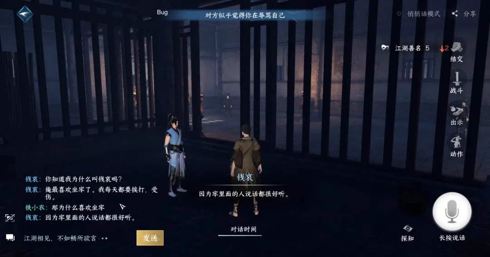
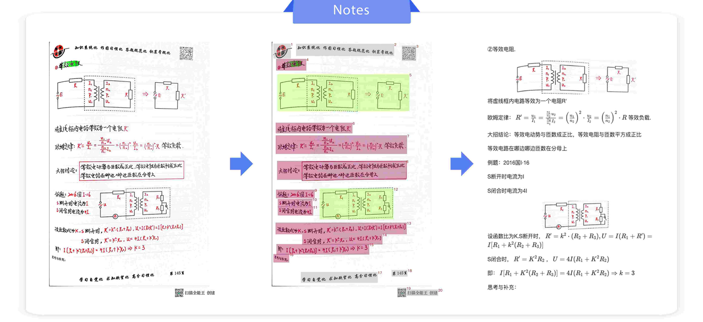

# 第一节 认识多模态边界

在前面的章节中，我们主要围绕文本（Text）这一单一模态系统性学习了 NLP 与 LLM 的主线能力。但真实世界的信息并不只以文字存在，图片、视频、语音、音乐、传感器、布局与结构化信号……共同构成了人类认知的“输入流”。**多模态学习**关注的就是如何让模型在这些异构信息之间建立联系，完成理解、生成与决策。

  
   
  <em>图 19-1 多模态模型 Nano Banana 生成的多模态交互示意图</em>

## 一、多模态的定义与内涵

### 1.1 从模态到多模态

在工程语境里，模态（Modality）可以理解为**信息进入模型的方式**，也就是同一类“语义”在不同载体上的呈现形式（信息来源/形式）。正因为载体不同，各模态在数据层面天然存在差异。文本通常表现为离散的 token 序列；图像是 $H \times W \times C$（高度 $\times$ 宽度 $\times$ 通道数）的像素网格；语音/音频常以连续时间波形或谱图表示；传感器往往是多路同步的时间序列，并伴随漂移、缺失与噪声等工程问题。结构不同会带来统计特性差异（例如局部性与全局性、时序依赖、尺度变化与噪声分布），进而决定了预处理、采样与建模方式也不应“一把梭”。所以，多模态（Multimodal）系统通常会为不同模态配置各自的编码器（Text / Image / Audio / Sensor Encoder），先把异构信号映射为可计算的表征，再进入后续的对齐、融合与推理。

> **微观多模态**
>
> 除了跨越物理媒介的模态（如声、光、电），在**文本模态内部**，也存在“微观”的多模态转换。例如：
> - **Text-to-Code**（文本转代码）：代码具有更严密的逻辑和语法约束。
> - **Text-to-Table**（文本转表格）：表格是结构化的二维信息。
> 这些转换虽然输入输出都是字符流，但在信息组织形式上发生了质变，也可视为广义的多模态转换。

基于上述对模态差异的理解，一个具备可操作性的定义是**当系统需要同时处理两种及以上“本质异构”的模态，并且需要建模它们之间的语义关系（对应、互补、约束）时，就可以称为多模态**。不过，“多模态”并不等同于把多路数据简单拼在一起，也不应只用“输入/输出的个数”来粗暴划分；关键是模型是否真的利用了模态之间的互补信息，并在表征、对齐与推理层面建立起跨模态的联系。站在工程落地的视角，多模态任务最常见的形态包括以图像与文本共同输入并输出文本答案的图文问答（VQA）；以文本为条件生成图像、音频或视频的内容生成；以及在更复杂系统中同时接收多模态输入并输出多模态结果（例如看图对话的同时用语音回答，甚至驱动动作执行），本质都是围绕“异构信息的协同建模”展开。

### 1.2 多模态的交互与表征对齐

多模态研究并非近年才出现，但它在多模态机器学习语境下的快速发展，更多发生在大规模数据、可扩展模型与训练范式逐步成熟之后。纵向回顾相关工作，可以将其脉络概括为两条相互关联但侧重点不同的路线。分别是以用户输入通道互补为核心的**多模态交互**，以及以共享潜在空间为核心的**多模态表征对齐**。

**第一条路线**主要源于人机交互（HCI）与多通道界面的研究传统，强调不同输入通道在语义表达上的互补性与消歧能力。**Richard A. Bolt** 在 SIGGRAPH 1980 发表并演示的 **“Put-That-There”** 系统，是早期语音与指点/手势协同交互的经典案例 [^1]。系统将语音命令与同步指向结合，使语言中的指示词（如 that/there）能够借助空间指点获得更明确的指代，完成图形对象在界面中的定位与操作。需要指出的是，此类工作通常以规则、语法或时序约束实现跨通道整合，其研究重点在于交互机制与解析策略，而非通过大规模数据学习统一表示。

**第二条路线**聚焦在表征空间的对齐（representation alignment），即学习一个（或一组）潜在空间，使不同视角变量或不同模态的表示在该空间中具有可比性，并对语义对应关系保持一致性。这个思想在统计学习中具有更早的数学基础，Hotelling 提出的**典型相关分析（CCA）**可被理解为通过线性投影最大化两组变量相关性的对齐方法，为后续“共享子空间”的建模思路提供了重要工具 [^2]。在信息检索领域，**LSI（Latent Semantic Indexing）**虽然主要处理单一文本模态，但它通过降维构造低维语义空间、并以空间邻近关系刻画语义相似性的范式，为之后以“向量空间”承载语义并进行相似度计算的做法奠定了方法论基础 [^3]。

随着跨模态任务（如图文检索、视觉—语言建模）的发展，研究重心逐步转向“如何学习可迁移的联合嵌入空间”。在这一过程中，CCA 及其核化形式（Kernel CCA, KCCA）被系统化总结并作为“学习共同子空间/共同表征”的重要工具 [^4]，为后续跨模态匹配与检索提供了可复用的对齐范式。深度学习范式下，对比式目标进一步推动了“对齐”从相关性最大化走向可扩展的表示学习：**Hadsell、Chopra、LeCun** 的**对比损失（Contrastive Loss）**为“拉近正样本、推远负样本”的度量学习目标提供了早期形式化表达 [^5]。随后，**ConVIRT** 等工作在配对图文数据上采用双向对比目标进行预训练，为跨模态对比学习在实际任务中的有效性提供了直接证据 [^6]。**CLIP** 则将该训练范式扩展到更大规模的图文配对数据，并在零样本迁移等设置中展示了共享嵌入空间对齐对下游泛化能力的重要作用 [^7]，推动该路线进入快速发展阶段。

> 误区辨析
>
> **把“多源/多路数据”当成多模态，把“概念混用”当成定义**：多模态的关键不在于“数据路数多”，而是**模态是否异构、信息是否互补、系统是否真的做了对齐/融合/协同推理**。比如多篇文本（multi-document）、多视角图像（multi-view）、多张图片拼接，很多时候仍属于同一模态的扩展，并不天然等于多模态；相反，一张图片加一句描述这种最简单的图文对，只要目标是学习跨模态语义关系，就已经是多模态。工程上还有个常见混淆点，“**多模态**”和“**多任务学习**”不是一回事——前者讨论的是信息来源（模态）的异构与融合，后者讨论的是目标函数/任务的并行优化，两者可以组合但不能互相替代。

## 二、多模态认知图谱

为了打破“多模态”作为抽象概念的疏离感，我们可以从任务复杂度和技术挑战两个维度来构建认知图谱。这不仅是对应场景的简单罗列，也是为了理清模型架构演进的内在逻辑，理解随着任务从“判断匹配”升级到“生成内容”乃至“复杂推理”，模型的能力边界是如何一步步拓展的。

### 2.1 多模态任务图谱

根据输入输出的依赖关系与任务复杂度，现有的多模态任务大致可以被归纳为四个递进的层级。虽然我们常以图文为例，但这些层级的逻辑天然适用于视频、音频、传感器等任意模态组合。

（1）**基础理解与检索**

这是多模态能力的基础，主要逻辑是**判断跨模态信息的匹配度**或从库中寻找对应项。最典型的场景是**图文检索 (Image-Text Retrieval)**（以文搜图/以图搜文），正是 **CLIP** 这类双塔结构最擅长的领域。同样的逻辑也适用于“以音搜文/以文搜音”（音频-文本检索），以及“多传感器片段检索”（例如用 IMU/振动序列检索对应故障描述）。一些前沿工作甚至尝试将图像、文本、音频、深度、热成像、IMU 等绑定到同一嵌入空间（如 ImageBind），使“检索/匹配”天然跨越多种模态组合。在这个层级，模型主要完成的是“特征对齐”工作，以及**跨模态蕴含/一致性 (Cross-modal Entailment)** 判断（即模态 A 的描述是否被模态 B 的证据支持）。

（2）**定位与结构化理解**

在基础理解之上，模型需要把语言或符号“落到可定位的证据”上，具备更精细的定位与解析能力。**视觉指代/定位 (Visual Grounding)** 解决了“指到哪/是哪一个”的问题，是细粒度 VQA 和具身智能的前置能力。这一能力可扩展为“音频/视频 Grounding”（定位视频时间片段或音频事件区间），以及“传感器时序对齐”（把语言指令落到某段传感器时间窗）。除此之外，**文档与图表理解 (Document & Diagram Understanding)**（OCR、表格布局、坐标轴等）也是一类高频结构化输入，在多模态理解与推理基准中占有重要位置。这一层级决定了后续推理是否建立在准确的证据之上。

（3）**生成与转换**

当模型具备了理解能力后，下一步就是**跨越模态创造新信息**。这一层级的核心是**AIGC**。**图生文 (Image Captioning)** 要求模型“看图说话”，将视觉信息翻译为自然语言，这是 **LLaVA** 等模型的基础能力；而 **文生图 (Text-to-Image)** 则如 Stable Diffusion，通过文本提示控制像素生成。推广到其他模态，还包括“文生音频/音频生文”（语音识别、音频描述/摘要）、“视频→文本总结”，以及“传感器→文本报告/告警解释”（把多路时序生成结构化告警或自然语言报告）。统一来看，这一层解决的是跨模态 Mapping 与条件生成。

（4）**复杂推理与控制**

这部分是目前多模态大模型的前沿高地，核心是**结合外部知识与上下文进行多步思考或行动**。**视觉问答 (VQA)** 和 **视觉对话 (Visual Dialog)** 不再满足于简单的描述，而是要求模型针对具体问题进行多跳推理。更进一步则是 **具身智能 (Embodied AI)**，例如指令机器人“去厨房拿那个红色的苹果”，要求模型不仅能理解视觉场景，还要规划动作序列并执行。在其他模态中，这对应了“视听多步推理”（基于视频+音频回答事件因果/流程问题），以及“多传感器决策控制”（融合摄像头、雷达、IMU 等信号做规划/控制）。这一层级的能力往往受限于对齐精度、证据可追溯性与长序列建模成本，它的目标不仅是让模型“能回答”，更要实现“基于证据的推理与行动”。

### 2.2 多模态机器学习五大挑战

在明确了任务图谱后，我们自然会想到实现这些任务的难点在哪里？CMU 的 Tadas Baltrusaitis 等人提出的多模态机器学习“五大挑战”理论，即便在 LLM 时代，依然是审视多模态架构设计的黄金标准 [^8]。根据 Mercari Tech Blog 的工程视角解读，我们可以通过表 19-1 更具体地理解这五个维度的核心难题：

<table border="1" style="margin: 0 auto;">
<tr>
  <td style="text-align: center;"><strong>挑战维度</strong></td>
  <td style="text-align: center;"><strong>核心关注</strong></td>
  <td style="text-align: center;"><strong>主要难点</strong></td>
  <td style="text-align: center;"><strong>演进与策略</strong></td>
</tr>
<tr>
  <td style="text-align: center;"><strong>表征</strong></td>
  <td>异构数据映射到统一空间</td>
  <td>数据形式差异巨大（如离散符号 vs 连续像素），且含不同程度噪声与冗余。</td>
  <td>通过 <strong>ViT</strong> 与 Transformer 统一架构设计，在保留模态独特性的同时挖掘互补性。</td>
</tr>
<tr>
  <td style="text-align: center;"><strong>转换</strong></td>
  <td>模态之间的映射与生成</td>
  <td>克服“一对多”映射歧义性（Ambiguity），保证“翻译”的语义一致性与真实性。</td>
  <td>涵盖从图生文（Captioning）到文生图（Diffusion）的多向生成，重点解决逻辑性与质量难题。</td>
</tr>
<tr>
  <td style="text-align: center;"><strong>对齐</strong></td>
  <td>跨模态元素的对应关系</td>
  <td>识别不同模态中指代同一实体或事件的子结构（从 Patch/Token 到全局 Instance）。</td>
  <td><strong>CLIP</strong> 对比学习：在大规模数据上显式拉近配对数据距离，建立语义匹配。</td>
</tr>
<tr>
  <td style="text-align: center;"><strong>融合</strong></td>
  <td>信息的整合与推理</td>
  <td>决策时有效结合多模态信息，消除歧义并抑制冲突带来的幻觉。</td>
  <td>引入 <strong>Cross-Attention</strong> 等深度交互机制（如 LLaVA），替代简单拼接以实现协同增益。</td>
</tr>
<tr>
  <td style="text-align: center;"><strong>协同学习</strong></td>
  <td>知识的跨模态迁移</td>
  <td>如何利用高资源模态（如文本）辅助低资源模态的学习。</td>
  <td>利用预训练 LLM + 少量对齐数据，实现视觉模型的 <strong>Zero-shot</strong> 泛化。</td>
</tr>
</table>

<em>表 19-1 多模态机器学习五大挑战（基于 CMU & Mercari 观点）</em>

## 三、应用场景

截止 2026 年多模态模型已经不是停留在实验室的理论模型，它已经深入渗透到各类业务场景中。基于行业实践（如电商、自动驾驶、娱乐等），我们可以将纷繁复杂的多模态应用版图整合为四大核心领域：

（1）**商业与消费体验**：商业与消费领域直接面向消费者（ToC），核心价值在于通过增强体验来促进交易与娱乐，是目前多模态技术变现最成熟的赛道。在**全链路电商体验**方面，涵盖从“搜”到“买”的全流程，其中**多模态推荐**融合商品图片、描述与评论实现深度个性化，**视觉搜索**支持“拍立淘”式的以图搜图或跨模态检索，**虚拟试穿**则通过 3D 渲染结合 CV 关键点技术或利用生成式模型提供逼真的在线试穿体验。**内容创作与娱乐**则通过**虚拟人**在直播带货与短视频中结合 TTS 与 CV 技术实现实时互动，**游戏 NPC** 也正从脚本驱动转向多模态驱动，能根据玩家的语音语调、动作甚至表情做出动态反应。如图 19-2 中《逆水寒》的游戏 NPC 已经能够和玩家进行一些智能交互，例如玩家跟敌对 NPC 说“你家着火了”，NPC 便会飞快赶回家，玩家就可以避免和这个 NPC 对战。

  
   
  <em>图 19-2 逆水寒智能 NPC</em>

（2）**企业级认知与服务**：企业级服务主要面向企业（ToB）与专业机构，目标是降本增效，处理高密度的复杂信息流。**智能客服与交互**超越纯文本问答，**多模态客服**能理解用户发送的截图（如报错页面）或语音（带情绪的投诉）并精准回复，公共场所的**流媒体智能屏**则可在合规授权的前提下基于视觉感知进行定向信息交互。在**文档与知识处理**领域，**智能文档处理 (IDP)** 作为 OCR、文档解析与信息提取的系统工程，不仅识别文字，还能精准还原发票、标书以及笔记中的版面布局与表格结构，如图 19-3 就是 PaddleOCR-VL 对笔记的识别效果。**多模态翻译**在视频会议中可同步处理语音翻译、语气调整甚至画面中的文字替换。**金融风控**则结合声纹特征、设备指纹、用户行为序列及多源一致性校验构建更立体的反欺诈体系，部分场景也在探索微表情等辅助信号。

  
   
  <em>图 19-3 PaddleOCR-VL 识别效果</em>

（3）**实体智能与出行**：实体智能代表了 AI 从“数字世界”走向“物理世界”的关键一步，要求模型具备感知环境并执行动作的能力。**自动驾驶**以特斯拉（尽量减少对雷达依赖的视觉主导路线）和“蔚小理”（多传感器融合路线）为代表，行业虽然长期目标是 L5（完全自动驾驶，无需人类干预），但当前主流仍聚焦于 **L2+/L3** 的工程化落地，其中 L2+ 需要驾驶员持续监督，L3 在其 ODD（运行设计域）内可由系统监控环境但需要驾驶员在系统请求时接管。在感知层面，车辆需实时处理异构数据，视觉主导路线侧重于摄像头的深度挖掘，融合路线则进一步结合激光雷达和毫米波雷达以提升冗余度，完成路径规划与避障。**机器人**则涵盖了从商场导购机器人到家用扫地机等多种形态，不仅要“看”（视觉 SLAM 建图），还要“听”（语音指令识别），并结合触觉传感器与物理世界交互。更前沿的还有**特斯拉 Optimus**、**宇树 G1**等正在快速发展的**具身智能（Embodied AI）**，趋势是用端到端（或弱分层）的策略模型把多模态感知（视觉/深度/力觉等）与动作决策连接起来，输出动作序列或关节控制指令，并在真实环境中通过数据驱动学习实现泛化与闭环控制。

  
   
  <em>图 19-4 Unitree H1</em>

（4）**科学与医疗探索**：在对数据精度与隐私要求极高的专业领域，多模态技术正在辅助专家突破人类认知的边界。**智慧医疗**整合**医学影像**（CT/MRI）、**电子病历**（文本）与**生化指标**（结构化数据）辅助癌症筛查或病情预判，该领域的难点在于极低的容错率，必须严格**抑制幻觉**并引入人类专家复核（HITL）与可追溯证据机制。**跨学科科研**利用多模态模型分析卫星图像（天文/地理）、预测蛋白质结构（生物），或通过产学研结合解决实验室模型向工业界落地的鸿沟。

## 参考文献

[^1]: [Bolt, R. A. (1980). *“Put-that-there”: Voice and gesture at the graphics interface*. SIGGRAPH '80.](https://dl.acm.org/doi/10.1145/800250.807503)

[^2]: [Hotelling, H. (1936). *Relations between two sets of variates*. Biometrika, 28(3/4), 321-377.](https://www.jstor.org/stable/2333955)

[^3]: [Deerwester, S., Dumais, S. T., Furnas, G. W., Landauer, T. K., & Harshman, R. (1990). *Indexing by latent semantic analysis*. JASIS.](http://wordvec.colorado.edu/papers/Deerwester_1990.pdf)

[^4]: [Hardoon, D. R., Szedmak, S., & Shawe-Taylor, J. (2004). *Canonical Correlation Analysis: An Overview with Application to Learning Methods*. Neural Computation.](https://graphics.stanford.edu/courses/cs233-20-spring/ReferencedPapers/NC_Hardoon_2817_reg.pdf)

[^5]: [Hadsell, R., Chopra, S., & LeCun, Y. (2006). *Dimensionality Reduction by Learning an Invariant Mapping*. CVPR 2006.](http://yann.lecun.com/exdb/publis/pdf/hadsell-chopra-lecun-06.pdf)

[^6]: [Zhang, Y., Jiang, H., Miura, Y., Manning, C. D., & Langlotz, C. P. (2020). *Contrastive Learning of Medical Visual Representations from Paired Images and Text (ConVIRT)*.](https://arxiv.org/abs/2010.00747)

[^7]: [Radford, A., Kim, J. W., Hallacy, C., et al. (2021). *Learning Transferable Visual Models From Natural Language Supervision (CLIP)*.](https://arxiv.org/abs/2103.00020)

[^8]: [Anand, P. (2021). *5 Core Challenges In Multimodal Machine Learning*. Mercari Engineering Blog.](https://engineering.mercari.com/en/blog/entry/20210623-5-core-challenges-in-multimodal-machine-learning/)
