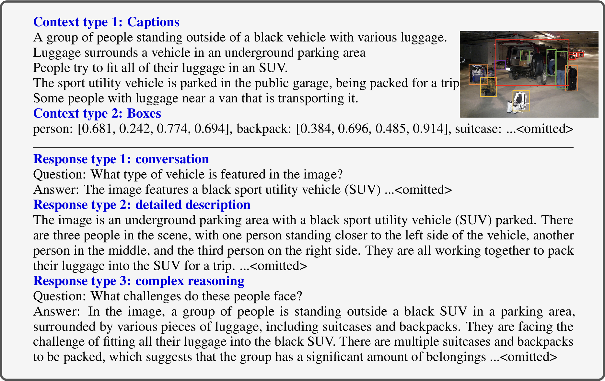
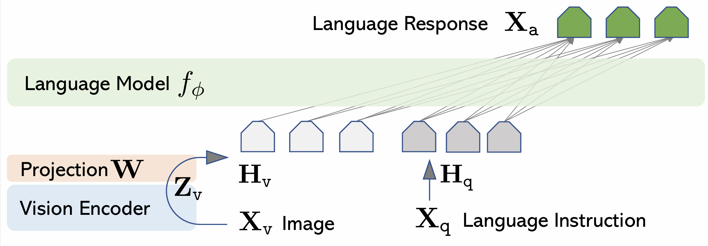

# 第一节 BLIP-2 与 LLaVA

## 一、从对齐到生成

### 1.1 如何高效构建多模态生成能力？

CLIP 通过对比学习让图像和文本在特征空间实现了对齐，但这仅仅完成了“理解”的第一步。作为典型的**双塔判别式**模型，CLIP 更擅长做“给定候选文本算相似度”的检索/分类式判断，而不是**自由形式的文本生成**；所以它不能像语言模型那样，直接对“画里有什么？”这类开放式问题给出自然语言答案。**为了突破这一局限**，我们需要赋予模型“**开口说话**”的能力，在强大的语义基础之上构建**生成能力**。为此，DeepMind 的 **Flamingo** [^1] 等先驱尝试了在冻结的视觉编码器与语言模型之间**插入跨注意力等新模块**，并在海量交错图文数据上训练这些新增模块以实现强大的生成与对话能力。虽然效果惊艳，但数据与训练成本**并非普通实验室所能承受**。

那不妨换个思路，既然我们手头已经有了“**视觉地基**”（ViT）和“**语言大脑**”（LLM），能不能只训练一个轻量级的“适配器”把它们连起来呢？Salesforce 提出的 **BLIP-2** [^2] 正是这一思路的杰出代表。它采用 **Bootstrapping**（引导）策略，利用冻结的预训练图像编码器和 LLM，以极低的计算成本实现了强大的多模态能力（例如，论文报告其在 VQAv2 零样本 test-dev 上相对 Flamingo-80B 高出 **8.7 个百分点**，同时使用 **54× 更少的可训练参数**）。这个“四两拨千斤”效果的关键在于它设计了轻量级的 **Q-Former**，作为一个**信息瓶颈**，从视觉特征中“萃取”出最关键的信息并“翻译”给 LLM。如图 20-1 所示，整个模型的训练如同在搭建积木，左侧是冻结的图像编码器负责“看”，右侧是冻结的 LLM 负责“说”，我们主要训练中间这个轻量级的 Q-Former（以及后续对接 LLM 的小映射层）来进行高效的“传译”。

  
   
  <em>图 20-1 BLIP-2 总体架构</em>

### 1.2 Q-Former 与两阶段预训练

在原论文中，Q-Former（Querying Transformer）是一个初始化自 **BERT-base** 的轻量级 Transformer 模块（仅 **188M 参数**），核心目标是连接冻结的视觉与语言模型。如图 20-2，Q-Former 内部包含两个**共享 Self-Attention 层**的子模块。**左侧路径**（论文中称为 **Image Transformer**）接收一组固定数量的**可学习查询向量 (Learnable Queries)**（文中设定为 **32 个**）作为输入，通过每一层的 **Cross-Attention** 机制与冻结的图像编码器输出交互，从海量的视觉特征中“萃取”出最精华的视觉信息；**右侧路径**（论文中称为 **Text Transformer**）则作为文本编码器或解码器处理文本输入。这种双塔共享权重的设计，让 Queries 既能通过 Cross-Attention 学习视觉特征，又能通过共享的 Self-Attention 与文本特征进行交互。由于 32 个 Query 的数量远小于原始图像特征的空间尺寸，这种设计强制模型进行高强度的信息压缩，构成了所谓的“**信息瓶颈**”，确保传递给 LLM 的都是经过筛选的、与文本最相关的有效信息。

  
   
  <em>图 20-2 Q-Former 详细架构</em>

为了确保 Q-Former 既能理解图像，又能对接到 LLM，BLIP-2 采用了两阶段预训练策略。

（1）**视觉-语言表征学习**

在此阶段，**图像编码器被冻结**。为了让那一组**可学习查询向量**能够提取出既包含视觉信息又与文本对齐的特征，Q-Former 设计了三种预训练目标，并利用特定的 **Attention Mask** 策略在同一个架构中同时优化它们。如图 20-3 所示，首先是**图文匹配 (ITM)**，利用 **Bi-directional Mask**，允许 Query 和 Text 互相完全可见，学习细粒度的图文对齐；中间是**图文生成 (ITG)**，使用 **Multimodal Causal Mask**，这里 Query 可以相互注意但看不见 Text，而 Text 可以看见所有的 Query 和之前的 Text，用于引导基于图像的文本生成；最后是**图文对比学习 (ITC)**，使用 **Uni-modal Mask**，让 Query 和 Text 互不可见，专注于对齐整体的视觉和语言表征。这三种策略的结合，确保了 Q-Former 输出的 Query Embeddings 包含了最精华的视觉语义信息。

  
   
  <em>图 20-3 第一阶段预训练目标 (a) ITC, (b) ITG, (c) ITM</em>

> **Mask 图解说明**：每个方形矩阵代表 Transformer 的注意力掩码（Attention Mask），横纵坐标分别对应 Query 和 Text 的 Token。矩阵被分为**四个象限**，**左上**是 Query 对自身的注意力（Q-Q），**右下**是 Text 对自身的注意力（T-T），**右上**和**左下**则是 Query 与 Text 之间的交叉注意力（Q-T 和 T-Q）。**空白区域表示“可见”**（unmasked），**深色区域表示“不可见”**（Masked）。例如在 ITC 任务中，我们希望 Query 和 Text **互不可见**，对应的右上和左下象限就是**深色**的。

（2）**视觉-语言生成学习**

这一阶段，**LLM 也被冻结**。为了将 Q-Former 提取的视觉特征注入到 LLM 中，BLIP-2 引入了一个全连接层（Fully Connected）将 Query Embeddings（$Z$）线性映射到 LLM 的文本 Embedding 维度。这些映射后的向量充当了“软视觉提示”，直接拼接在文本 Embedding 之前。如图 20-4 所示，具体对接策略取决于 LLM 的架构。若对接 **Decoder-based LLM（图 20-4 上半部分，如 OPT）**，Q-Former 的输出作为前缀，由于 Decoder 是单向注意力的，它能看见视觉 Prompt 并据此生成后续文本；若对接 **Encoder-Decoder-based LLM（图 20-4 下半部分，如 Flan-T5）**，Q-Former 的输出与文本前缀拼接后输入到 Encoder 中，Decoder 则负责根据 Encoder 的跨模态表示生成后缀文本。这种设计通过“软提示”机制，巧妙地复用了 LLM 强大的语言生成能力。

  
   
  <em>图 20-4 BLIP-2 第二阶段预训练：对接 Decoder-based 或 Encoder-Decoder-based LLM</em>

通过这种方式，BLIP-2 成功地用极小的代价（主要训练 Q-Former，以及将其输出映射到 LLM 词向量空间的全连接映射层）就将视觉感知能力“嫁接”到了大语言模型上。

## 二、LLaVA 与视觉指令微调

### 2.1 视觉指令微调的必要性

虽然 **BLIP-2** 成功地将视觉编码器和 LLM 连接了起来，并且在论文中已经展示了**通过提示词进行零样本的指令式图像到文本生成**，但它的预训练目标核心仍围绕“**模态对齐**”与“**图像条件生成**”。在实际“助手式”交互场景中，这通常表现为模型**可以生成**，但对复杂指令的稳定遵循、多轮对话格式、以及更贴近人类偏好的回答风格，并没有被系统性地对齐与强化（尤其缺少专门的视觉指令对话数据来做端到端的指令微调）。所以，BLIP-2 更像是“能看懂、也能说”的通用接口原型，而距离像 ChatGPT 一样可对话、可推理、强指令遵循的视觉助手仍有差距。

**LLaVA (Large Language and Vision Assistant)** [^3] 的出现正是为了解决这一问题。它引入了 **视觉指令微调**，目标是将多模态模型从“看图说话”的工具升级为通用的“**智能视觉助手**”。正如 NLP 领域从 GPT-3 到 ChatGPT 的进化离不开**指令微调**，多模态模型也需要通过高质量的**视觉指令数据**来学习如何遵循人类意图。LLaVA 不仅提出了一个简单的架构，更重要的是提出了一种低成本构建这些数据的方法。

### 2.2 数据构建

LLaVA 团队（2023年4月）发现，当时虽然缺乏图像-指令对数据，但有丰富的**图像-文本对**数据（如 COCO），于是他们利用 GPT-4 作为“老师”，采用**上下文学习**的方式，将图像的符号化表示（多视角**图像描述**与 COCO 等数据集中现成的**目标边界框/类别标注**）以及少量人工设计的种子样例喂给 GPT-4，从而生成了总计 **158K** 条高质量的指令数据。这批数据包含 **58K** 条模拟人与助手日常交互的**对话**数据；包含 **23K** 条要求对图片各个方面进行详尽刻画的**详细描述**数据；此外还有 **77K** 条**复杂推理**数据，这类数据会提出需要基于图片内容进行更深层逻辑推理的问题，并要求给出相对清晰的推理过程。

图 20-5 就是一个具体的生成实例。注意 GPT-4 并没有通过视觉编码器“看”到原始图片，而是根据输入的“**Context type 1: Captions**”提供的语义描述（如“一群人站在黑色车旁”、“SUV 在地下车库”）以及“**Context type 2: Boxes**”提供的精确定位信息（如“person: [坐标]”、“suitcase: [坐标]”），在脑海中“脑补”出了完整的场景。基于这些符号化信息，GPT-4 生成了下方的“**Response type 1: Conversation**”关于车型和地点的问答，“**Response type 2: Detailed Description**”对场景和人物动作的细致刻画，甚至在“**Response type 3: Complex Reasoning**”中推理出了人们正面临“如何把大量行李装进车里”的挑战。这种利用大语言模型强大的常识推理能力来生成视觉指令数据的方法，就是 LLaVA 的核心创新之一。

  
   
  <em>图 20-5 LLaVA 数据构建示例</em>

### 2.3 LLaVA 架构与训练

LLaVA 的架构非常简洁（如图 20-6 所示）。输入图片 $X_v$ 首先经过 **Vision Encoder**（使用预训练的 CLIP ViT-L/14），提取出视觉特征 $Z_v$。在其实验中，作者比较了使用 CLIP ViT 的最后一层与最后一层之前的 patch/grid tokens 作为视觉特征。在 ScienceQA 设置下，使用倒数一层特征带来约 **0.96 个百分点**的提升。随后，**Projection Layer**（一个简单的线性层 $W$）起到了“翻译官”的作用，将视觉特征线性映射为 LLM 能理解的 Embedding $H_v$。最后，开源 **LLM** Vicuna（基于 LLaMA 微调）同时处理这些视觉 Embedding 和文本指令 Embedding $H_q$，最终生成回复 $X_a$。

  
   
  <em>图 20-6 LLaVA 模型架构</em>

为了让这些组件协同工作并获得多模态能力，LLaVA 同样采用了**两阶段的训练策略**：

（1）**特征对齐预训练**

为了平衡概念覆盖率和训练效率，LLaVA 将 CC3M 数据集过滤至 **595K** 个图像-文本对。在此阶段，**冻结 Vision Encoder 和 LLM**，仅训练**投影层**。这一步的目标是训练一个与 LLM 兼容的“视觉 Tokenizer”，让图像特征能够对齐到 LLM 的语义空间。

（2）**视觉指令微调**

使用前述 GPT-4 生成的 **158K** 条高质量指令数据（对话、描述、推理），**冻结 Vision Encoder**，同时更新**投影层和 LLM 的权重**。这一阶段让模型真正学会了如何作为多模态助手与人类交互。

**实验结果**显示，LLaVA 不仅在日常聊天中展现了出色的多模态能力，在 **ScienceQA**（多模态科学问答）数据集上也取得了令人瞩目的成绩。论文报告的 **92.53%** 来自一种“集成”设置，当 LLaVA 与**文本版** GPT-4 结合，并由 GPT-4 充当“裁判”在两者答案不一致时做最终仲裁时，可达到该准确率。

---

## 参考文献

[^1]: [Alayrac, J. B., Donahue, J., Luc, P., et al. (2022). *Flamingo: a Visual Language Model for Few-Shot Learning*. NeurIPS.](https://arxiv.org/abs/2204.14198)

[^2]: [Li, J., Li, D., Savarese, S., & Hoi, S. (2023). *BLIP-2: Bootstrapping Language-Image Pre-training with Frozen Image Encoders and Large Language Models*. ICML.](https://arxiv.org/abs/2301.12597)

[^3]: [Liu, H., Li, C., Wu, Q., & Lee, Y. J. (2023). *Visual Instruction Tuning*. NeurIPS.](https://arxiv.org/abs/2304.08485)
