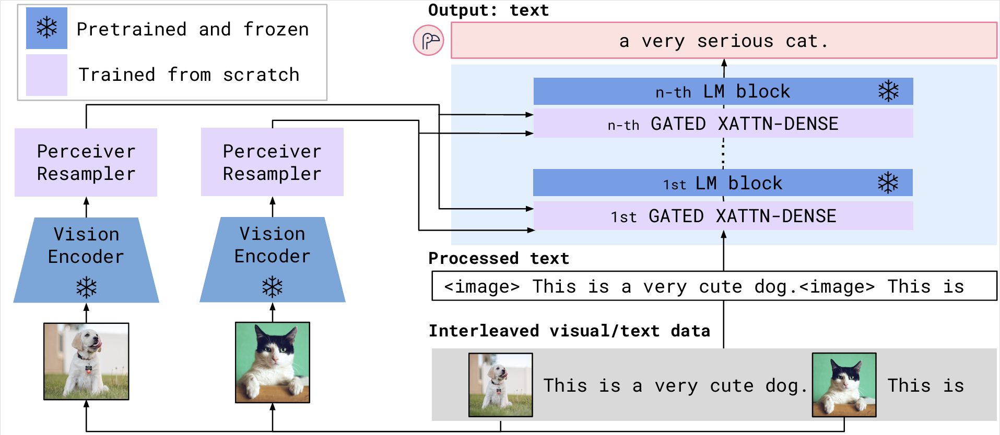
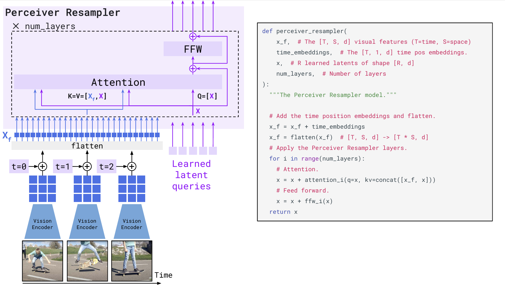
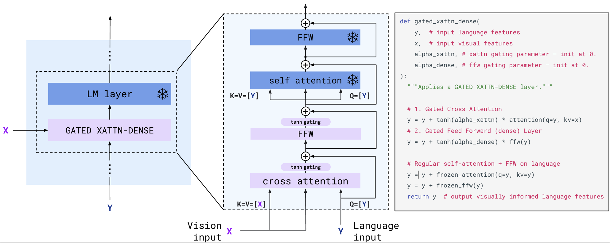
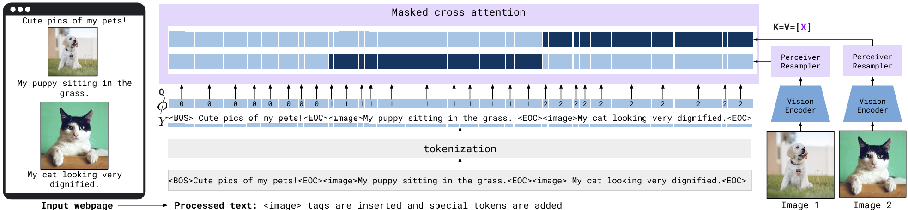
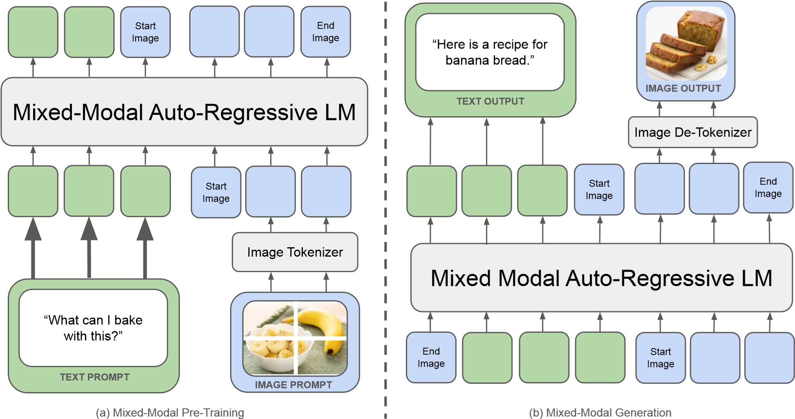
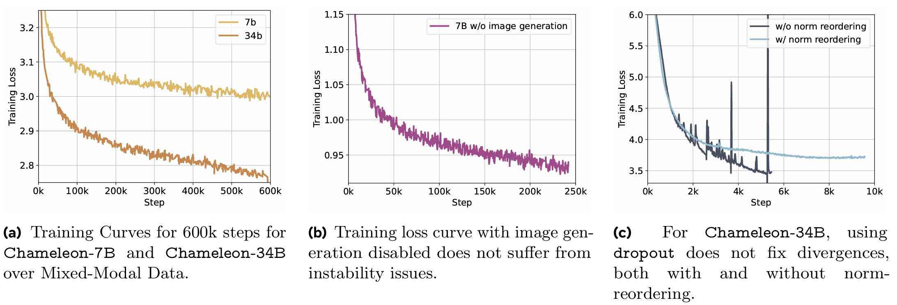
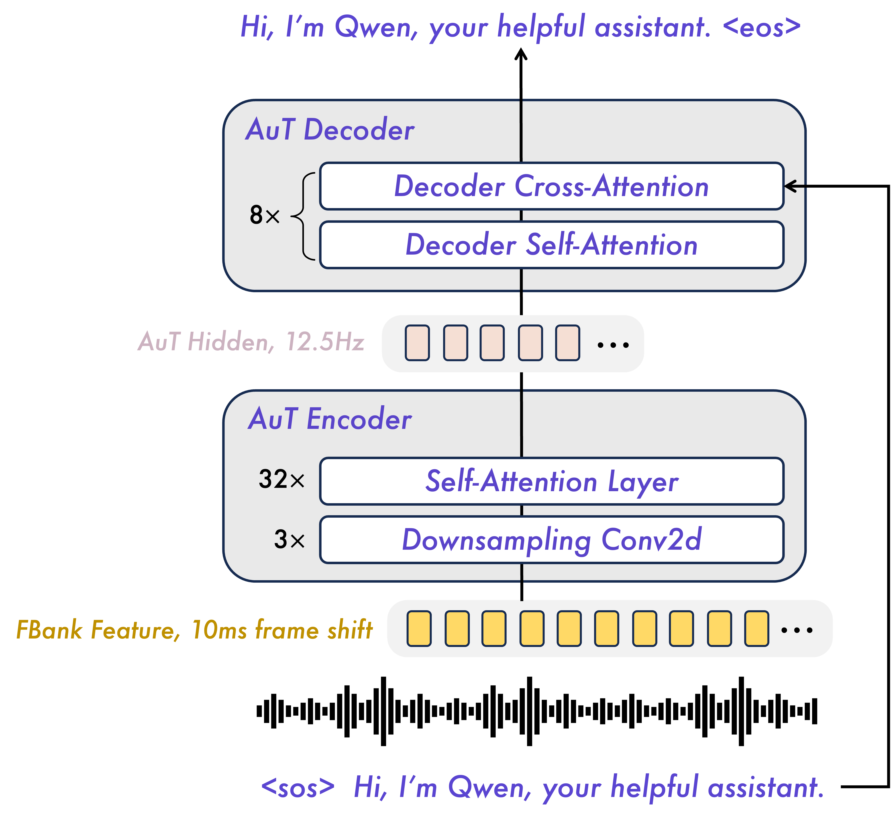
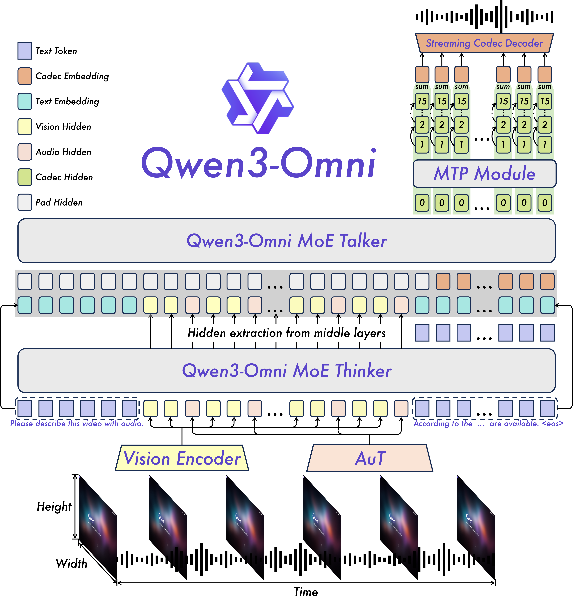
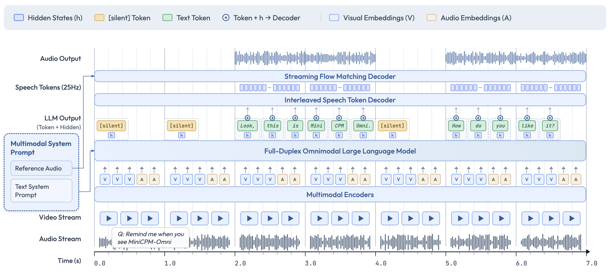

# 第二节 原生统一架构

上节我们介绍了以 **BLIP-2** 和 **LLaVA** 为代表的“**连接**”方法。这类方法通过轻量级适配模块连接**冻结的视觉编码器**与 **大语言模型**，虽极大降低了训练成本，但底层模态的分离和输入端的生硬拼接限制了其在实时音频/视频交互等场景下的表现。为了突破这些局限，学术界与工业界正加速向**原生统一**的架构演进。

## 一、迈向统一的探索

### 1.1 Flamingo 架构设计

DeepMind 在 2022 年提出的 **Flamingo** [^1] 虽然在时间上早于 BLIP-2，但在多模态的大一统进程中占据了独特的生态位。不同于 BLIP-2 和 LLaVA 追求的“利用现有组件高效连接”，Flamingo 探索的是**大规模图文交错序列（Interleaved Image-Text）**的学习极限。在架构演进的视角下，它事实上构成了从“简单连接”向“原生统一”进化的关键**过渡形态**。其核心架构目标是桥接强大的预训练视觉模型和大型语言模型（LLM），在保留它们各自预训练知识的同时，成功实现了在**极少样本**情况下对**任意交错（Interleaved）**图像和文本序列的处理能力。为了实现这一目标，Flamingo 采用了如图 20-7 所示的架构。

  
   
  <em>图 20-7 Flamingo 架构</em>

可以看到图中的图像数据会先通过**左侧的视觉路径**进行视觉编码（Vision Encoder）和重采样（Perceiver Resampler），生成固定长度的视觉特征。接着，这些特征被注入到**右侧的语言路径**中，通过插入在 LLM 层间的门控交叉注意力接口（Gated XATTN-DENSE）参与文本生成。为了支撑这一跨模态流转过程，Flamingo 设计了以下三个关键组件：

（1）**视觉感知与特征重采样**

Flamingo 使用 **NFNet-F6** 作为冻结的视觉编码器，提取图像或视频的特征。由于视觉输入的分辨率和视频帧数可能不同，导致特征图的大小和数量也是变化的。为了将这些变长的视觉特征统一为固定长度的输入，Flamingo 引入了 **Perceiver Resampler** 模块。该模块预定义了一组固定数量的**可学习的潜在查询向量（Latent Queries）**，通过 Cross-Attention 机制与视觉特征交互，最终输出固定数量的视觉 Token（论文中为 64 个）。这种设计不仅显著降低了视觉-文本 Cross-Attention 的计算开销，也通过“压缩视觉 token 数量”的方式在实践中缓解了 Transformer 随序列长度增长带来的 $O(N^2)$ 计算/显存压力（严格来说并非“消除” $O(N^2)$，而是让 $N$ 不至于被视觉 token 拉得过大）。结合图 20-8 所示，Perceiver Resampler 会先将 Vision Encoder 输出的变长视觉特征（$X_f$）展平。对于视频输入，Flamingo 会在展平前为每一帧特征加入可学习的时间嵌入；同时作者也明确指出**未显式加入空间网格位置编码**（空间信息更多由 CNN 特征隐式携带）。这里的 **Key** 和 **Value** 在论文的示意与伪代码中可以由**时空视觉特征 $X_f$ 与 learned latent vectors 拼接**而成。也就意味着 Latent Queries 在通过 Attention 机制“查询”视觉信息时，不仅关注图像特征，也在“参考”自身的当前状态，继而保持了特征提取的连贯性。随后，这些 Latent Queries 主动去“查询”视觉特征中包含的关键信息，无论输入视觉特征序列有多长（单图或多帧视频），最终都只输出与 Latent Queries 数量一致的定长视觉 Token。通过这种机制，海量的视觉数据被高效地压缩成了少量的定长 Token 序列，供后续 LLM 使用。

  
   
  <em>图 20-8 Perceiver Resampler 机制</em>

（2）**视觉信息注入与门控机制**

为了将视觉信息有效注入预训练且冻结的语言模型（**Chinchilla**）中，Flamingo 在其层间插入了 **GATED XATTN-DENSE** 模块。如图 20-9 所示，该模块以语言特征（Language input）作为 **Query**，以 Perceiver Resampler 输出的视觉特征（Vision input）作为 **Key** 和 **Value**，通过交叉注意力机制让语言模型主动从视觉序列中提取相关信息。为了维持冻结 LLM 原有的语言能力，Cross-Attention 和随后的 FFW 层均配置了 **tanh 门控机制**（tanh gating），这些门控参数在初始化时设为 0，确保模型在训练初期表现为纯语言模型，避免了视觉噪声冲击导致的训练不稳定。随着训练的进行，门控值逐渐增大，视觉信息以残差连接的方式“平滑”地融入语言特征流中。这种设计不仅防止了灾难性遗忘，还让模型能够通过交错的 Self-Attention 和 Cross-Attention 层，在保持语言逻辑的同时实现深度的多模态对齐。

  
   
  <em>图 20-9 Gated Cross-Attention</em>

（3）**多图支持与掩码策略**

为了支持任意数量的图像/视频输入，Flamingo 在 **Masked Cross-Attention** 层采用了特殊的**分段掩码策略**。如图 20-10 所示，这种策略实施了严格的**局部关注**，即每个文本 Token **仅被允许关注其直接前导的那一张图像**（由指示函数 $\phi$ 决定），而不是所有历史图像。例如，图中标记为 `1` 的文本段只能看到 Image 1，而无法看到 Image 2 或其他图像。具体而言，图中**亮蓝色区域**代表允许文本 Token 关注的视觉特征，而**深色区域**则代表被屏蔽的部分。这种设计限制了单次交叉注意力的计算复杂度，防止模型被无关图像干扰。虽然 Cross-Attention 层只关注局部，但跨图像的长程依赖被交给底层的 **LM Self-Attention**，通过文本 Token 作为中介，间接实现了多图信息的融合。基于这一机制，Flamingo 能够高效处理包含多达 32 对图文的 Few-Shot Prompt，展示了强大的上下文学习能力。

  
   
  <em>图 20-10 多模态掩码注意力</em>

### 1.2 局限性与思考

Flamingo 强大的少样本能力很大程度上归功于它的训练数据。DeepMind 构建了 **M3W (Multi-Modal Massive Web)** 数据集，包含从 **4300 万个网页**中提取的图文交错序列（如：文本-图像-文本）。这种结构模拟了人类浏览网页的真实体验，使模型学会了根据上下文预测下一个 Token。而且，为了兼顾通用的视觉识别能力，Flamingo 还混合使用了传统的强对齐图文对数据集（**ALIGN**, **LTIP**）和视频文本对数据集（**VTP**），并通过加权损失函数进行联合训练。然而，Flamingo 仍然存在一些局限性。例如，相较于直接优化图文检索任务的 Contrastive 模型（如 CLIP），Flamingo 在单纯的图像分类任务表现稍逊，这可能源于其生成式目标的特性。同时，作为建立在 LLM 基础上的模型，Flamingo 继承了 LLM 的缺点，偶尔会产生**幻觉**或做出无根据的猜测。最关键的是，受限于当时的技术背景，Flamingo 依然保留了“冻结视觉编码器”这一**连接范式**的特征。虽然这种依赖冻结编码器的设计有助于保留预训练模型的通用能力，但也导致视觉和语言在底层特征空间上无法真正融合，细腻的视觉感知能力（如 OCR、细粒度识别）容易在层层传递中丢失。

## 二、Token 级统一与单一网络

为了彻底打破上述局限，**Chameleon** [^2] 和 **GPT-4o** [^3] 等模型开启了**纯粹的原生**时代。严格意义上的“纯粹原生”指模型不再是“拼凑”出来的，它从一开始就将所有模态视为地位平等的“语言”，在同一个大模型中进行**混合模态的端到端预训练**。就像人类婴儿并非先学会“看”再学会“说”，而是在成长的过程中同时通过视觉、听觉和语言来感知世界一样，原生多模态模型试图模拟这种过程。在架构方面，模型**彻底摒弃了独立的模态编码器**，并将像素、波形和文本一视同仁地映射为 Token 或底层特征，直接送入同一个“大脑”（单一大模型网络）进行处理。

### 2.1 Chameleon 与统一词表

Meta AI 推出的 **Chameleon** 是“**早期融合（Early-Fusion）**”架构的典型代表。虽然在架构上进行了彻底的重构（不再依赖外挂的视觉编码器），但从数据层面来看，Chameleon 完美继承并发展了 Flamingo 最宝贵的遗产，也就是基于大规模“图文交错”数据的训练范式。它的理念非常激进，主张**把一切都视为 Token**。为了实践这一目标，Chameleon 在架构设计上进行了以下三个层面的创新：

（1）**统一词表与离散化**

Chameleon 使用一个名为 Gafni 的图像分词器将 $512 \times 512$ 的图像量化为 1024 个离散的 **Image Tokens**。这些视觉 Token 与文本 Token 并没有本质区别，它们共同组成了一个大小为 65,536 的**统一词表**（包含了 8192 个图像 Codebook Token）。这意味着在模型眼中，像素和文字都是来自同一个字典的“单词”。

（2）**混合序列与端到端架构**

在处理输入时，Chameleon 将图像 Token 和文本 Token 按照逻辑顺序拼接成一个**混合模态序列（Mixed-Modal Sequence）**。整个序列直接输入到一个**统一的 Transformer 架构**中。无论是理解还是生成，本质上都转化为了**自回归的下一 Token 预测**任务。这种架构极大地简化了流程，**不再依赖外挂的视觉编码器或复杂的跨模态对齐模块**。如图 20-11 所示，通过**图像分词器（Image Tokenizer）**，图像被转化为与文本（绿色）地位平等的蓝色 Token，并在**边界符（Start/End Image）**的辅助下混合编排，真正实现了端到端的全原生多模态理解与生成。

  
   
  <em>图 20-11 Chameleon 混合模态序列</em>

（3）**攻克训练稳定性挑战**

“从头开始”训练这样一个混合模态大模型面临着巨大的**优化稳定性**挑战（如模态间的竞争导致的 Logit 漂移）。为此，Chameleon 引入了一系列架构创新，包括 **QK-Norm (Query-Key Normalization)** 和特殊的层归一化布局。这些改进确保了模型能够在没有预训练视觉编码器“保底”的情况下，稳定地学习到跨模态的复杂依赖关系。图 20-12 通过三组实验揭示了稳定性问题的本质与解决方案。图 (a) 展示了在应用优化策略后，7B 和 34B 模型均能在混合模态数据上稳定收敛。图 (b) 则通过对比实验指出，**图像生成任务**（Image Generation）是导致不稳定的根源——当禁用图像生成时，Loss 曲线非常平滑，未出现发散。图 (c) 进一步验证了架构调整的有效性，单纯引入 Dropout 并不能解决发散问题（橙色曲线依然发散），而**层归一化重排（Norm Reordering）** 才是实现稳定训练的关键（蓝色曲线）。

  
   
  <em>图 20-12 Chameleon 训练稳定性实验</em>

通过表 20-1 可以清楚地看到，Chameleon 7B 和 34B 在架构参数上与 LLaMa-2 总体保持一致（如 Context Length 和 GQA），但为了适应混合模态训练，其在优化策略上做出了明显调整，重点包括引入 **Z-loss** 和 **QK-Norm**，并将训练数据量提升到了 4.4T Token（约为 LLaMa-2 的两倍）。这种**原生统一**架构实现了真正的**全模态理解与生成**。模型可以在任意层级、任意位置进行模态间的推理，展现出惊人的上下文学习能力。然而，这种“原生”也是昂贵的。Chameleon 需要在包含约 **10 万亿（10T）** token 的混合数据上进行大规模预训练，且训练过程对超参数极度敏感。

<table border="1" style="margin: 0 auto; width: 100%; border-collapse: collapse;">
<tr>
  <td style="text-align: center;"><strong>Model</strong></td>
  <td style="text-align: center;"><strong>Params</strong></td>
  <td style="text-align: center;"><strong>Context</strong></td>
  <td style="text-align: center;"><strong>GQA</strong></td>
  <td style="text-align: center;"><strong>Tokens</strong></td>
  <td style="text-align: center;"><strong>LR</strong></td>
  <td style="text-align: center;"><strong>Epochs</strong></td>
  <td style="text-align: center;"><strong>Dropout</strong></td>
  <td style="text-align: center;"><strong>Z-loss</strong></td>
  <td style="text-align: center;"><strong>QK-Norm</strong></td>
</tr>
<tr>
  <td style="text-align: center;" rowspan="2"><strong>LLaMA-1</strong></td>
  <td style="text-align: center;">7B</td>
  <td style="text-align: center;">2k</td>
  <td style="text-align: center;">x</td>
  <td style="text-align: center;">1.0T</td>
  <td style="text-align: center;">3.0e-4</td>
  <td style="text-align: center;">1.0</td>
  <td style="text-align: center;">0.0</td>
  <td style="text-align: center;">0.0</td>
  <td style="text-align: center;">x</td>
</tr>
<tr>
  <td style="text-align: center;">33B</td>
  <td style="text-align: center;">2k</td>
  <td style="text-align: center;">x</td>
  <td style="text-align: center;">1.4T</td>
  <td style="text-align: center;">1.5e-4</td>
  <td style="text-align: center;">1.0</td>
  <td style="text-align: center;">0.0</td>
  <td style="text-align: center;">0.0</td>
  <td style="text-align: center;">x</td>
</tr>
<tr>
  <td style="text-align: center;" rowspan="2"><strong>LLaMA-2</strong></td>
  <td style="text-align: center;">7B</td>
  <td style="text-align: center;">4k</td>
  <td style="text-align: center;">x</td>
  <td style="text-align: center;">2.0T</td>
  <td style="text-align: center;">3.0e-4</td>
  <td style="text-align: center;">1.0</td>
  <td style="text-align: center;">0.0</td>
  <td style="text-align: center;">0.0</td>
  <td style="text-align: center;">x</td>
</tr>
<tr>
  <td style="text-align: center;">34B</td>
  <td style="text-align: center;">4k</td>
  <td style="text-align: center;">✓</td>
  <td style="text-align: center;">2.0T</td>
  <td style="text-align: center;">1.5e-4</td>
  <td style="text-align: center;">1.0</td>
  <td style="text-align: center;">0.0</td>
  <td style="text-align: center;">0.0</td>
  <td style="text-align: center;">x</td>
</tr>
<tr>
  <td style="text-align: center;" rowspan="2"><strong>Chameleon</strong></td>
  <td style="text-align: center;">7B</td>
  <td style="text-align: center;">4k</td>
  <td style="text-align: center;">x</td>
  <td style="text-align: center;">4.4T</td>
  <td style="text-align: center;">1.0e-4</td>
  <td style="text-align: center;">2.1</td>
  <td style="text-align: center;">0.1</td>
  <td style="text-align: center;">1e-5</td>
  <td style="text-align: center;">✓</td>
</tr>
<tr>
  <td style="text-align: center;">34B</td>
  <td style="text-align: center;">4k</td>
  <td style="text-align: center;">✓</td>
  <td style="text-align: center;">4.4T</td>
  <td style="text-align: center;">1.0e-4</td>
  <td style="text-align: center;">2.1</td>
  <td style="text-align: center;">0.0</td>
  <td style="text-align: center;">1e-5</td>
  <td style="text-align: center;">✓</td>
</tr>
</table>

<em>表 20-1 Chameleon 架构参数与优化配置对比</em>

### 2.2 GPT-4o 与全模态原生

在图文统一的基础上，**GPT-4o** ("o" 代表 Omni) 进一步打破了音频的边界，成为了纯粹原生全模态模型的标杆。根据 OpenAI 的公开介绍，在 GPT-4o 之前，语音模式是由三个独立模型组成的级联系统（ASR 转文本 -> LLM 处理文本 -> TTS 转语音）。对于 GPT-4o，OpenAI 跨文本、视觉和音频端到端地训练了一个单一的新模型，也就意味着所有的输入和输出都由同一个神经网络处理。这种纯粹的原生架构使 GPT-4o 能够直接感知语气、多个说话者、背景噪音，并输出带有情感的语音，在语音对话中甚至能达到**最短约 232ms**的响应延迟。

## 三、走向全能：端到端 Omni 系统的工业实践

虽然 Chameleon 和 GPT-4o 定义了“纯粹原生”的最终形态（单一网络、彻底的 Token 统一），但从头训练的成本极为高昂。在真实的工业界和开源社区中，更常见也更容易规模化落地的一条路线，是走向**端到端紧耦合（End-to-End Tightly-Coupled）**的 Omni 系统。这类系统（如 **Qwen3-Omni** [^4] 和 **MiniCPM-o 4.5** [^5]）严格来说**不属于**单一网络的原生架构，因为它们**依然保留了专门的音频或视觉编码器**。但它们打破了早期“冻结外挂”的连接范式，通过**全参数解冻的端到端联合训练**、**深度的隐藏态耦合**以及**高速的流式架构**，在体验上无限逼近了 GPT-4o 的实时语音交互。

### 3.1 解耦架构与流式生成

虽然 GPT-4o 的闭源策略让我们难以窥探其单一网络的内部细节，但 **Qwen3-Omni** 为这种“全能体验”的工业落地给出了可复现的系统级拆解。它不仅在文本和视觉任务上保持了与同系列单模态模型相当的性能，也在实时音频交互上展现了很高的工程水准。

（1）**通用的听觉底座**

不同于以往多模态模型常依赖 Whisper 等现成且冻结的 ASR 模型，Qwen3-Omni 采用了一个拥有约 6 亿参数的从头训练的 **AuT（Audio Transformer）** 音频编码器。如图 20-13 所示，AuT 采用了 **Transformer** 架构，包含 **32 层 Encoder** 和 **8 层 Decoder**。并在 **2000 万小时**的监督音频数据上进行了预训练，使它不仅能处理语音，还能理解环境音和音乐。在特征提取阶段，AuT 通过 **3 层下采样卷积** 将输入音频（10ms 帧移的 FBank 特征）在时间维度上压缩 8 倍，将特征采样率大幅降低至 **12.5Hz**（即每 80ms 一个 Token），实现了高效表征。同时，**AuT** 在 32 层 Encoder 中还引入了 **分块窗口注意力 (Block-wise Window Attention)** 机制，支持动态窗口大小，使得模型在实时流式输入时能高效地进行 Prefill（预填充），而无需等待整个音频片段。

  
   
  <em>图 20-13 Audio Transformer (AuT) 与 Block-wise Attention</em>

（2）**Thinker-Talker 混合专家架构与极致流式**

Qwen3-Omni 采用了独特的 **Thinker-Talker** 双模型协作架构，并均升级为 **MoE** 以应对高并发需求。为了达成 **234ms** 的端到端延迟，这套架构结合了**深度解耦**与**极速流式**设计。主要分成 **Thinker（思考者）**和 **Talker（表达者）**两部分。其中，Thinker 是一个强大的多模态 MoE 模型，它主要负责“脑力”工作，也就是理解来自 AuT 的音频流、视觉编码器的视频流以及文本输入，进行深度推理，并生成文本回复或推理结果；Talker 则是一个专门的流式语音生成 MoE 模型，它**不再直接消费 Thinker 的高层文本表征/文本 Token**，而是接收 Thinker 输出的多模态高维表征，并共享对话历史。这种**解耦**设计赋予了 Talker 更高的灵活性，使它能专注于对齐语音的韵律、情感和语速，不必受制于语言模型的逐词生成节奏，各模块的具体参数配置如表 20-2 所示。

<table border="1" style="margin: 0 auto; width: 100%; border-collapse: collapse;">
<tr>
  <td style="text-align: center;"><strong>Module</strong></td>
  <td style="text-align: center;"><strong>Architecture</strong></td>
  <td style="text-align: center;"><strong>Params</strong></td>
  <td style="text-align: center;"><strong>Streaming</strong></td>
</tr>
<tr>
  <td style="text-align: center;"><strong>Audio Encoder</strong></td>
  <td style="text-align: center;">AuT</td>
  <td style="text-align: center;">650M</td>
  <td style="text-align: center;">✓</td>
</tr>
<tr>
  <td style="text-align: center;"><strong>Vision Encoder</strong></td>
  <td style="text-align: center;">SigLIP2-So400M</td>
  <td style="text-align: center;">540M</td>
  <td style="text-align: center;">-</td>
</tr>
<tr>
  <td style="text-align: center;"><strong>Thinker</strong></td>
  <td style="text-align: center;">MoE Transformer</td>
  <td style="text-align: center;">30B-A3B</td>
  <td style="text-align: center;">✓</td>
</tr>
<tr>
  <td style="text-align: center;"><strong>Talker</strong></td>
  <td style="text-align: center;">MoE Transformer</td>
  <td style="text-align: center;">3B-A0.3B</td>
  <td style="text-align: center;">✓</td>
</tr>
<tr>
  <td style="text-align: center;"><strong>MTP</strong></td>
  <td style="text-align: center;">Dense Transformer</td>
  <td style="text-align: center;">80M</td>
  <td style="text-align: center;">✓</td>
</tr>
<tr>
  <td style="text-align: center;"><strong>Code2wav</strong></td>
  <td style="text-align: center;">ConvNet</td>
  <td style="text-align: center;">200M</td>
  <td style="text-align: center;">✓</td>
</tr>
<tr>
  <td style="text-align: center;"><strong>First-Packet Latency</strong></td>
  <td style="text-align: center;"><strong>End-to-End</strong></td>
  <td style="text-align: center;"><strong>234/547ms (Audio/Video, cold start theoretical)</strong></td>
  <td style="text-align: center;">-</td>
</tr>
</table>

<em>表 20-2 Qwen3-Omni 30B-A3B 架构参数与延迟概览</em>

各组件的协同工作，实现了极其高效的端到端生成。如图 20-14 所示，为了实现极致流式，**Thinker 模型**首先处理多模态输入，生成高层语义表征；而后 **Talker** 接收这些表征并**自回归**地预测**第 0 层（主）Codebook**；紧接着，轻量级的 **MTP 模块**会**快速预测**同一帧中其余残差 Codebook。最后，所有层级的 Codebook 被送入 **流式 Codec 解码器 (Streaming Codec Decoder)**，**逐帧流式**地合成出波形。这一流程确保了模型不需要等待完整的句子甚至完整的词生成完毕，只要第一个 codec token 产生，声音就能立即被“流”出来。

  
   
  <em>图 20-14 Qwen3-Omni 架构概览</em>

（3）**三阶段训练策略**

为了实现上述能力，Qwen3-Omni 还经历了三个关键的预训练阶段。在**编码器对齐（Encoder Alignment）**阶段，模型冻结 LLM，专注于训练 AuT 和视觉编码器的适配器，使其对齐到语言空间。进入**通用预训练**阶段后，全参数解冻，在包含 2 万亿 Token 的大规模多模态数据（文本、图像、音频、视频）上进行混合训练。而在**长上下文扩展（Long Context Stage）**阶段，序列长度被扩展至 32k，重点增强模型对长视频和长音频的理解能力。这一系列复杂的联合优化与流式调度证明，通过精巧的系统设计，模型完全可以在复用现成模块的同时，打破延迟瓶颈，兼顾强大的推理能力与毫秒级的交互响应。

### 3.2 全双工与端侧延伸

在 Omni 系统领域，除了追求模型体量和极致的理解能力，**系统级的实时流式交互（全双工，Full-Duplex）**和**端侧部署**成为了另一个重要的演进方向，开源社区的 **MiniCPM-o 4.5** 正是这一趋势的代表。以往的语音助手多采用“半双工”（你听我说，我说你听）或简单的打断机制，而 MiniCPM-o 4.5 实现了真正的“边听边想边说”。它能够在接收实时视频和音频输入流的同时，不阻塞地并行输出文本和语音流。得益于它底层将多模态数据流（并行输入/输出）在毫秒级时间轴上进行了精密的对齐与同步处理，使模型能在任意时刻主动决定是否发声，实现自然的“主动插话”和“响应打断”。如图 20-15 所示，模型会在 LLM 输出序列中插入 `[silent]` **占位 Token** 以维持流式节拍，并将生成的 Token 与隐藏态 $h$ 一并送入语音 Token 解码器，产生 25Hz 的 speech tokens，由此在统一时间轴上对齐输入与输出，完成复杂的全双工调度。

  
   
  <em>图 20-15 MiniCPM-o 4.5 全双工流式对齐机制</em>

尽管 MiniCPM-o 4.5 整合了视觉（SigLIP2）、听觉（Whisper-medium）、语音合成（CosyVoice2）以及大语言模型（Qwen3-8B），但这套架构被端到端地深度融合在了一起，整体参数量控制在 9B 左右。配合高效的模型量化（如 Int4 仅需 11GB 显存）和专属推理框架，它甚至能够在普通的个人电脑乃至手机上流畅运行全双工的音视频对话。这种在有限算力下逼近 GPT-4o 级别实时体验的设计，展现了端到端紧耦合架构在工程落地上的巨大潜力。

---

## 参考文献

[^1]: [Alayrac, J. B., et al. (2022). *Flamingo: a Visual Language Model for Few-Shot Learning*. NeurIPS.](https://arxiv.org/abs/2204.14198)

[^2]: [Team, C., et al. (2024). *Chameleon: Mixed-Modal Early-Fusion Foundation Models*. ArXiv.](https://arxiv.org/abs/2405.09818)

[^3]: [OpenAI. (2024). *Hello GPT-4o*. OpenAI Blog.](https://openai.com/index/hello-gpt-4o/)

[^4]: [Qwen Team. (2025). *Qwen3-Omni Technical Report*.](https://arxiv.org/pdf/2509.17765)

[^5]: [OpenBMB. (2026). *MiniCPM-o 4.5* (GitHub repository).](https://github.com/OpenBMB/MiniCPM-o)
