# 第三节 从 0 训练简化版 Omni 模型

> 本节未完工

经过了这么多章节的漫长学习，想必大家已经对大模型技术的完整演进脉络有了相对全面的认知。本节我们来把此前所学的知识进行融会贯通，在单张消费级显卡上从 0 开始，使用 PyTorch 实现一个简版的 Omni 模型。我们的目标是构建一个能够同时接收**文本**和**图像**两路输入的多模态基座。在这个模型中，我们将通过投影与注入机制，将提取好的视觉特征与文本序列相结合，构建一个端到端联合计算与生成的多模态大模型。

## 一、数据准备与预处理

### 1.1 获取训练数据

由于资源所限，我们可以参考上一节介绍的 Qwen3-Omni 等模型的落地方案，采取“先炼纯文本基座，再做多模态对齐”的分阶段训练策略。为了能够在单卡上完成训练，我们需要抛开动辄数 TB 的海量语料，转而寻找“小而精”的高质量数据集作为切入点。在纯文本数据准备阶段，我们可以借用开源项目 [MiniMind](https://github.com/jingyaogong/minimind) 提供的数据。这是一个致力于在普通个人显卡上从 0 训练超轻量级大模型的开源项目，其中自带了作者经过过滤乱码、去重除噪与启发式质量打分后沉淀出的高质量精简数据集。我们主要选择其中的 [pretrain_hq.jsonl](https://huggingface.co/datasets/jingyaogong/minimind_dataset/resolve/main/pretrain_hq.jsonl?download=true) 作为语言预训练语料，以及 [sft_mini_512.jsonl](https://huggingface.co/datasets/jingyaogong/minimind_dataset/resolve/main/sft_mini_512.jsonl?download=true) 作为微调语料。当纯文本基座有了优质的数据后，要想让它进一步具备视觉感知，还需要引入跨模态对齐数据。出于同样的算力及训练时长考量，图像数据方面，我们可以选择 **[Flickr8k](https://github.com/jbrownlee/Datasets/releases/tag/Flickr8k)** 这个经典的测试数据集。由于我们的目标是在中文语境下进行交互，所以就需要配套引入 **Flickr8k-CN** 的中文描述文本（[flickr8kzhc.caption.txt](https://raw.githubusercontent.com/li-xirong/flickr8kcn/master/data/flickr8kzhc.caption.txt)）。

有了现成的高质量开源数据之后，就可以开始实现项目代码了。我们先创建一个名为 `seeker-omni` 的项目文件夹，并且作为现代化的 Python 工程，可以在该目录下使用 `uv init` 快速初始化一个带有 `pyproject.toml` 的虚拟环境，并把运行所需的依赖（如 `torch`、`tokenizers`、`tqdm` 等）都一并在环境中打通。随后在其中分别创建一个 `dataprep/download` 和一个 `dataprep/prepare` 文件夹，用于存放数据的下载脚本以及前期的清洗、Tokenizer（分词器）训练等处理代码。由于不同数据集的下载接口和清洗逻辑大同小异，且往往伴随繁琐的工程细节，为了不偏离本节的主要目标，就不再赘述这部分“脏活累活”的代码实现了，我们可以直接利用 AI 编程工具辅助生成相应的处理脚本。笔者运行脚本拉取数据并处理后的目录结构大致如下：

```text
seeker-omni/
└─ data/
   ├─ raw/
   │  ├─ minimind/
   │  │  ├─ pretrain_hq.jsonl
   │  │  └─ sft_mini_512.jsonl
   │  └─ flickr8k/
   │     ├─ flickr8kzhc.caption.txt
   │     ├─ Flickr8k_Dataset/
   │     │  ├─ *.jpg
   │     │  └─ ...
   │     └─ text/
   │        ├─ Flickr_8k.trainImages.txt
   │        └─ ...
   └─ interim/
      ├─ tokenizer_corpus/
      │  └─ minimind_pretrain_text.txt
      ├─ sft_converted/
      │  └─ minimind_sft_chatml.jsonl
      └─ packs/
         └─ mm/
            └─ train_imgonly.jsonl
```

可以看到 `data/interim`（中间产物）目录下，存放着经过脚本“清洗过滤与格式转换”后的数据。`tokenizer_corpus/minimind_pretrain_text.txt` 是在去除乱码并剔除低含中量、多符号以及长度不合格等低质样本后提取出的预训练文本，专门用于后续训练我们自己的分词器。为了让大家对这些数据有一个直观的体感，我们可以看一下截取自 `minimind_pretrain_text.txt` 的纯文本语料片段（各对话之间用 `<|im_end|>` 粗略隔开）：

```text
我知道底边长度和高，分别是5cm和8cm，请告诉我计算出来的面积是多少。三角形的面积为20平方厘米。<|im_end|> 为什么理智告诉我们不要跟陌生人接触？因为陌生人可能会对我们的个人安全造成威胁、危害或诱骗等恶劣行为。<|im_end|> 上一次科比在NBA总决赛中获得总冠军是哪一年？科比在NBA总决赛中最后一次获得总冠军是在2010年。<|im_end|> 写一首五言诗，以“秋天”为主题。秋叶飘飘降，秋风肆虐长街，落叶纷纷掉下，百鸟南飞不归，唯有寒蝉孤嘶。<|im_end|> 好的。那你可以跟我聊一下最近的天气吗？当然可以。最近的天气因地区而异，你想知道哪个城市的天气情况呢？<|im_end|> 好的，那么请你接着把这个句子进一步改写，加入一个介绍该书的短语。这本畅销书是由名著名文学家所著写的。<|im_end|> 从以下描述中归纳出这是哪种动物：该动物四肢行走，有毛发，是哺乳动物。这是哺乳动物，具体种类无法确定。<|im_end|> 请问这周末的天气怎么样？我需要您告诉我您所在的城市地区，我可以通过查询天气API来提供相关天气信息。<|im_end|>
```

还有 `sft_converted/minimind_sft_chatml.jsonl` 除了经过同样的清洗，还被统一赋予了包含 System、User、Assistant 角色绑定的标准 ChatML 对话指令格式，它的一行 JSONL 数据结构大致如下：

```json
{"id": "line-676605", "conversations": [{"role": "system", "content": "你是一个知识丰富的AI，尽力为用户提供准确的信息。"}, {"role": "user", "content": "请向我解释在 GitHub 的公共代码库中使用的 MIT 许可证。"}, {"role": "assistant", "content": "MIT 许可证是一种广泛使用的开源软件许可证，允许用户自由地使用、修改和分发软件。它通常用于 GitHub 上的公共存储库，因为它提供了一个简单和宽松的许可证，允许其他人在不需要担心严格要求或复杂的法律条款的情况下使用和建立在该软件之上。该许可证还要求用户保留软件中的版权和许可证通知，这有助于确保该软件的原始创建者获得信誉，并且其他人知道可以使用该软件的条款。总的来说，MIT 许可证为他人提供开源软件的简单有效方式，同时保护原始创建者的权利。"}, {"role": "user", "content": "你觉得 MIT 许可证好吗？"}, {"role": "assistant", "content": "MIT许可证的好处最终取决于使用它的个人或组织的具体情况和目标。一般而言，MIT许可证被认为是一种非常宽松和简单的开源许可证，允许用户自由使用、修改和分发软件，而不需要其他开源许可证中存在的严格要求和法律复杂性。这使它成为许多开源项目的好选择，特别是那些专注于协作和社区参与的项目。"}]}
```

至于图文侧最终产出的 `packs/mm/train_imgonly.jsonl`，同样以类似风格的结构化格式将 Flickr8k 的图片路径与经过基础规范的中文描述整齐地绑定在了一起：

```json
{"id": "flickr8k-2208631481_3e4a5675e1-zhc-0", "system": "你是一个只用中文回答的助手。", "prompt": "请描述这张图片。", "answer": "在草地上赛跑的两只黑狗。", "image": "data/raw/flickr8k/Flickr8k_Dataset/2208631481_3e4a5675e1.jpg"}
```

### 1.2 分词器的构建与训练

数据处理好后我们是不是就可以开始编写大模型的训练代码了呢？当然不是，在此之前我们需要先完成分词器的训练。来到 `dataprep/prepare` 文件夹下，开始创建分词器的核心执行脚本 `tokenizer.py`。为了让代码结构更清晰，我们“自顶向下”的来逐步完成各个模块。首先在 `tokenizer.py` 文件顶部，引入必要的系统包，并提前规划好本库多模态架构与对话微调高度依赖的特殊控制符。这些标记包括通用占位符 `<|endoftext|>`，切分 ChatML 角色发言边界的 `<|im_start|>` 和 `<|im_end|>`，以及界定视觉特征插入位置的 `<img_bos>`、`` 与 `<img_eos>`。只有在构建字典时硬性绑定这批特殊的控制标记，后续端到端训练时的切片逻辑才能正常运作。

```python
# dataprep/prepare/tokenizer.py
import json
import random
import shutil
import time
from pathlib import Path

from tokenizers import Tokenizer

from .text_bpe import train_text_bpe
from ..data_paths import DATA_INTERIM, MINIMIND_TEXT_CORPUS, TOKENIZER_DIR, TOKENIZER_VOCAB_SIZE

MINIMIND2_CHATML_TOKENS = [
    "<|endoftext|>",
    "<|im_start|>",
    "<|im_end|>",
    "<img_bos>",
    "",
    "<img_eos>",
]
```

可以看到上面的代码中，我们引入了两个当前还未详细讲解的模块分别是 `data_paths` 和 `text_bpe`。先来看相对简单的路径管理模块。其实在之前的 `dataprep/download` 数据清洗阶段，为了避免整个项目中随处可见散落的硬编码路径，我们就已经建立了一个集中的路径注册表。在 `dataprep` 目录下新建的这个 `data_paths.py` 中，已经把诸如中间存放语料的目录、分词器保存的目录，以及词表大小上限等统一定义在了这里并暴露出去：

```python
# dataprep/data_paths.py
from pathlib import Path

DATA_RAW = Path("data/raw")
DATA_INTERIM = Path("data/interim")
DATA_PROCESSED = Path("data/processed")
ARTIFACTS = Path("artifacts")

# 默认设置常量
SEED = 42
OVERWRITE = False

# (此处省略中间各种有关 Flickr8k 图文和 minimind 基础语料的大量源地址定义和图文的交接文件配置)
...

# 分词器语料与默认导出目录
MINIMIND_TEXT_CORPUS = DATA_INTERIM / "tokenizer_corpus" / "minimind_pretrain_text.txt"
TOKENIZER_VOCAB_SIZE = 6400
TOKENIZER_DIR = ARTIFACTS / "tokenizers" / "bpe_m2chatml_6400"

def default_dataprep_cfg():
    """返回 dataprep 默认配置 dict"""
    return {
        "seed": int(SEED),
        "overwrite": bool(OVERWRITE),
        "tokenizer": {
            "sample_ratio": 0.6,
            "sample_seed": int(SEED),
        },
        # 其他限流参数与占位配置省略...
    }
```

除了上面统一管理的大量路径常量外，`data_paths.py` 底部还提供了一份 `default_dataprep_cfg()` 默认配置字典。它将所有的下载源链接、文件覆盖策略以及分词器的采样种子参数等统统打包在了一起，为整个数据处理管道提供了一套完整的开箱即用蓝本。

> 在实际的工程开发中，`data_paths.py` 里专门针对 tokenizer 的这部分配置往往是和下游的分词器训练脚本同步编排、逐渐补充完善的。但出于教学脉络连贯的考量，我们在文中予以了提前展示。

搞定了路径与全局变量的集中管控后，接下来就要解决分词器训练的底层算法 `train_text_bpe` 了。我们在 `dataprep/prepare/` 目录下创建一个脚本 `text_bpe.py`。由于这个脚本兼具了推断配置参数和核心算法调用的双重职责，我们把它拆解为两部分进行实现。第一部分是辅助函数，负责智能推断模型的对话体系标准并自动写入对应的配置文件。

```python
# dataprep/prepare/text_bpe.py
import json
from pathlib import Path

from tokenizers import Tokenizer
from tokenizers.decoders import ByteLevel as ByteLevelDecoder
from tokenizers.models import BPE
from tokenizers.pre_tokenizers import ByteLevel
from tokenizers.trainers import BpeTrainer

# 此处省略 ChatML Jinja 模板字符串，完整内容参考配套代码
_MINIMIND_CHAT_TEMPLATE = """..."""

def _infer_core_tokens(special_tokens):
    """从 special_tokens 推断 scheme 名称与 pad/bos/eos/unk 的字符串形式。
    
    当前 dataprep 只支持 minimind2_chatml。
    """
    s = set(map(str, special_tokens))
    required = {"<|endoftext|>", "<|im_start|>", "<|im_end|>"}
    if not required.issubset(s):
        raise ValueError(
            "special_tokens must include minimind2_chatml core tokens: "
            "<|endoftext|>, <|im_start|>, <|im_end|>"
        )
    return "minimind2_chatml", "<|endoftext|>", "<|im_start|>", "<|im_end|>", "<|endoftext|>"

def _write_tokenizer_config(
    *, out_dir, tok, special_tokens,
    scheme_name, pad_token, bos_token, eos_token, unk_token,
):
    added_tokens_decoder = {
        str(i): {
            "content": t, "lstrip": False, "normalized": False, 
            "rstrip": False, "single_word": False, "special": True
        } for i, t in enumerate(special_tokens)
    }

    cfg = {
        "legacy": True, "model_max_length": 32768,
        "tokenizer_class": "PreTrainedTokenizerFast",
        "added_tokens_decoder": added_tokens_decoder,
        "bos_token": str(bos_token), "eos_token": str(eos_token),
        "pad_token": str(pad_token), "unk_token": str(unk_token),
        "vocab_size": int(tok.get_vocab_size()),
    }
    if str(scheme_name) == "minimind2_chatml":
        cfg["chat_template"] = _MINIMIND_CHAT_TEMPLATE

    (out_dir / "tokenizer_config.json").write_text(json.dumps(cfg, ensure_ascii=False, indent=2), encoding="utf-8")
```

上面的 `_infer_core_tokens` 函数通过严格提取并校验我们预先指定的控制符子集，专门针对 ChatML 对话方案进行了映射绑定。只要它检查到外部传来的控制符列表里包含了完整的 ChatML 核心边界符，就会直接提取这套专为多轮交互设计的词表配置映射，进而在 `_write_tokenizer_config` 时自动将大模型体系专用的那段对话提示词模板（`_MINIMIND_CHAT_TEMPLATE`）写入最终的 `tokenizer_config.json` 配置文件中，实现参数装配的自动化与解耦。在准备好这些后勤辅助逻辑后，第二部分就是真正负责读取清洗数据并调用 Hugging Face 库训练构建字典的核心函数了。为了解决生僻字或特殊符号导致的 OOV 问题，我们在这一步采用跟 GPT 实现相同的**字节级 BPE（BBPE）**。

> **分词器是怎么“训练”的？**
> 
> 在这个 BBPE 算法中，训练不涉及神经网络的梯度反向叠加，而是纯粹的词频统计与合并分析。算法首先会把海量的预训练纯文本语料彻底打碎成最基础的 256 种单字节。然后遍历整套语料，统计拼在一起出现频率最高的“字节对”，并把这两个字节“粘合”成一个新的专属词条加入词典。接着它会在剩下的语料中继续寻找新的高频组合不断粘合。这个过程一直循环周而复始，直到词典里的“积木块”数量达到了我们设定的上限（本例中设定了 `vocab_size=6400`）为止，训练就会停止。也正对应我们在 GPT 应用中发现的，常见词语会被切成完整的一块，生僻字可能会被拆解为两三个散碎的底层字节。

```python
# dataprep/prepare/text_bpe.py
def train_text_bpe(
    *, input_path, out_dir, vocab_size=6400, special_tokens,
):
    inp = Path(input_path)
    out = Path(out_dir)
    out.mkdir(parents=True, exist_ok=True)

    special_tokens = list(special_tokens)
    scheme_name, pad_token, bos_token, eos_token, unk_token = _infer_core_tokens(special_tokens)

    tok = Tokenizer(BPE(unk_token=str(unk_token), byte_fallback=True))
    tok.pre_tokenizer = ByteLevel(add_prefix_space=False)

    trainer = BpeTrainer(
        vocab_size=int(vocab_size), special_tokens=special_tokens,
        show_progress=True, initial_alphabet=ByteLevel.alphabet(),
    )
    tok.train([str(inp)], trainer=trainer)

    # 保证特殊 token 的 ID 稳定
    for i, t in enumerate(special_tokens):
        tid = tok.token_to_id(t)
        if tid is None or int(tid) != int(i):
            raise ValueError(f"special token id mismatch: {t} -> {tid} (expected {i})")
    
    tok.decoder = ByteLevelDecoder()
    tok.save(str(out / "tokenizer.json"))
    _write_tokenizer_config(
        out_dir=out, tok=tok, special_tokens=special_tokens,
        scheme_name=str(scheme_name), pad_token=str(pad_token),
        bos_token=str(bos_token), eos_token=str(eos_token), unk_token=str(unk_token),
    )

    meta = {
        "special_tokens_scheme": str(scheme_name), "vocab_size": tok.get_vocab_size(),
        "special_tokens": special_tokens, "special_ids": {t: tok.token_to_id(t) for t in special_tokens},
    }
    (out / "meta.json").write_text(json.dumps(meta, ensure_ascii=False, indent=2), encoding="utf-8")
```

`train_text_bpe` 函数会首先实例化一个开启了底层字节回退（`byte_fallback=True`）机制的 BPE 模型，并利用 `BpeTrainer` 对输入语料集进行高频片段的归并与词典训练。但在训练出底层映射后，它还执行了一步关键的断言校验，**主要用于强制检查字典里那批系统级特殊控制符所分配的 ID 是否与我们预期硬塞入的列表索引完全一致（验证它们是否强制占用了词表最靠前的 0, 1, 2... 等位置）**。这步“锁死”特殊 Token ID 的操作对于多模态架构很重要，只有它们的系统 ID 永远固定，后续大模型在做视觉特征切片与对应的词嵌入检索时才不会发生错位。一切校验无误后，它才会将分词器本体、模型配置及自定义的元数据分别落盘保存。实现了底层算法后，我们再回到刚才未完成的 `tokenizer.py` 文件中，补全余下负责整体统筹的流程控制代码。剩余的逻辑主要负责读取 `MINIMIND_TEXT_CORPUS` 语料，为避免语料过大导致内存溢出，它还会根据配置支持对预训练文本进行按比例采样以加快训练速度。随后，代码会调用刚才写好的 `train_text_bpe` 正式挂载训练构建。

```python
# dataprep/prepare/tokenizer.py
def _count_nonempty_lines(path):
    n = 0
    with path.open("r", encoding="utf-8-sig") as f:
        for line in f:
            if line.strip():
                n += 1
    return n

def _sample_text_corpus(*, src, dst, ratio, seed, overwrite):
    # 随机采样逻辑，详见配套源码
    pass

def _ensure_tokenizer(*, text_corpus, out_dir, vocab_size, overwrite):
    meta_path = out_dir / "meta.json"
    if overwrite and out_dir.exists():
        shutil.rmtree(out_dir)

    if meta_path.exists():
        meta = json.loads(meta_path.read_text(encoding="utf-8"))
        if meta.get("special_tokens_scheme") == "minimind2_chatml" and int(meta.get("vocab_size", -1)) == int(vocab_size):
            return

    out_dir.parent.mkdir(parents=True, exist_ok=True)
    t0 = time.time()
    train_text_bpe(
        input_path=text_corpus,
        out_dir=out_dir,
        vocab_size=int(vocab_size),
        special_tokens=list(MINIMIND2_CHATML_TOKENS),
    )
    dt = int(time.time() - t0)
    print(f"ok: tokenizer -> {out_dir} (sec={dt})")

def ensure_tokenizer_and_load(cfg):
    seed = int(cfg.get("seed", 42))
    overwrite = bool(cfg.get("overwrite", False))
    tok_cfg = cfg.get("tokenizer", {})

    vocab_size = int(TOKENIZER_VOCAB_SIZE)
    tokenizer_out = Path(TOKENIZER_DIR)
    text_corpus = Path(MINIMIND_TEXT_CORPUS)
    if not text_corpus.exists():
        raise FileNotFoundError(text_corpus)

    tmp_root = Path(DATA_INTERIM) / "tmp"
    sample_ratio = float(tok_cfg.get("sample_ratio", 1.0))
    sample_seed = int(tok_cfg.get("sample_seed", seed))

    tokenizer_corpus_for_train = text_corpus
    if sample_ratio < 1.0:
        safe_name = text_corpus.name.replace(".", "_")
        ratio_str = f"{sample_ratio:.6f}".rstrip("0").rstrip(".")
        sampled = tmp_root / f"{safe_name}.sample_p{ratio_str}_seed{sample_seed}.txt"
        tokenizer_corpus_for_train = _sample_text_corpus(
            src=text_corpus, dst=sampled, ratio=sample_ratio, seed=sample_seed, overwrite=overwrite
        )

    print(f"using tokenizer corpus: {tokenizer_corpus_for_train} (lines={_count_nonempty_lines(tokenizer_corpus_for_train)})")
    print("== prepare: tokenizer ==")
    
    _ensure_tokenizer(
        text_corpus=tokenizer_corpus_for_train,
        out_dir=tokenizer_out,
        vocab_size=vocab_size,
        overwrite=overwrite,
    )

    if tokenizer_corpus_for_train != text_corpus and tokenizer_corpus_for_train.exists():
        tokenizer_corpus_for_train.unlink(missing_ok=True)

    tok = Tokenizer.from_file(str(tokenizer_out / "tokenizer.json"))
    if int(tok.get_vocab_size()) != int(vocab_size):
        raise RuntimeError(f"tokenizer vocab mismatch: tok={tok.get_vocab_size()} expected={vocab_size}")
    return tok
```

当我们把分词器的训练和加载逻辑收拢完毕后，为了便于外部作为工程模块统一调用，我们在 `dataprep/prepare` 目录下顺手把包结构搭建起来。新建一个 `__init__.py` 对外暴露出一个全局的 `run` 执行入口：

```python
# dataprep/prepare/__init__.py
from .tokenizer import ensure_tokenizer_and_load

def run(cfg):
    tok = ensure_tokenizer_and_load(cfg)
```

### 1.3 训练语料特征序列化

有了分词器和对应数据，按理说大模型就可以直接拿它们去训练了，但如果我们直接在 PyTorch 的 `DataLoader` 里挂载前面我们处理好的那些 `.jsonl` 或是 `.txt` 文本，在进行多卡甚至是单卡的大批量吞吐时，由于涉及到海量变长字符串的实时分词与内存分配，CPU 或磁盘 I/O 很容易成为阻碍 GPU 计算的性能瓶颈。为了解决这个问题我们可以**在预处理阶段，提前把文本与图像都转换为可训练的数值表示。文本用分词器转换为等长的数字 ID，再使用 Numpy 的 `memmap`（内存映射）技术，将这些张量紧凑地当成二维连续矩阵序列化到磁盘特定的二进制（`.bin`）文件中**。我们在 `dataprep/prepare` 目录下创建一个执行脚本 `memmap.py`。这个脚本的作用就是把前面清洗好的语料和训练好的分词器组合起来，分别去生成预训练和微调所需的二进制数据块：

```python
# dataprep/prepare/memmap.py
import shutil
import time
from pathlib import Path
from tokenizers import Tokenizer
from .memmap_io import MemmapMeta

def _ensure_packed_text(*, text_path, out_dir, tokenizer, vocab_size, max_seq_len, max_samples, seed, overwrite):
    # 1. 校验是否已存在符合要求的历史特征，避免重复生成
    meta_path = out_dir / "meta.json"
    if meta_path.exists() and not overwrite:
        meta = MemmapMeta.load(meta_path)
        if int(meta.seq_len) == int(max_seq_len) and int(meta.vocab_size) == int(vocab_size):
            return

    # 2. 调用底层的构造器正式生成二进制特征阵列
    # (具体封装逻辑 `build_packed_text_memmap_dataset` 省略，功能是读取文本逐行Token化并写入硬盘)
    ...
```

在上述的调度流程中可以看到，真正将海量文本转化为连续硬盘矩阵的逻辑都交由底层的 `memmap_io` 模块来实现。让我们在同级目录下继续建设这个基础读写模块 `memmap_io.py`：

```python
# dataprep/prepare/memmap_io.py
import json
from dataclasses import dataclass
from pathlib import Path
import numpy as np

@dataclass(frozen=True)
class MemmapMeta:
    """memmap 数据集的元信息（用于数据准备阶段写入/校验）。"""
    # ...省略字段定义（num_samples, seq_len 等）...

    @staticmethod
    def load(path):
        # ...从 JSON 加载元数据逻辑...
        pass
        
    def save(self, path):
        # ...保存至 meta.json 逻辑...
        pass

class MemmapWriter:
    """将 token/labels/attention 写入到 memmap 目录。"""
    def __init__(self, out_dir, *, num_samples, seq_len, vocab_size, pad_id, image_tokens=None, image_feat_dim=None, mode="w+"):
        self.out_dir = Path(out_dir)
        self.out_dir.mkdir(parents=True, exist_ok=True)
        
        # 初始化与校验元数据
        self.meta = MemmapMeta(num_samples, seq_len, vocab_size, pad_id, image_tokens=image_tokens, image_feat_dim=image_feat_dim)
        if mode == "w+":
            self.meta.save(self.out_dir / "meta.json")
            
        n = int(self.meta.num_samples)
        s = int(self.meta.seq_len)

        # 基于元信息开辟 Numpy 内存映射空间
        self.input_ids = np.memmap(self.out_dir / "input_ids.bin", dtype=np.dtype(self.meta.input_dtype), mode=mode, shape=(n, s))
        self.labels = np.memmap(self.out_dir / "labels.bin", dtype=np.dtype(self.meta.label_dtype), mode=mode, shape=(n, s))
        self.attention_mask = np.memmap(self.out_dir / "attention_mask.bin", dtype=np.dtype(self.meta.attention_dtype), mode=mode, shape=(n, s))

        self.image_feats = None
        if self.meta.image_tokens is not None and self.meta.image_feat_dim is not None:
            self.image_feats = np.memmap(
                self.out_dir / "image_feats.bin", dtype=np.float16, mode=mode,
                shape=(n, int(self.meta.image_tokens), int(self.meta.image_feat_dim)),
            )

    def write(self, idx, *, input_ids, labels, attention_mask, image_feats=None):
        self.input_ids[idx] = input_ids.astype(self.input_ids.dtype, copy=False)
        self.labels[idx] = labels.astype(self.labels.dtype, copy=False)
        self.attention_mask[idx] = attention_mask.astype(self.attention_mask.dtype, copy=False)
        
        if self.image_feats is not None and image_feats is not None:
            self.image_feats[idx] = image_feats.astype(np.float16, copy=False)

    def flush(self):
        self.input_ids.flush()
        self.labels.flush()
        self.attention_mask.flush()
        if self.image_feats is not None:
            self.image_feats.flush()
```

这里的 `memmap_io` 模块展示了数据管道走向落地的最后一步。首先，我们用不可变的数据类 `MemmapMeta` 将包括序列长度、词表大小在内的这套张量规格严格固化了下来，并保存为同级目录下的 `meta.json` 索引卡。这么做是为了在后续训练读取甚或是增量生成数据时，防止维度定义错乱造成内存越界。在建立好规范后，`MemmapWriter` 的 `__init__` 函数直接利用 `np.memmap` ，一次性为全部将要输入模型的核心张量（输入 ID、标签 Label、注意力掩码 Attention Mask）预分配好结构严密且连续的二进制磁盘空间。而且为了原生支撑整个多模态架构的运行，一旦检测到外部配置了图片特征的相关维度约束（`image_tokens` 与 `image_feat_dim`），它还会专门开辟出一整块用于存储大体积视觉向量矩阵的 `image_feats.bin` 区域，并精细地将其底层数据格式卡在 `np.float16` 以节省空间。当 `MemmapWriter` 初始化并分配好内存映射空间后，`memmap.py` 调度脚本只需源源不断地抽取处理好的文本 Token ID 或图像特征矩阵，通过 `writer.write(idx, ...)` 方法按索引写入对应的预定位置，最后调用 `flush` 将数据落盘保存即可。

完成了无监督预训练数据的落盘操作后，我们知道大模型要想掌握对话的能力，还必须用到 SFT 指令语料。接下来我们继续在 `memmap.py` 中实现负责调度微调数据的 `_ensure_sft_text` 函数：

```python
# dataprep/prepare/memmap.py
from .sft_builder import build_sft_text_memmap_dataset

def _ensure_sft_text(*, in_jsonl, out_dir, tokenizer, vocab_size, max_seq_len, overwrite):
    # 第一步同理，先通过 meta.json 校验是否可复用缓存跳过...

    # 主要差异：由专属的 SFT 构造器来处理带角色限定的对话语料
    build_sft_text_memmap_dataset(
        jsonl_path=str(in_jsonl),
        out_dir=str(out_dir),
        text_tokenizer=tokenizer,
        vocab_size=int(vocab_size),
        max_seq_len=int(max_seq_len),
        resume=False,
        flush_every=200,
    )
```

与预训练阶段直接顺次拼接文本并分块切片的简单流水线不同，微调语料有着严格的结构划分（System、User、Assistant），所以必然得有一套专门用于提示模板包裹与交叉熵损失屏蔽的逻辑。为了实现 `build_sft_text_memmap_dataset` 接口，我们继续在同级目录下新建一个 `sft_builder.py` 脚本来处理这份更加精细的构造任务：

```python
# dataprep/prepare/sft_builder.py
import json
import numpy as np
from .memmap_io import MemmapWriter

def build_sft_text_memmap_dataset(*, jsonl_path, out_dir, text_tokenizer, max_seq_len, vocab_size, ...):
    # 1. 挂载词表中的特殊控制 Token（如 pad 占位，以及 ChatML 体系的体系化标记）
    pad_id = text_tokenizer.token_to_id("<|endoftext|>")
    bos_id = text_tokenizer.token_to_id("<|im_start|>")
    eos_id = text_tokenizer.token_to_id("<|im_end|>")
    # ...省略繁琐的 Token ID 校验与断言...
    
    # 2. 初始化底层流式存储类
    writer = MemmapWriter(out_dir, num_samples=n, seq_len=max_seq_len, vocab_size=vocab_size, pad_id=pad_id, mode='w+')
    
    # 3. 逐行读取 jsonl 格式的微调语料，通过 ChatML 角色控制符硬编码包裹拼接
    for idx, obj in enumerate(_iter_json_objects(jsonl_path)):
        conversations = obj.get("conversations")
        
        tokens = []       # 喂给大模型的所有字符索引
        labels_list = []  # 训练掩码对齐数组
        
        for m in conversations:
            role = m["role"]
            content = m["content"]
            
            # 使用 ChatML 特有的边界符包裹具体的发言内容，帮助基座快速建立角色认知
            header = [bos_id] + text_tokenizer.encode(f"{role}\n").ids
            body = text_tokenizer.encode(content).ids
            footer = [eos_id] + text_tokenizer.encode("\n").ids
            
            msg_tokens = header + body + footer
            
            # 只让大模型对 Assistant（它自己的答案）去计算 Loss
            # 对于 System、User 的上下文前提，统统打上 -100 (PyTorch CrossEntropyLoss 默认的 ignores_index)
            msg_labels = [-100] * len(msg_tokens)
            if role == "assistant":
                for j in range(len(header), len(msg_tokens)):
                    msg_labels[j] = msg_tokens[j]
                    
            tokens.extend(msg_tokens)
            labels_list.extend(msg_labels)

        # 4. 根据设定的最大序列长度进行截断与 Padding（以 pad_id 填补余位），最后交由 MemmapWriter 写盘
        # ...省略截断补齐的矩阵赋值...
        writer.write(idx, input_ids=input_ids, labels=labels, attention_mask=attention_mask)
        
    writer.flush()
```

`sft_builder` 的代码实现有两个亮点。其一是针对大模型专属的对话提示进行了系统性的 ChatML 组装，使基座模型可以通过识别专门的边界占位符快速建立对应的角色认知。第二个是在构造训练标签时，我们设计了一套巧妙的交叉熵掩码屏蔽机制。这里我们利用了 PyTorch 原生计算交叉熵去忽略无效索引的默认掩码值 `-100`。基于这种遮蔽策略我们将先验指令和人类的问题都打上了专门的占位符，只让基座模型对应该作答的内容去收敛预测参数。不管人类怎么提问这些前序语句都只作为上下文条件存在而不单独耗费梯度的算力，这也为模型带来了最高效的针对性复习体验。接下来回到 `memmap.py` 中，我们分别通过 `_ensure_packed_text` 和 `_ensure_sft_text` 铺设好了预训练与微调的解析方案后，只需在 `memmap.py` 的最下方提供一个统一的对外调度入口 `ensure_memmaps`：

```python
# dataprep/prepare/memmap.py
from pathlib import Path
from ..data_paths import MINIMIND_TEXT_CORPUS, MINIMIND_SFT_SEEKER, TEXT_PRETRAIN_340, TEXT_SFT_340

def ensure_memmaps(cfg: dict, tokenizer):
    overwrite = bool(cfg.get("overwrite", False))
    vocab_size = int(tokenizer.get_vocab_size())
    
    print("== prepare: packed text (340) ==")
    _ensure_packed_text(
        text_path=Path(MINIMIND_TEXT_CORPUS),
        out_dir=Path(TEXT_PRETRAIN_340),
        tokenizer=tokenizer,
        vocab_size=vocab_size,
        max_seq_len=340,
        overwrite=overwrite,
    )

    print("== prepare: sft text (340) ==")
    _ensure_sft_text(
        in_jsonl=Path(MINIMIND_SFT_SEEKER),
        out_dir=Path(TEXT_SFT_340),
        tokenizer=tokenizer,
        vocab_size=vocab_size,
        max_seq_len=340,
        overwrite=overwrite,
    )
```

回到 `dataprep/prepare/__init__.py` 的 `run` 函数中，把刚刚写完的二进制分配逻辑加上，成为数据准备管线的“最后一块拼图”：

```python
# dataprep/prepare/__init__.py
from .tokenizer import ensure_tokenizer_and_load
from .memmap import ensure_memmaps  # 引入新增的内存映射逻辑

def run(cfg):
    tok = ensure_tokenizer_and_load(cfg)
    ensure_memmaps(cfg, tok)  # 词表构建完毕，正式执行所有数据的二进制分配
```

最后，我们还可以在这层包下再补上一个 `__main__.py` 入口，支持从命令行一键独立拉起这整个预处理管线：

```python
# dataprep/prepare/__main__.py
from . import run
from ..data_paths import default_dataprep_cfg

if __name__ == "__main__":
    cfg = default_dataprep_cfg()
    run(cfg)
```

> 有了这套外壳，我们在系统终端只要敲下 `uv run python -m dataprep.prepare` 的指令，基于 `uv` 隔离环境的整个数据准备构建流程就能一顺到底彻底跑通了。运行结束后，我们将会得到以下两大类核心产物。
> 
> **分词器配置**：
> - `tokenizer.json`：BPE 分词器的权重与词缀拼装合并规则集合。
> - `tokenizer_config.json`：包含控制符配置以及供后续推理框架适配使用的 ChatML 对话模板（Jinja 格式）。
> - `meta.json`：我们在预处理流程中专门固化的元数据（包含词表大小、特殊 Token 的映射关系等）。
> 
> **可以直接供模型吞吐的训练张量**：
> - **预训练 Packed Memmap**：位于 `data/processed/text_pretrain_packed_340_u16_offline/`（`TEXT_PRETRAIN_340`），包含 `meta.json`、`input_ids.bin`、`labels.bin` 与 `attention_mask.bin` 四份张量。
> - **微调 SFT Memmap**：位于 `data/processed/text_sft_340/`（`TEXT_SFT_340`），包含 `meta.json`、`input_ids.bin`、`labels.bin` 与 `attention_mask.bin` 四份张量。

## 二、模型训练流水线与核心架构设计

数据准备就绪后，接下来我们在项目根目录下创建一个 `seeker_omni` 模块文件夹，开始具体设计模型架构与训练组装流程。与一上来就搭建庞大复杂的网络不同，在有限的算力下，我们要想让大模型具备出色的多模态能力，稳妥的做法是让模型先掌握语言规律，再学习遵循人类指令，最后注入视觉感知。那么我们可以将整个训练流水线明确划分为纯文本无监督预训练、纯文本指令微调以及端到端多模态对齐三个阶段。在第一阶段，也就是纯文本无监督预训练中，我们将此前清洗得到的二进制连续分布语料库送入模型，通过海量的无标注文本和因果语言建模进行自监督学习，让模型首先“学会说话”并掌握语言文字规律。但是，单纯的预训练基座只懂得顺着上文续写，所以在第二阶段的纯文本指令微调中，我们会使用 ChatML 格式包裹好、且带有 `-100` 交叉熵掩码屏蔽用户问题的精选问答数据对其进行精进，使模型蜕变为能听懂指令的助手。当纯文本基座具备了成熟的对话能力后，我们再进入第三阶段的端到端多模态对齐训练来赋予其视觉感知。不同于早期梯度断裂的拼接模型，这里我们引入图文描述记录，在训练中同时更新视觉特征投影层甚至解冻部分语言模型的骨干权重。这种端到端的联合反向传播，正是上一节中我们学习过的 Qwen3-Omni 等工业级模型时所强调的“紧耦合”架构的精髓所在。通过这种联合优化，拉近离散文本空间与连续视觉编码特征的距离，使大模型能够自然吞吐外界视觉特征，实现看图作答。如果想要进一步打磨模型的回答质量，让它的风格、安全性和有用性更符合人类的期望，就还需要进行基于人类反馈的强化学习偏好对齐，这部分技术我们在前面的章节中已经进行过学习和实战。由于本节我们的主要目标是跑通大模型多模态化的流程与核心回路，而不是实现一款可用的产品，所以这部分就略去了。笔者在后续的额外章节中，会基于当前这套项目框架，专门探讨如何引入 RLHF 对齐以及 MoE 等进阶优化技术，进一步释放模型潜力。

基于上述的阶段性训练策略，我们简化的多模态框架应该包含三个核心组件，第一个是负责文本处理的模块，它主要由常规的词嵌入与多模态特殊占位符构成。其次是视觉特征投影，负责接收由外部冻结的视觉编码器提取出的视觉特征，通过线性层和门控机制将视觉特征投影对齐到大模型的特征维度并注入到特征序列中。最后是统一大语言模型，也就是一个标准的 Transformer Decoder 模型，用来接收多模态融合后的特征序列并进行端到端自回归推理。具体架构如图 20-16 所示。

```mermaid
graph LR
    subgraph 输入["输入"]
        TXT["Token IDs"]
        IMG["Image Features"]
    end

    subgraph 嵌入["嵌入层"]
        EMB["词嵌入<br/><i>special + base</i>"]
        PROJ["Linear Projection<br/>× tanh(门控)"]
        ADD_E(("Add"))
    end

    TXT --> EMB --> ADD_E
    IMG -.-> PROJ -.-> ADD_E
    ADD_E --> DROP["Dropout"]

    subgraph BLOCK["Transformer Block × N"]

        subgraph 自注意力["Grouped-Query Attention"]
            QKV["Q / K / V 投影"] --> ROPE["RoPE"]
            ROPE --> SDPA["Scaled Dot-Product<br/>Attention<br/><i>+ Causal Mask</i>"]
            SDPA --> O_PROJ["Output Projection"]
        end

        subgraph 前馈网络["SwiGLU Feed-Forward"]
            GU["W_gate / W_up"] --> SW["SiLU(gate) × up"]
            SW --> WD["W_down"]
        end

        DROP --> NORM1["RMSNorm"]
        NORM1 --> QKV
        O_PROJ --> ADD1(("Add"))
        DROP -. "残差" .-> ADD1

        ADD1 --> NORM2["RMSNorm"]
        NORM2 --> GU
        WD --> ADD2(("Add"))
        ADD1 -. "残差" .-> ADD2
    end

    subgraph 输出["输出层"]
        FNORM["RMSNorm"]
        HEAD["LM Head<br/><i>与嵌入权重共享</i>"]
        LOGITS["Output Logits"]
    end

    ADD2 --> FNORM --> HEAD --> LOGITS

    style BLOCK fill:#fef9e7,stroke:#f39c12,stroke-width:2px
    style 自注意力 fill:#eaf2f8,stroke:#2980b9
    style 前馈网络 fill:#f5eef8,stroke:#8e44ad
    style 嵌入 fill:#fdf2e9,stroke:#e67e22
    style 输出 fill:#e8f8f5,stroke:#1abc9c
    style ADD1 fill:#d5f5e3,stroke:#27ae60
    style ADD2 fill:#d5f5e3,stroke:#27ae60
    style ADD_E fill:#d5f5e3,stroke:#27ae60
```


<p align="center"><i>图 20-16 Seeker-Omni 统一多模态大模型架构</i></p>

## 三、模型架构的实现

了解了整体架构与流水线之后，我们就开始动手，用 PyTorch 将这套多模态网络“搭”出来。我们先在刚刚创建好的 `seeker_omni` 模块下，新建一个专门存放模型核心代码的 `model` 文件夹，后续所有的网络组件实现都将归档于这个目录下。

### 3.1 前置配置模块

在工程开发中，各种常量路径、特殊字符和模型超参数的定义，往往是我们在搭建各个核心模块的过程中逐渐沉淀、抽离出来的。不过，为了让大家在后续组装主干网络时能在脑海里有个大致的结构概念，我们不妨先提前预览一下 `seeker_omni` 模块根目录下的这三个基础依赖文件的核心骨架。首先是整个项目输入输出常量的 `paths.py`，以及专门存放模型超参数数据类的 `config.py`：

```python
# seeker_omni/paths.py
from pathlib import Path
DATA_PROCESSED = Path("data/processed")
TEXT_PRETRAIN_340 = DATA_PROCESSED / "text_pretrain_packed_340_u16_offline"
# ... 其他训练相关的数据集与分词器默认常量路径定义
```

```python
# seeker_omni/config.py
from dataclasses import dataclass
from .special_tokens import DEFAULT_SPECIAL_TOKENS_SCHEME

@dataclass(frozen=True)
class ModelConfig:
    name: str
    vocab_size: int
    max_seq_len: int
    hidden_size: int
    num_layers: int
    num_heads: int
    # ... 其他架构参数
    special_tokens_scheme: str = DEFAULT_SPECIAL_TOKENS_SCHEME
```

在 `config.py` 中，我们为超参数设定了默认的词表方案，所以我们需要在 `special_tokens.py` 中将整个模型用到的特殊占位符（如 `<|im_start|>`、`<|im_end|>` 与 ``）以及对应的方案列表进行统一定义：

```python
# seeker_omni/special_tokens.py
from dataclasses import dataclass

@dataclass(frozen=True)
class TokenSchemeSpec:
    name: str
    special_tokens: list[str]
    pad_token: str
    bos_token: str
    eos_token: str
    unk_token: str


MINIMIND2_CHATML = TokenSchemeSpec(
    name="minimind2_chatml",
    special_tokens=[
        "<|endoftext|>",
        "<|im_start|>",
        "<|im_end|>",
        "<img_bos>",
        "",
        "<img_eos>",
    ],
    pad_token="<|endoftext|>",
    bos_token="<|im_start|>",
    eos_token="<|im_end|>",
    unk_token="<|endoftext|>",
)


_SPECS: dict[str, TokenSchemeSpec] = {
    MINIMIND2_CHATML.name: MINIMIND2_CHATML,
}


def get_token_scheme_spec(scheme: str | None) -> TokenSchemeSpec:
    scheme = (scheme or MINIMIND2_CHATML.name).strip()
    spec = _SPECS.get(scheme)
    if spec is None:
        opts = ", ".join(sorted(_SPECS.keys()))
        raise ValueError(f"unknown special_tokens_scheme={scheme!r} (expected one of: {opts})")
    return spec


@dataclass(frozen=True)
class SpecialTokenIds:
    pad: int
    unk: int
    bos: int
    eos: int
    img_bos: int
    img: int
    img_eos: int


def build_special_token_ids(spec: TokenSchemeSpec) -> SpecialTokenIds:
    tok2id = {t: i for i, t in enumerate(spec.special_tokens)}

    def _id(t: str) -> int:
        if t not in tok2id:
            raise ValueError(f"required special token missing from scheme={spec.name!r}: {t}")
        return int(tok2id[t])

    return SpecialTokenIds(
        pad=_id(spec.pad_token),
        unk=_id(spec.unk_token),
        bos=_id(spec.bos_token),
        eos=_id(spec.eos_token),
        img_bos=_id("<img_bos>"),
        img=_id(""),
        img_eos=_id("<img_eos>"),
    )


DEFAULT_SPECIAL_TOKENS_SCHEME = MINIMIND2_CHATML.name
```

### 3.2 文本嵌入

接下来我们就可以在 `model` 目录下新建 `lm.py` 文件，开始编写模型的主干类 `SeekerOmniLM`。多模态大模型的底座依然是语言模型，所以文本处理始终是最基础的起点。为了保持系统的高内聚与低耦合，并为后续多模态控制标记的演进（如增减模态占位符）预留空间，我们不会简单地使用单一的 `nn.Embedding` 把所有标记揉在一起，而是将**特殊控制标记**与**普通文本词表**的嵌入层在物理结构上直接拆分开来。有了前面的配置支撑，我们就能毫无阻碍地切分出特殊词表和普通词表，并完成真正的文本查表组装映射：

```python
# seeker_omni/model/lm.py
import torch
import torch.nn as nn
from ..config import ModelConfig
from ..special_tokens import get_token_scheme_spec, build_special_token_ids

class SeekerOmniLM(nn.Module):
    def __init__(self, cfg: ModelConfig):
        super().__init__()
        self.cfg = cfg
        self.special_spec = get_token_scheme_spec(cfg.special_tokens_scheme)
        self.special = build_special_token_ids(self.special_spec)
        self.n_special = int(len(self.special_spec.special_tokens))

        # 将特殊 token（如 bos, eos, img 占位符等）与普通文本 token 分离
        self.special_embed = nn.Embedding(self.n_special, cfg.hidden_size)
        self.base_embed = nn.Embedding(cfg.vocab_size - self.n_special, cfg.hidden_size)

    def _embed_tokens(self, input_ids):
        # 分别根据 ID 范围查特殊词表和普通词表，最后拼合成统一的隐藏层张量
        n_special = int(self.n_special)
        is_special = input_ids < n_special

        x = torch.empty(
            (*input_ids.shape, self.cfg.hidden_size),
            device=input_ids.device,
            dtype=self.special_embed.weight.dtype,
        )

        if is_special.any():
            x[is_special] = self.special_embed(input_ids[is_special])
        if (~is_special).any():
            base_ids = (input_ids[~is_special] - n_special).clamp(min=0)
            x[~is_special] = self.base_embed(base_ids)
        return x

    def reset_parameters(self):
        # 初始化常规嵌入以及线性层
        nn.init.normal_(self.special_embed.weight, mean=0.0, std=0.02)
        nn.init.normal_(self.base_embed.weight, mean=0.0, std=0.02)
        for module in self.modules():
            if isinstance(module, nn.Linear):
                nn.init.normal_(module.weight, mean=0.0, std=0.02)

        # 关键：将模态占位符的词嵌入强行初始化为 0，确保模型初期不会因占位符引入额外噪声
        with torch.no_grad():
            for tid in (
                self.special.img_bos,
                self.special.img,
                self.special.img_eos,
            ):
                self.special_embed.weight[tid].zero_()

    def _lm_head_weight(self):
        # 语言模型头的权重与底层的文本嵌入权重共享（Weight Tying）以节约显存
        return torch.cat([self.special_embed.weight, self.base_embed.weight], dim=0)
```

通过这一步处理，混合了图片标记和文本标记的序列被成功映射为了连续向量。但是如果在输入序列中出现了图像占位符，我们就需要将外部的视觉特征对应注入进来。所以，我们先去实现一下它所依赖的视觉对齐模块。

### 3.3 视觉特征压缩与注入

由于资源所限，我们不再把 ViT 写在 LLM 的前向传播里进行重头训练，转而选择接收训练好的 SigLIP 提取出来的视觉特征。但预训练的 Vision Encoder 提取出的特征序列通常非常长（例如 729 个 Token），如果直接送入语言模型会极大拖慢推理速度并消耗过多显存。所以，我们需要引入一个感知重采样器对这一长串特征序列进行压缩。我们在 `model` 目录下新建 `resampler.py`，通过少量的可学习潜在查询向量，利用交叉注意力机制将冗长的图像特征平滑过渡并压缩到固定的较短长度（例如 64 个 Token）。

```python
# seeker_omni/model/resampler.py
import torch
from torch import nn

class PerceiverResampler(nn.Module):
    def __init__(self, *, dim, num_latents, num_layers=2, num_heads=8, ff_mult=4):
        super().__init__()
        self.dim = int(dim)
        
        # 初始化固定数量的可学习潜在特征 (Latents)
        lat = torch.empty((num_latents, dim), dtype=torch.float32)
        nn.init.trunc_normal_(lat, std=0.02)
        self.latents = nn.Parameter(lat)
        
        # 构建交叉注意力层与前馈网络
        # ... (具体层的构建代码省略)
        self.layers = nn.ModuleList([...])

    def forward(self, x):
        # x 为 SigLIP 提取的原始长序列视觉特征: [B, T_img, D]
        b = int(x.shape[0])
        # 扩展潜在特征以匹配批次大小: [B, num_latents, D]
        latents = self.latents.unsqueeze(0).expand(b, -1, -1)

        for layer in self.layers:
            q = layer["ln_q"](latents)
            kv = layer["ln_kv"](x)
            # 通过交叉注意力，用少量的 Latents 去 Query 密集的视觉特征 KV
            attn_out, _ = layer["attn"](q, kv, kv, need_weights=False)
            latents = latents + attn_out
            latents = latents + layer["ff"](layer["ln_ff"](latents))

        # 返回定长的压缩视觉特征: [B, num_latents, D]
        return latents
```

视觉特征被成功压缩后，我们还需要最后一步的对齐。也就是在 `model` 目录下新建 `projector.py` 文件，通过可学习的线性映射与零初始化门控策略，将这些特征的维度对齐到大模型的隐藏层维度，并注入到对应的“图像占位 Token”位置中。

```python
# seeker_omni/model/projector.py
import torch

def inject_feature_tokens(
    x,
    *,
    input_ids,
    image_feats,
    img_token_id,
    img_proj,
    img_gate,
):
    # x: [B, S, hidden_size]
    if image_feats is not None:
        img_mask = input_ids == int(img_token_id)
        if img_mask.any():
            # 将视觉特征投影至 LLM 维度
            img_tokens = img_proj(image_feats.to(dtype=x.dtype))
            # 门控机制：初始阶段 tanh(0)=0，使得模型初期等同于纯文本模型，有助于更稳定的联合训练
            img_tokens = img_tokens * torch.tanh(img_gate)[None, None, :]
            
            # 使用 nonzero 获取展平索引，进行快路径累加注入
            pos = img_mask.nonzero(as_tuple=False)  # [N,2] row-major
            flat = img_tokens.reshape(-1, img_tokens.shape[-1])
            if pos.shape[0] == flat.shape[0]:
                x[pos[:, 0], pos[:, 1]] = x[pos[:, 0], pos[:, 1]] + flat
            else:
                for b in range(int(x.shape[0])):
                    idx = torch.where(img_mask[b])[0]
                    if idx.numel() == 0:
                        continue
                    take = min(idx.numel(), img_tokens.shape[1])
                    x[b, idx[:take]] = x[b, idx[:take]] + img_tokens[b, :take]
    return x
```

可以注意到，这里的 `projector.py` 内部并没有直接去调用 `resampler.py`。这是一种非常经典的**解耦设计**：我们在上游的系统调度代码（例如专门的预处理脚本或多模态 Pipeline 本身）中，先运用 `resampler.py` 把极长的图像特征压缩成了短小精悍的连续张量。最后，这批被压缩过的张量会以 `image_feats` 参数的形式，干干净净地传递到文本底座的 `projector` 里进行投影和注入。这样一来，大模型主干代码的阅读体验就仿佛是在处理纯文本一样。为了在 `lm.py` 的主干网络中顺利调用 `inject_feature_tokens` 函数，我们只需在 `SeekerOmniLM` 类里补充一个轻便的内部方法 `_inject_modality_tokens` 来进行中转映射：

```python
# seeker_omni/model/lm.py

    def _inject_modality_tokens(self, x, *, input_ids, image_feats):
        # 将传入的投影参数绑定好，方便 forward 调用
        from .projector import inject_feature_tokens
        return inject_feature_tokens(
            x,
            input_ids=input_ids,
            image_feats=image_feats,
            img_token_id=int(self.special.img),
            img_proj=self.img_proj,
            img_gate=self.img_gate,
        )
```

现在我们特征的提取和对齐注入工作就已经备齐了。但如果现在就开始写前向传播，会发现还缺了一个“计算大脑”，所以还得先把解码块写完。

### 3.4 构建 Transformer 解码块

我们继续在 `model` 目录下新建 `block.py` 分别实现前馈神经网络块。在 `block.py` 中，我们的 `SeekerBlock` 需要组合注意力层、全连接层与均方根归一化，并且支持流式推理必须的 KV Cache。为了理清脉络，我们先写出 `block.py` 的主干骨架：

```python
# seeker_omni/model/block.py
import torch
from torch import nn

from .attention import PastKeyValue, SeekerSelfAttention
from .mlp import SeekerMLP
from .norm import RMSNorm

class SeekerBlock(nn.Module):
    def __init__(self, hidden_size, num_heads, num_kv_heads, **kwargs): # 用 **kwargs 代替其他传入的初始化超参数
        super().__init__()
        self.attn_norm = RMSNorm(hidden_size)
        self.attn = SeekerSelfAttention(hidden_size, num_heads, num_kv_heads, **kwargs)
        self.mlp_norm = RMSNorm(hidden_size)
        self.mlp = SeekerMLP(hidden_size, **kwargs)

    def forward(self, x, cos, sin, attention_mask=None, past_kv=None, use_cache=False):
        # 如果开启流式缓存，则调用注意力机制时抽取并封装 KV 缓存
        if use_cache:
            attn_out, present_kv = self.attn(
                self.attn_norm(x),
                cos=cos, sin=sin, attention_mask=attention_mask,
                past_kv=past_kv, use_cache=True,
            )
            x = x + attn_out
            x = x + self.mlp(self.mlp_norm(x))
            return x, present_kv

        # 否则普通的残差堆叠计算
        x = x + self.attn(self.attn_norm(x), cos=cos, sin=sin, attention_mask=attention_mask)
        x = x + self.mlp(self.mlp_norm(x))
        return x
```

有了蓝图，我们再逐个将引入的三个基础底座组件实现出来。首先在 `model` 目录下新建 `norm.py` 代入对应公式实现 `RMSNorm`。

```python
# seeker_omni/model/norm.py
import torch
from torch import nn

class RMSNorm(nn.Module):
    def __init__(self, dim, eps=1e-5):
        super().__init__()
        self.eps = eps
        self.weight = nn.Parameter(torch.ones(dim))

    def forward(self, x):
        scale = torch.rsqrt(x.pow(2).mean(dim=-1, keepdim=True) + self.eps)
        return (x * scale) * self.weight
```

在编写自注意力层之前，我们还需要先实现它的一个**旋转位置编码**。由于我们使用了早融合机制将图像作为特征序列插入文本，为了让整个序列的长距离注意力衰减保持绝对一致，我们在 `model` 目录下新建 `rope.py` 来专门处理位置编码的生成与应用。

```python
# seeker_omni/model/rope.py
import torch
from torch import nn

def _build_rope_cache(seq_len, dim, theta):
    # 构建复数域的旋转角度缓存矩阵
    inv_freq = 1.0 / (theta ** (torch.arange(0, dim, 2).float() / dim))
    positions = torch.arange(seq_len, dtype=torch.float32)
    freqs = torch.einsum("i,j->ij", positions, inv_freq)
    return torch.cos(freqs), torch.sin(freqs)

def apply_rope(x, cos, sin):
    # 将预计算好的 cos 和 sin 旋转矩阵作用到张量的奇偶维度上
    x_even = x[..., 0::2]
    x_odd = x[..., 1::2]
    
    cos = cos[None, None, :, :]
    sin = sin[None, None, :, :]
    
    out_even = x_even * cos - x_odd * sin
    out_odd = x_even * sin + x_odd * cos
    return torch.stack((out_even, out_odd), dim=-1).flatten(-2)
```


然后，我们需要新建 `attention.py`，来编写自注意力机制 `SeekerSelfAttention`。为了兼顾训练与推理的性能，我们在此类中引入**分组查询注意力**以成倍缩减显存开销，并直接内嵌对流式长文本生成的底层支持，即在每层实时计算并拼接 KV Cache。对于输入特征的位置标识，我们还需应用**旋转位置编码**技术，使模型即使在处理变长上下文时也能准确捕捉词汇相对距离。同时，注意力缩放点积计算，我们可以直接调用 PyTorch 原生集成在后端的 Flash Attention 算子（`F.scaled_dot_product_attention`），以缓解大矩阵内存读写的瓶颈。下面是这一核心流程的代码构建：

```python
# seeker_omni/model/attention.py
import torch.nn.functional as F
from .rope import apply_rope

class SeekerSelfAttention(nn.Module):
    def __init__(self, hidden_size, num_heads, num_kv_heads, dropout=0.0):
        super().__init__()
        # ... 维度整除校验等省略 ...
        self.hidden_size = hidden_size
        self.num_heads = num_heads
        self.num_kv_heads = num_kv_heads
        self.head_dim = hidden_size // num_heads
        
        # 分组查询注意力（GQA）投影层
        q_out = num_heads * self.head_dim
        kv_out = num_kv_heads * self.head_dim
        self.q_proj = nn.Linear(hidden_size, q_out, bias=False)
        self.k_proj = nn.Linear(hidden_size, kv_out, bias=False)
        self.v_proj = nn.Linear(hidden_size, kv_out, bias=False)
        self.o_proj = nn.Linear(q_out, hidden_size, bias=False)

    def forward(self, x, *, cos, sin, attention_mask=None, past_kv=None, use_cache=False):
        bsz, seq_len, _ = x.shape

        # 1. 投影并重塑维度: [B, H, S, D]
        q = self.q_proj(x).view(bsz, seq_len, self.num_heads, self.head_dim).transpose(1, 2)
        k = self.k_proj(x).view(bsz, seq_len, self.num_kv_heads, self.head_dim).transpose(1, 2)
        v = self.v_proj(x).view(bsz, seq_len, self.num_kv_heads, self.head_dim).transpose(1, 2)

        # 2. 对 Q 和 K 注入 RoPE 旋转位置编码
        q = apply_rope(q, cos, sin)
        k = apply_rope(k, cos, sin)

        # 3. 如果使用 KV Cache，则与历史缓存进行维度拼接
        if past_kv is not None:
            past_k, past_v = past_kv
            k_all = torch.cat([past_k.to(k.dtype), k], dim=2)
            v_all = torch.cat([past_v.to(v.dtype), v], dim=2)
        else:
            k_all, v_all = k, v

        # 4. GQA：将 K, V 的头数广播扩展至与 Q 一致
        if self.num_kv_heads != self.num_heads:
            repeat = self.num_heads // self.num_kv_heads
            k_rep = k_all.repeat_interleave(repeat, dim=1)
            v_rep = v_all.repeat_interleave(repeat, dim=1)
        else:
            k_rep, v_rep = k_all, v_all

        # 5. 求解自回归掩码与 Padding 掩码偏差（attn_bias）的逻辑省略 ...
        attn_bias = None 

        # 6. 调用 PyTorch 原生的 Flash Attention / 缩放点积注意力加速计算
            out = F.scaled_dot_product_attention(
                q, k_rep, v_rep,
                attn_mask=attn_bias,
                dropout_p=self.dropout if self.training else 0.0,
                is_causal=False, # 手动传入掩码时需关闭原生 causal 标志
            )

        # 6. 维度还原与输出投影
        out = out.transpose(1, 2).contiguous().view(bsz, seq_len, -1)
        out = self.o_proj(out)

        if use_cache:
            return out, (k_all, v_all)
        return out
```

然后我们需要新建 `mlp.py` 来实现带门控结构的前馈神经网络 `SeekerMLP`。这里我们选择使用表现更优的 **SwiGLU**（SiLU + Gate）激活机制。为了配合门控机制的矩阵乘法，网络中需要设置平行的 `w_gate` 和 `w_up` 两个上采样投影层，以及一个下采样投影层 `w_down`。同时为了保持参数量水平，中间隐藏层维度（`intermediate_size`）默认会按照隐藏层的 $\frac{8}{3}$ 比例进行缩放并向上取整到 64 的倍数，以获得硬件计算上的最佳内存对齐效率。下面是包含这一完整结构的代码实现：

```python
# seeker_omni/model/mlp.py
import torch
import torch.nn.functional as F
from torch import nn

def _round_up(x, multiple):
    # 向上取整到 multiple 的倍数，用于硬件显存对齐
    return ((x + multiple - 1) // multiple) * multiple

class SeekerMLP(nn.Module):
    def __init__(self, hidden_size, intermediate_size=None, dropout=0.0):
        super().__init__()
        # 如果未指定中间层维度，则默认缩放为 8/3 并对齐 64
        if intermediate_size is None:
            intermediate_size = int(hidden_size * 8 / 3)
            intermediate_size = _round_up(intermediate_size, 64)

        # SwiGLU 需要平行的 Gate 和 Up 两个上采样矩阵
        self.w_gate = nn.Linear(hidden_size, intermediate_size, bias=False)
        self.w_up = nn.Linear(hidden_size, intermediate_size, bias=False)
        self.w_down = nn.Linear(intermediate_size, hidden_size, bias=False)
        self.dropout = dropout

    def forward(self, x):
        # 将门控输出经过 SiLU 后与 Up 输出逐元素相乘
        x = F.silu(self.w_gate(x)) * self.w_up(x)
        x = self.w_down(x)
        return F.dropout(x, p=self.dropout, training=self.training)
```

### 3.5 组装统一的主干网络

文本词表嵌入机制、视觉投影机制以及 Transformer 解码块都准备就绪后，我们回到刚才创建的 `lm.py` 文件中，看看真正的早融合（Early Fusion）是如何在自回归主干流中发生的。在 `SeekerOmniLM` 类中继续补全前向传播方法：

```python
# seeker_omni/model/lm.py

class SeekerOmniLM(nn.Module):
    def __init__(self, cfg):
        super().__init__()
        self.cfg = cfg
        # ... 前文已初始化的特殊文本嵌入层等代码 (此处略)
        
        # 初始化模态投影层与门控
        self.img_proj = nn.Linear(cfg.image_feat_dim, cfg.hidden_size, bias=False)
        self.img_gate = nn.Parameter(torch.zeros(cfg.hidden_size))
        
        # 初始化旋转位置编码与自注意力解码块序列
        head_dim = cfg.hidden_size // cfg.num_heads
        self.rope = RotaryEmbedding(dim=head_dim, max_seq_len=cfg.max_seq_len, theta=cfg.rope_theta)
        self.blocks = nn.ModuleList([
            SeekerBlock(
                cfg.hidden_size,
                cfg.num_heads,
                cfg.num_kv_heads,
                dropout=cfg.dropout,
                intermediate_size=cfg.mlp_intermediate_size,
            ) for _ in range(cfg.num_layers)
        ])
        
        self.norm = RMSNorm(cfg.hidden_size)

    def forward(self, input_ids, image_feats=None, **kwargs): 
        # 1. 文本 Token 化为词汇嵌入矩阵
        x = self._embed_tokens(input_ids)
        
        # 2. 模态特征注入: 使用 Projector 将视觉特征注入到指定的图像占位符位置
        x = self._inject_modality_tokens(x, input_ids=input_ids, image_feats=image_feats)
        x = self.drop(x)
        
        # 3. 准备 RoPE 旋转位置编码
        seq_len = int(input_ids.shape[1])
        cos, sin = self.rope.get_cos_sin(seq_len) # 省略对具体最大序列长度和精度的适配

        # 4. 逐层通过标准的 Transformer Decoder Blocks 进行自注意力推理
        present_kv = [] if use_cache else None

        for i, block in enumerate(self.blocks):
            if use_cache:
                pkv = past_kv[i] if past_kv is not None else None
                x, kv = block(x, cos=cos, sin=sin, attention_mask=attention_mask, past_kv=pkv, use_cache=True)
                present_kv.append(kv)
            else:
                x = block(x, cos=cos, sin=sin, attention_mask=attention_mask)

        # 5. 计算最后的输出与 LM Loss
        x = self.norm(x)
        logits = F.linear(x, self._lm_head_weight())
        
        # 返回带分布概率的 Logits 和更新后的 KV 缓存
        return SeekerOmniOutput(logits=logits, loss=loss, kv_cache=present_kv) # 封装为 dataclass，省略损失计算部分
```

现在一套完整的前向传播链路就初步搭建出来了。但对于一个大语言模型来说，光有 `forward` 计算特征和损失还不够，我们还必须为它编写一套能够自回归生成回答的**推理循环机制**。因为大模型生成文本是一个“逐字往外蹦”的过程，如果没有 KV Cache，模型每次生成一个新词都需要把前面成百上千个历史词元重新计算一遍注意力，这在计算量上很不划算。所以，我们在 `lm.py` 的最后，补全用于文本生成的 `generate_text` 方法。需要利用我们在前向传播中预留的 `use_cache` 开关与 `past_kv` 管道，实现 **Prefill（预填充） + Decode（解码）** 两阶段加速生成流。

```python
# seeker_omni/model/lm.py

class SeekerOmniLM(nn.Module):
    # ...

    @torch.no_grad()
    def generate_text(self, input_ids, image_feats=None, max_new_tokens=64, eos_id=None, **kwargs):
        self.eval()
        out = input_ids
        prompt_len = out.shape[1]

        # ==========================================
        # 阶段一：Prefill (预填充阶段)
        # 一次性将完整的 Prompt 送入模型，提取并保存其 KV Cache
        # ==========================================
        # ... 省略 prefill_chunk_size 分块处理超长 Prompt 的支持逻辑
        out_prefill = self.forward(
            out, 
            image_feats=image_feats,
            past_kv=None, # 第一步没有历史缓存
            use_cache=True, 
            position_offset=0
        )
        
        # 提取出 Prompt 最后一个 Token 的预测 Logits，以及这一长串的 KV 缓存
        logits_prev = out_prefill.logits[:, -1, :]
        past_kv = out_prefill.kv_cache

        # ==========================================
        # 阶段二：Decode (解码阶段)
        # 拿着 Prefill 吐出来的最后一个 Token，逐字自回归生成
        # ==========================================
        # ... 省略针对控制占位符的禁止生成列表 (forbid_ids) 的构建逻辑

        for _ in range(max_new_tokens):
            # ... 省略 Repetition Penalty (重复惩罚) 与 No-Repeat N-Gram 过滤逻辑
            
            # 1. 采样：本例采用最简单的贪心解码 (Greedy Decoding) 取概率最大的词
            # ... 省略 Temperature, Top-P, Top-K 分布采样逻辑
            next_id = torch.argmax(logits_prev, dim=-1, keepdim=True)
            
            # 将新生成的词拼接到最终输出序列中
            out = torch.cat([out, next_id], dim=1)
            
            # 如果碰到了终止符 EOS，立刻提前退出生成循环
            if eos_id is not None and torch.all(next_id.squeeze(-1) == int(eos_id)):
                break

            # 2. 状态更新：带着上一步吐出的*单个新词*和*庞大的历史缓存*再次进入模型
            out_step = self.forward(
                next_id, # 注意！这里输入的长度只有 1
                image_feats=image_feats,
                past_kv=past_kv, # 将上一轮积累的缓存喂给当前层
                use_cache=True,
                position_offset=past_kv[0][0].shape[2] # 偏移量即为当前缓存的长度
            )
            
            # 更新缓存，为下一次循环做准备
            past_kv = out_step.kv_cache
            logits_prev = out_step.logits[:, -1, :]

        return out
```

至此，我们多模态的底层架构 `lm.py` 就实现闭环了。它不仅能接收图文混合排列的标记序列进行并行训练（`forward`），还能在推理阶段利用增量缓存成倍加速对话生成的响应速度（`generate_text`）。

### 3.6 封装训练循环

完成了所有的架构拼装之后，我们下一步要做的就是实现整体训练流程。不过，在开始写训练循环之前，还需要先在 `seeker_omni` 下新建一个 `dataset` 目录，来进行数据方面的一些处理。在预训练和普通指令微调阶段，为了最大化显卡的计算吞吐率，我们这套框架采用了全离线的数据处理策略。要求所有的文本都提前被切成 Token，还有图片也提前被视觉模型抽成特征，一起固化成底层的二进制文件（`.bin`）。所以，我们得编写一个 `MemmapDataset`，通过内存映射技术，让 GPU 在训练时能极其高效地将**文本的 Token 序列**和**预先提取好的图像特征**直接吸入显存。具体实现如下：

```python
# seeker_omni/dataset/memmap.py
import numpy as np

class MemmapDataset:
    def __init__(self, data_dir):
        # ... 读取元数据
        self._input_ids = np.memmap(data_dir / "input_ids.bin", dtype=np.int32, mode="c", shape=(n, s))
        self._labels = np.memmap(data_dir / "labels.bin", dtype=np.int32, mode="c", shape=(n, s))
        self._attn = np.memmap(data_dir / "attention_mask.bin", dtype=np.uint8, mode="c", shape=(n, s))
        self._image_feats = np.memmap(data_dir / "image_feats.bin", dtype=np.float16, mode="c", shape=...)

    def __getitem__(self, idx: int):
        import torch
        # 将磁盘映射数据零拷贝搬往 Tensor
        out = {
            "input_ids": torch.from_numpy(self._input_ids[idx]),
            "labels": torch.from_numpy(self._labels[idx]),
            "attention_mask": torch.from_numpy(self._attn[idx]),
            "image_feats": torch.from_numpy(self._image_feats[idx])
        }
        return out
```

打通了数据加载后，我们就可以继续在 `seeker_omni` 中新建一个专门用于存放训练模块的 `train` 文件夹。首先，我们先在该文件夹中创建 `loop.py`，它将包含驱动模型参数更新的 `train()` 大循环。

```python
# seeker_omni/train/loop.py

# ... 前置的导包与辅助函数（代码细节已省略）：
# 1. _prepare_batch：负责将纯文本和图文 Batch 动态推入显存；若无填充词，机智抛弃注意力掩码以触发底层 Flash Attention 加速。
# 2. _corrupt_answer_tokens_for_mm：多模态强力去依赖机制；在监督对的答案开头强制注入 UNK 掩码，断刷语言模型的续写本能，逼迫其观察视觉特征。
# 3. _adamw_param_groups：精细化权重衰减控制器；不对视觉门控矩阵、词表和归一化层施加脆弱的 L2 正则约束。
# --------------------------------------------------------------------------

def train(cfg: ExperimentConfig) -> None:
    device = torch.device(cfg.train.device)
    dtype = torch.float16 if cfg.train.dtype == 'fp16' else torch.bfloat16
    
    # ... 环境变量与混合数据集对象读取逻辑省略 ...
    
    # 1. 实例化自回归语言模型，并强制应用多阶段冻结策略
    # 此步骤极为关键：例如在 s1 阶段它只会解冻 Projector 投影层，冻结其它一切参数
    model = SeekerOmniLM(cfg.model).to(device)
    apply_stage_freeze(model, cfg.train)
    
    # 2. 构造优化器与半精度损失梯度缩放器
    opt = torch.optim.AdamW(_adamw_param_groups(model, weight_decay=cfg.train.weight_decay), lr=cfg.train.lr)
    scaler = torch.amp.GradScaler(device.type, enabled=(device.type == 'cuda' and dtype == torch.float16))

    # 3. 正式开启工业级训练单步大循环
    while step < int(total_steps):
        step += 1
        
        # 4. 动态学习率调度
            lr = cosine_lr(step, base_lr=cfg.train.lr, total_steps=int(total_steps), warmup_steps=cfg.train.warmup_steps)
            for g in opt.param_groups:
                g['lr'] = lr

            # 2. 从多个数据集中按权重混采数据
            batch, src = next_mixed_batch()
            input_ids, labels, attention_mask, image_feats = _prepare_batch(batch, device=device)

            # 3. 多模态教师强制扰动：降低对“标准答案前缀”的依赖，逼迫模型看图
            if image_feats is not None:
                input_ids = _corrupt_answer_tokens_for_mm(
                    input_ids, labels,
                    unk_id=int(model.special.unk), n_special=int(model.n_special),
                )

            # 4. 混合精度（FP16/BF16）前向传播，狂省显存
            with torch.autocast(device_type=device.type, dtype=dtype):
                out = model(
                    input_ids,
                    attention_mask=attention_mask,
                    labels=labels,
                    image_feats=image_feats,
                )
                
                # 开启梯度累加（Gradient Accumulation），单次 Loss 除以累加步数
                loss = out.loss / cfg.train.grad_accum

            # 5. 反向传播与梯度缩放（防止半精度下溢）
            if scaler.is_enabled():
                scaler.scale(loss).backward()
            else:
                loss.backward()

            # 6. 当累加步数凑齐了 batch_size 倍数时，执行真更新
            if step % cfg.train.grad_accum == 0:
                if scaler.is_enabled():
                    scaler.unscale_(opt)
                
                # 梯度裁剪：防止突发的坏数据导致梯度爆炸毁掉整个模型
                torch.nn.utils.clip_grad_norm_(params, cfg.train.grad_clip)

                # 更新权重并清零梯度
                if scaler.is_enabled():
                    scaler.step(opt)
                    scaler.update()
                else:
                    opt.step()
                opt.zero_grad(set_to_none=True)
            
            # ... 后续的 TensorBoard 记录与保存断点逻辑省略 ...
```

可以看到，在 `train()` 里面我们调用了一个叫 `apply_stage_freeze` 的函数。多模态大模型的训练中，**“什么时候该冻结什么参数”** 甚至比“怎么写 Loss”还要重要。如果不加选择地将一个好不容易预训练聪明的 LLM 底座与一个随机初始化的视觉投影层一起放开训练，激烈的梯度更新会在第一个 Epoch 就摧毁大语言模型原有的文本能力（灾难性遗忘）。所以，我们需要在 `seeker_omni/train/freezing.py` 中编写一套实用的参数冰冻术。

```python
# seeker_omni/train/freezing.py
from ..config import TrainConfig
from ..model.lm import SeekerOmniLM

def apply_stage_freeze(model: SeekerOmniLM, train_cfg: TrainConfig) -> None:
    # 默认放开所有参数的梯度
    for p in model.parameters():
        p.requires_grad = True

    # 1. 冻结语言模型底座（对齐阶段的常规操作，只练 Projector）
    if train_cfg.freeze_backbone:
        for p in model.blocks.parameters():
            p.requires_grad = False
        for p in model.norm.parameters():
            p.requires_grad = False
        for p in model.base_embed.parameters():
            p.requires_grad = False
            
        # 即使冻结底座，也可以选择性地放开最后 N 层 Transformer 
        # 用于承担更深度的多模态特征融合
        unfreeze_last_n = int(train_cfg.unfreeze_last_n_layers or 0)
        if unfreeze_last_n > 0:
            n = min(unfreeze_last_n, len(model.blocks))
            for blk in model.blocks[-n:]:
                for p in blk.parameters():
                    p.requires_grad = True
            for p in model.norm.parameters():
                p.requires_grad = True

    # 2. 独立冻结词表与特殊占位符
    if train_cfg.freeze_base_embed:
        for p in model.base_embed.parameters():
            p.requires_grad = False
    if train_cfg.freeze_special_embed:
        for p in model.special_embed.parameters():
            p.requires_grad = False
```

> 除了 `freezing.py` 和 `loop.py`，我们其实还需要 `lr.py`（学习率调度）、`checkpoint.py`（断点保存与加载）以及 `seed.py`（随机种子设置）。这些都是标准的深度学习工程化模板代码，这里就不再赘述。

拥有了这套单步训练引擎后，我们可以回过头来对“纯文本预训练 -> 指令微调 -> 多模态对齐”这三个训练阶段进行统一管理。为了将这些零散的阶段无缝串联起来，我们在 `seeker_omni` 中再新建一个用于总体编排的 `steps` 目录，并在其中编写最外层入口脚本 `train.py`。这个脚本将作为**多阶段总控调度器**，它的作用是读取一系列连贯的阶段配置文件，并将上一个阶段引擎跑出来的最终 Checkpoint 权重，自动喂给下一个阶段作为初始权重：

```python
# seeker_omni/steps/train.py
def run(cfg):
    cfg_paths = [str(x) for x in cfg["configs"]]
    prev_cfg = None

    # 循环遍历每一个训练阶段的配置文件
    for i, cfg_path in enumerate(cfg_paths):
        exp = ExperimentConfig.load(cfg_path)
        
        # ... （省略部分容错检查、第一阶段 init_from 处理以及日志打印代码）

        # 核心逻辑：自动去上一个阶段的输出目录里找最新的权重，作为本阶段起点
        if i > 0 and auto_init and prev_cfg is not None:
            prev_ckpt = latest_checkpoint(prev_cfg.train.out_dir)
            
            # 若本阶段未显式指定起点，则接力加载上一阶段的存档
            cur_init = exp.train.init_from
            if cur_init is None or not Path(cur_init).exists():
                exp = replace(exp, train=replace(exp.train, init_from=prev_ckpt))
        
        # 将最新的配置送入底层 loop.py 训练引擎开始单步训练
        # ... （省略 set_seed 等细节操作）
        train(exp)
        prev_cfg = exp
```

通过上述的 `steps/train.py` 调度器，我们已经顺利串联起了**文本预训练**和**指令微调**。到目前为止，整个工程里还缺少的最后一个阶段就是**多模态对齐**。但在正式开始编写这部分代码之前，我们不妨先把现有的基础工程跑通。为了实现一键启动，我们需要在核心包目录下创建一个总管线脚本：`seeker_omni/pipeline.py`，把前面写好的纯文本阶段都打包统筹起来。

```python
# seeker_omni/pipeline.py
import os
from pathlib import Path

from .config import load_yaml

def _project_root():
    return Path(__file__).resolve().parents[1]

def _read_yaml(path):
    p = Path(path)
    return load_yaml(p)

def train():
    from .steps.train import run as train_run

    os.chdir(_project_root())
    print("== pipeline: train ==")
    cfg = _read_yaml("configs/train.yaml")
    train_run(cfg)
    return 0
```

回到 `seeker_omni/steps` 文件夹下，我们新建一个 `e2e` 文件夹，继续实现最后的对齐流程。在实现这部分内容之前，我们同样还需要来到 `seeker_omni/dataset` 文件夹下，新建一个 `schema.py` 文件，用来处理**在线的动态图文数据流解析**。端到端联合对齐的第一大挑战就是数据加载方式的转变。在先前的 `train` 循环中，由于不用加载视觉模型，我们为了速度读取 `memmap.py` 喂的离线 `.bin` 数组。但在真正的端到端联合对齐阶段，模型需要自由调配图文混采比例，此时就必须抛弃固化的离线特征，转为从原始的 `.jsonl` 语料文件中逐行流式解析指令文本，并实时提取真实图片的本地路径：

```python
# seeker_omni/dataset/schema.py
import json
from pathlib import Path

class RawSample:
    def __init__(self, id, system, prompt, answer, image):
        self.id = id
        self.system = system
        self.prompt = prompt
        self.answer = answer
        self.image = image

def iter_jsonl(path):
    p = Path(path)
    with p.open("r", encoding="utf-8-sig") as f:
        for line_no, line in enumerate(f, start=1):
            line = line.strip()
            if not line:
                continue
            try:
                obj = json.loads(line)
            except json.JSONDecodeError as e:
                raise ValueError(f"invalid json at line {line_no}: {p}") from e

            yield RawSample(
                id=str(obj.get("id", f"line-{line_no}")),
                system=obj.get("system"),
                prompt=str(obj.get("prompt", "")),
                answer=str(obj.get("answer", "")),
                image=obj.get("image"),
            )
```

补齐数据处理后，我们就可以将目光切回刚才新建的 `steps/e2e` 文件夹，来实现最终的对齐脚本 `runner.py`。

```python
# seeker_omni/steps/e2e/runner.py
import torch
# ... (省略引包和 Dataset 初始化的逻辑) ...

def run_from_yaml_config(cfg):
    # 1. 恢复我们在上一阶段微调好的 LLM 主模型
    model = SeekerOmniLM(cfg.model).to(device)
    # ... 

    # 2. 加载 SigLIP 视觉模型
    from transformers import SiglipVisionModel
    vision = SiglipVisionModel.from_pretrained(args.vision_model).to(device)
```

接下来我们就要处理端到端的对齐，为了在不毁灭视觉模型原有认知的情况下解锁深层能力，不能靠无脑的全局梯度更新。我们需要依赖两项精细的手术，分别是**局部解冻**（只放开最后几层）和**特征蒸馏**（用原版模型约束行为）。我们 `runner.py` 的同级目录下新建两个扩展组件 `vision.py` 用于负责从本地加载原始 RGB 图片，并提供一个函数用来冻结视觉模型绝大多数的层，仅放开最后 $N$ 层：

```python
# seeker_omni/steps/e2e/vision.py
import torch
import torch.nn.functional as F
from PIL import Image

def load_rgb(path):
    img = Image.open(path)
    if img.mode in ("RGBA", "LA"):
        img = img.convert("RGB")
    return img

def pool_tokens_torch(x, *, target_tokens):
    # [B, T, D] -> [B, target, D] 池化压缩视觉 Token
    if int(x.shape[1]) == int(target_tokens):
        return x
    t = x.transpose(1, 2)
    return F.adaptive_avg_pool1d(t, int(target_tokens)).transpose(1, 2)

def freeze_vision_all_but_last_n(vision, *, last_n):
    for p in vision.parameters():
        p.requires_grad = False

    n = int(last_n)
    if n <= 0:
        return

    # 仅解冻最后 n 层 Transformer 块的参数
    vm = getattr(vision, "vision_model", vision)
    layers = getattr(vm.encoder, "layers", None)
    for layer in list(layers)[-n:]:
        for p in layer.parameters():
            p.requires_grad = True

    # 别忘了还有最后的 LayerNorm 层
    pln = getattr(vm, "post_layernorm", None)
    if pln is not None:
        for p in pln.parameters():
            p.requires_grad = True
```

紧接着，为了防止这刚解冻就被卷入剧烈更新的最后 $N$ 层彻底“放飞自我”、遗忘掉原本优秀的特征提取能力，我们再新建一个 `distill.py` 脚本文件。它利用最简单的 MSE 均方误差，计算正在训练的**学生视觉特征**与一个被完全冻死在原始状态的**老师视觉特征**之间的差距，作为正则化惩罚项：

```python
# seeker_omni/steps/e2e/distill.py
import torch
import torch.nn.functional as F

def mse_distill(student_hidden, teacher_hidden):
    return F.mse_loss(student_hidden.float(), teacher_hidden.float())
```

完成这两个组件的编写之后，我们切回 `runner.py` 接着往下写：

```python
# seeker_omni/steps/e2e/runner.py
from transformers import SiglipVisionModel

def run_from_yaml_config(cfg):
    # ... (省略 LLM 与主视觉模型加载代码) ...

    # 实例化主视觉编码器，并动态解冻最后 N 层
    vision = SiglipVisionModel.from_pretrained(args.vision_model).to(device)
    if int(args.vision_train_last_n) > 0:
        freeze_vision_all_but_last_n(vision, last_n=int(args.vision_train_last_n))

    # 引入处于完全冻结状态的教师视觉模型
    teacher_vision = None
    if float(args.vision_distill_weight) > 0.0 and (not bool(args.freeze_vision)):
        teacher_vision = SiglipVisionModel.from_pretrained(args.vision_model).to(device)
        teacher_vision.eval()
        for p in teacher_vision.parameters():
            p.requires_grad = False

    # ... (省略进入核心的大循环逻辑) ...
    # ... 以下为在训练大循环 (Train Loop) 中计算蒸馏损失的部分：
    
    if has_image:
        vout = vision(pixel_values=px)
        hs = vout.last_hidden_state
        
        # 与教师模型的输出特征进行 MSE 蒸馏，防止视觉特征遗忘
        if teacher_vision is not None:
            with torch.no_grad():
                tout = teacher_vision(pixel_values=px)
                ths = tout.last_hidden_state
            distill_loss = mse_distill(hs, ths)
```

在上述端到端的实现中，通过 `freeze_vision_all_but_last_n` 解冻视觉网络最后的数层计算图，使得视觉编码器能够直接接收来自大语言模型的梯度回传。同时，为了防止解冻后的视觉网络在语言梯度的更新中“遗忘”原本优秀的识图能力，代码中引入了一个完全冻结的同构 `teacher_vision` 模型。在每步的前向传播中，都会计算当前解冻视觉层与教师模型输出特征之间的均方误差，将其作为蒸馏损失加入到总 Loss 中，以此在联合演化的同时保住视觉模型的性能底线。 `runner.py` 完成后，我们回到 `seeker_omni/pipeline.py`，把最后对齐阶段的调用给组装上，并写一个 `run_all()` 把整个流程串起来：

```python
# seeker_omni/pipeline.py

import os
from pathlib import Path

# ... (省略 _read_yaml, _project_root 等帮助函数) ...

def train():
    # ... (省略上文已实现的纯文本阶段管线)
    pass

def e2e():
    from .steps.e2e.runner import run_from_yaml_config

    os.chdir(_project_root())
    print("== pipeline: e2e ==")
    cfg = _read_yaml("configs/e2e.yaml")
    run_from_yaml_config(cfg)
    return 0

def run_all():
    train()
    e2e()
    return 0
```

那么现在全部的核心内容我们就写完了。接下来，只需要在相关模块里补齐工程化的封装收口（例如通过 `__init__.py` 暴露对外 API、在 `__main__.py` 中提供 `python -m ...` 的启动入口，并将训练阶段的参数收拢到 `config.py` / YAML 等配置文件中统一管理），就可以使用 `uv run python -m seeker_omni` 命令将整套训练跑起来了。
