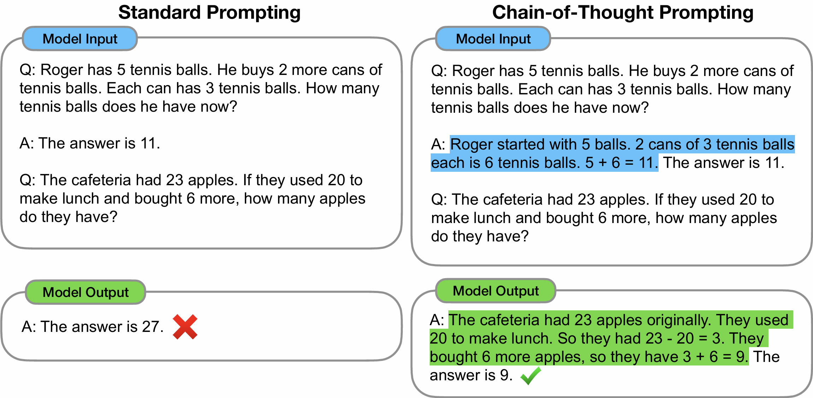
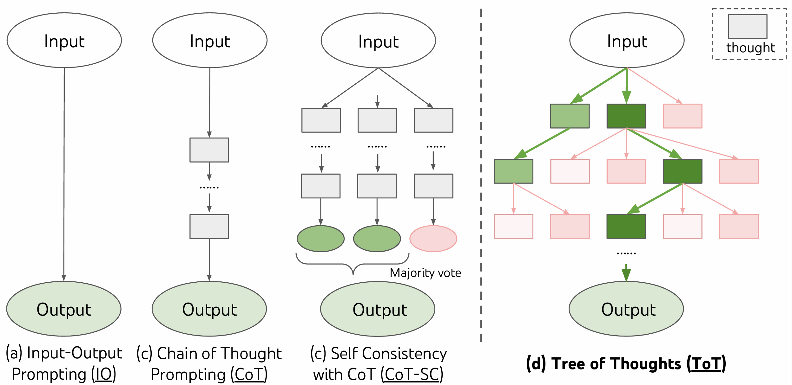
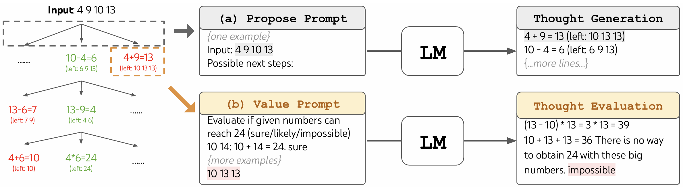
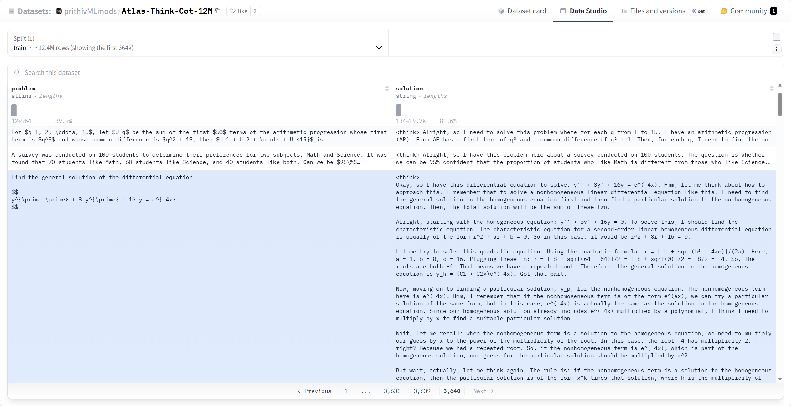

# 第四节 上下文学习与提示词技术

在学习 GPT 结构的过程中，我们提到过**上下文学习**以及它所包含的各种提示模式（Zero-shot、One-shot、Few-shot）。可以了解到，这是一种只需提供不同数量的参考示例，在推理阶段不发生任何梯度反向传播或权重更新，主要依靠提示词就能让大模型在许多任务上获得可观效果的交互范式。既然没有实际的学习更新过程，模型是如何做到这一点的？本节我们就深入探究它的工作机制，以及当遇到难度瓶颈时，如何利用提示词技术进一步激发模型的推理潜能。

## 一、零样本与少样本机制

### 1.1 零样本学习

**零样本学习（Zero-Shot Learning）**是指在提示词中仅提供任务指令和待处理的输入内容，而不提供任何预期输出的参考示例。大语言模型凭借预训练阶段积累的广博知识，直接对未见过的任务进行处理。以常见的情感分析任务为例，下面是在没有任何示例的情况下让模型判断文本情感倾向的典型设定：

```text
阅读以下评论，并判断一下评论表达的情感：

评论：这部电影的剧情有些拖沓。
情感：
```

如图 6-34 所示，我们在 DeepSeek 的网页端测试一下这个输入。可以看到在这个场景下，模型不只是机械地弹出一个分类标签，而是输出了一句完整的自然语言“评论表达的情感：负面。”，并且精准地给出了 `负面` 这个情感判断。之所以能够做到这一点，得益于模型在海量语料上预训练所建立的**共享语义空间**，预训练阶段模型不仅学习到了“电影”、“剧情”、“拖沓”等词汇的表征，还有这些词汇与“负面”情感概念在潜空间中的深层关联。当我们下达自然语言指令时，零样本学习在实践中往往还依赖于模型经过对齐微调后形成的指令遵循能力 [^1]。通过解析指令的意向，自回归生成机制会将当前的新任务映射到其已构建的底层语义概念上。这种基于先验知识的语义映射会直接影响模型预测下一个 token 时的**概率分布**。模型不仅能依次采样输出结构完整的句子，而且当生成到表达核心态度的那一步时，代表“负面”的 token 往往会因上下文的语义引导而获得更高的生成概率，进而在不更新任何权重的条件下完成任务。

<div align="center">
  
  <p>图 6-34 零样本学习示例</p>
</div>


### 1.2 少样本学习

尽管零样本学习展现出了强大的泛化能力，但这种能力高度依赖于数据中固有的常见模式。如果我们需要模型严格遵循某种特定的输出格式，或者处理一些边界模糊、容易混淆的复杂情况，仅仅依靠指令说明可能无法得到稳定可靠的结果，模型很多时候还会像零样本例子中那样，输出多余的解释性自然语言或产生判断偏差。这就必须引入具备“观摩”作用的**少样本学习（Few-Shot Learning）**，在上下文中补充几个规范的输入输出示例，向大模型清晰地演示预期效果。其中，**单样本学习（One-Shot Learning）**就是只给模型提供一个参考示例，相当于是少样本学习的特例。例如，为了让模型明白我们只需要单纯的极性词，可以给模型输入如下内容：

```text
阅读以下评论，并判断一下评论表达的情感：

评论：画面非常唯美，配乐也很震撼！
情感：正面

评论：这部电影的剧情有些拖沓。
情感：
```

如图 6-35，有了这个单样本的约束，模型的输出就变得非常干净。

<div align="center">
  
  <p>图 6-35 单样本学习示例</p>
</div>

单样本学习在大多数常规规范任务中表现良好，但是如果面临的任务比较复杂、反直觉或高度定制化时，它的效果就捉襟见肘了。比如，我们加上一条极其违背常规语言习惯的规则，将情感词倒序输出（“正面”输出“面正”，“负面”输出“面负”）：

```text
阅读以下评论，并判断一下评论表达的情感：

评论：画面非常唯美，配乐也很震撼！
情感：面正

评论：这部电影的剧情有些拖沓。
情感：
```

在这种非标准逻辑的冲击下，由于只看了一个反直觉的例子，模型往往无法确信这究竟是一次偶然的拼写错误，还是一条必须遵循的硬性规定。它可能会干脆放弃顺应你的规则。如图 6-36 所示，它不仅没有按照规则逆序输出，反而还补充了多余的对话文本。

<div align="center">
  
  <p>图 6-36 单样本反差约束失效示例</p>
</div>

要克服模型预训练阶段积累的语言先验，以及对齐微调阶段形成的固有对话范式对新规则的强烈干扰，让上下文构建的任务模式能够主导最终的输出概率，我们就需要增加示例的数量，用**少样本学习**来强化这种非标准的映射关系：

```text
阅读以下评论，并判断一下评论表达的情感：

评论：画面非常唯美，配乐也很震撼！
情感：面正

评论：演技太令人尴尬了，中途就想离场。
情感：面负

评论：一般般，没有预期的那么好看，但也不至于太差。
情感：性中

评论：这部电影的剧情有些拖沓。
情感：
```

有了这几个示例作为铺垫，如图 6-37 所示，模型捕捉到了隐藏的规则，判断出这不是单词拼错，而是要将情感分类词汇逆序输出。

<div align="center">
  
  <p>图 6-37 少样本反差约束成功示例</p>
</div>

少样本学习之所以有效，是因为它在上下文窗口中构建了一个临时的任务概率分布。受上下文连续多个一致性示例的驱动，模型的注意力机制能够较为敏锐地提炼并模仿这种有悖常理的映射关系，并将其更稳健地泛化到当前的目标输入上。这证明大语言模型不仅能回忆静态知识，还能实时地在复杂上下文中进行动态的全新模式匹配与学习。

### 1.3 上下文学习的内在机制

为了解释为什么在不更新任何权重的情况下，大语言模型依然能在提示词上下文中“学会”新任务，学术界近年来提出了几种主流的假设与验证机制：

（1）**感应头机制** [^2]：这是从模型内部注意力层面的机械可解释性角度提出的。研究发现，Transformer 模型在预训练的特定阶段会激发出一种特殊的注意力头——“感应头”。它的核心行为模式是“匹配并复制”，当模型在上下文中发现当前输入 `A` 此前出现过，它会将注意力回溯到前一个 `A`，并倾向于直接预测其后跟随的 Token `B` 作为当前的输出。这种底层的复制机制是**少样本学习**中模式匹配的重要微观基础之一。

（2）**隐式学习动力学（隐式权重更新）** [^3]：有研究从“前向计算本身就是一种学习过程”的角度解释上下文学习。在 Transformer block 内，自注意力会把上下文中的示例信息写入激活，再与后续的 MLP 组合，可近似理解为产生一种对后续计算起作用的低秩“权重更新/适配”效应。这个过程无需显式反向传播或持久化的权重改动，但会以瞬时激活的形式影响后续 token 的 logits，从而动态改变输出分布。

（3）**（近似）贝叶斯视角与其检验** [^4][^5]：有一类工作把上下文学习理解为“在上下文中对潜在任务/潜变量做（近似）推断”的过程，用先验—后验来解释零样本与少样本的差异；也有研究提出可操作的统计检验，并在其实验设置下观察到 LLM 的上下文学习会偏离严格的贝叶斯性质。总体而言，贝叶斯更像是一类有启发性的解释框架，而非已被普遍证明的严格等价。

这三大理论从微观执行（注意力单元复制）、中观适配（隐式权重更新）到宏观统计（概率推断），共同揭示了现代大语言模型强大泛化能力的底层本质。

## 二、进阶提示词技术

随着对大语言模型潜力挖掘的深入，如图 6-38 研究人员发现仅靠简单的示例有时仍然无法解决需要多步复杂逻辑推理的数学或算法规划问题。为此，提示词工程领域发展出了更高级的引导策略。

<div align="center">
  
  <p>图 6-38 标准提示词与思维链（CoT）的效果对比</p>
</div>

### 2.1 思维链

**思维链（Chain-of-Thought, CoT）** 技术 [^6] 鼓励模型在给出最终答案之前，先显式地输出中间的推理步骤。这种方法不仅客观上增加了生成过程的计算步数，让模型获得了更多的“思考时间”，而且将一个复杂的大问题拆解成了多个简单连贯的小逻辑节点。在应用层面上，这项技术经历了一条清晰且快速的演进路线。最初的研究提出了需要手动编写详尽推理示例的**多样本思维链（Few-Shot CoT）**。随后，研究人员观察到在一些模型与任务上，在提示词末尾添加一句“Let's think step by step”也可能显著提升推理过程的显式展开，也就是常说的**零样本思维链（Zero-Shot CoT）**。后续，学术界又提出了尝试让大模型自动化构建推理示例的**自动思维链（Auto-CoT）** [^7]。对于基础大模型，我们可以用一个非常直观的零样本测试样例去感受思维链被激活的过程。例如向模型抛出一道暗含生活常识与逻辑陷阱的问题：

```text
我想洗车，洗车店离我家 50 米。我应该开车去还是走路去？
```

如图 6-39 所示，未经过深层推理特化的大模型往往会被表面的“距离近应该走路”逻辑误导，给出一个“抽象”的建议。

<div align="center">
  
  <p>图 6-39 缺乏深层推理时的逻辑错误示例</p>
</div>

如果我们尝试在提示词末尾加上要求逐步思考的“魔法咒语”，会发现一个有意思的情况。

```text
我想洗车，洗车店离我家 50 米。我应该开车去还是走路去？让我们一步一步地思考
```

如图 6-40 所示，模型虽然列出了“一步步”的分析框架，但在关键逻辑上依然出现了严重的幻觉（在第 3 点中假设人走过去车就在那里），最后给出“走路去”的错误结论。

<div align="center">
  
  <p>图 6-40 中文 CoT 引导失败示例</p>
</div>

但如果我们换用英文最经典的 CoT 触发词：

```text
我想洗车，洗车店离我家 50 米。我应该开车去还是走路去？Let's think step by step
```

这一次模型如图 6-41 成功发现了盲点。它准确推理出“如果走路去，车还在家里，所以没法洗车”，得出“you should drive”的正解。

<div align="center">
  
  <p>图 6-41 英文 CoT 引导成功示例</p>
</div>

> 仅仅是中英文提示词的差异，为什么会导致截然不同的逻辑推理结果？
>
> 这在一定程度上反映出基础大语言模型的多语言推理能力可能存在分布不均衡。在模型的预训练阶段，包含严密逻辑推导的高质量数据（如数学解答、编程逻辑、学术论文等）在英文语料中往往更常见、积累时间更长，也更容易在早期训练中形成相对稳健的推理模式。同时，诸如“Let's think step by step”这类高频的经典触发短语，可能在部分微调和评测数据集中反复出现，更容易在一些模型上引导出“显式分步推导”的生成模式。而且，如图 6-41 所示，在使用英文触发词后，模型不仅算对了答案，后续的整个推导过程也全都变为了英文。对这种现象，比较合理的猜测是在该模型的训练数据与对齐策略下，英文触发短语更容易让模型调动到其较强的推理习惯与表达模板。相比之下，中文直译版本在某些模型上可能只强化了“分点作答”的外观格式，而未必稳定触发有效的自我校验。本质上，通过显式要求生成中间推导步骤，并提供更容易引导分步推导的提示方式，模型会把前文生成的中间结果当作延伸的“草稿纸”，继续引导下一步的文本生成，在一定程度上缓解“直觉短路”带来的局部逻辑盲区。

思维链技术的生效归根结底仍然高度依赖于底层训练数据。常规模型只有在预训练阶段见过海量的推理论证逻辑，才更可能在推理阶段被某些提示方式稳定引导出分步推导。随着业界对大模型复杂推理能力的追求，最新一代的专用推理模型（如 OpenAI o1、DeepSeek-R1 等）在产品形态上也更强调“先推导、后作答”。这类模型在预训练之后，通常还会结合强化学习等后训练方法，并配合高质量样本对输出行为进行规范化，从而让模型在面对复杂或充满陷阱的问题时，更倾向于在内部展开更充分的自我检查与多步推演。

### 2.2 思维树

在线性、单向的思维链基础上，研究人员进一步提出了**思维树（Tree of Thoughts, ToT）** 框架 [^8]。对于更具挑战性、需要全局规划或容易陷入逻辑死胡同的任务（如算 24 点、填字游戏或规划调度），单向单线的 CoT 很可能有去无回——中间某一步哪怕只犯了微小的评估错误，就会使得推理陷入**局部最优**，导致最终结果全盘皆输。如图 6-42 所示，思维树将线性的推理链条扩展成了具有多个分支的树状拓扑结构。它的核心理念可以总结为“**系统性多路径探索 + 智能评估 + 回溯机制**”。它允许模型在推理过程中像树枝一样展开多个可能的探索分支，并交替执行以下环节：
- **生成候选**：在当前步骤生成多种可能的下一步解法方向。
- **状态评估**：由模型自身作为“智能裁判”，对各个候选路径的后续成功潜力进行打分排查。
- **选择与回溯**：借助经典的搜索算法（如**广度优先搜索 BFS** 或**深度优先搜索 DFS**），根据评分选择最优路径继续深入。一旦发现某条路径走进了“死胡同”，立刻向后回溯到上一个安全节点并尝试其他选项。

<div align="center">
  
  <p>图 6-42 从 IO、CoT 到思维树（ToT）的提示词范式演进</p>
</div>

我们可以继续用前文探讨的“**洗车问题**”来做一个极简的推演。面对“应该开车去还是走路去洗车”的决策，ToT 会首先要求模型生成第一步所有可能的行动候选分支（如 `分支 A：开车去` 或 `分支 B：走路去`）。接着，它触发状态评估机制，判断这些分支能否真正达成“洗车”的目的。例如，走入 `分支 B：走路去` 时，评估模型会判断出“如果人走过去了，车却留在了家里，没有车可以洗”。于是，系统会抛弃这条无效路径，向后回溯并选择另外一个候选分支（`分支 A：开车去`）。当然，洗车只是一个用于演示的简单示例。如图 6-43 所示，在应对“算 24 点”这类搜索空间庞大的复杂任务时，ToT 基于状态评分与剪枝回溯的探索机制才能体现出实际的工程价值。

<div align="center">
  
  <p>图 6-43 思维树（ToT）在“算 24 点”游戏中的执行过程</p>
</div>

这种将经典启发式搜索算法与大模型实时评估能力融合的框架具有创新性。但是在工程落地时，开发者也必须清醒认识到实际应用中的弊端。首先是**算力成本的急剧膨胀**，每一次分支探索和智能审查都需要密集消耗推理资源和等待时间。其次是**自我评估偏差**，完全依赖模型自身进行裁判很容易产生认知盲点。最后则是随时可能因为迭代轮次过多而导致的**搜索空间爆炸**。**ToT 只是一种算法思想，它并不强制要求绑定复杂的智能体（AI Agent）框架才能运行**。开发者完全可以通过编写原生的 Python 脚本（利用数组维护树节点、使用 while 循环进行 BFS/DFS 搜索、通过 API 调用大模型进行打分）来实现一套轻量级的 ToT 推理链路。只因为这种多步规划与自省的机制与自主智能体的诉求高度契合，ToT 目前才更多地被提炼为一种宏观规划模块，融入到了现代复杂 Agent 的底层架构之中，而不是作为一种日常单次对话中最常用的提示词技巧。

### 2.3 专用推理模型

前文提到的诸如 OpenAI o1 或 DeepSeek-R1 等**专用推理模型**，标志着大模型**底层能力维度的范式进化**。为了实现“将探索、试错与自省的推导能力更充分地内化于基座权重”，这些新型模型在训练阶段经历了范式的转变。以 DeepSeek-R1 为例，实现这一跨越的核心机制通常涉及多个阶段的后训练组合。其中往往包含**强化学习主导**的阶段：在基础预训练之后，模型不再单纯依赖传统的人类偏好对齐，还会通过大规模的强化学习提升逻辑推导能力。在数学求解或代码生成等具有明确结果反馈的场景中，系统基于规则的奖励机制引导模型自我探索，促使模型更愿意延长推导链条以换取更高奖励，形成更强的自我校验与纠错倾向。同时，也常会配合**监督微调**的阶段，通过整理、过滤与构建高质量样本，进一步稳定模型长序列推理的输出风格与可读性，如图 6-44 展示了这类用于微调的数据集示例。

<div align="center">
  
  <p>图 6-44 推理数据集示例</p>
</div>

结合上述机制，专用推理模型在接收到复杂用户请求时，往往会在输出答案前自动展开更长的推导过程（耗时会持续数秒到数分钟不等）。从外部可观察到的效果是模型更倾向于进行自我检查、反思与多步推演。至于内部是否采用显式的树状展开、剪枝与回溯等实现形式，则可能因模型与系统实现而异。如图 6-45，我们使用 DeepSeek 的推理模型对“洗车问题”进行测试，可以看到它的思考内核经历了“评估走路（距离近）、发现盲点（车没带过去）、尝试发散解决（让人把车开过去但麻烦）、最终收敛（必须开车去）”的自省链条。

<div align="center">
  
  <p>图 6-45 推理模型应对“洗车问题”时的后台推导轨迹</p>
</div>

不过，在带来更好推理效果的同时，这类模型也伴随显著的代价，首当其冲的便是**推理期算力开销的成倍增加**以及**首字响应延迟的延长**。所以，对于日常问答、常规翻译或直接的信息检索等无需长逻辑链条干预的基础级任务，调用满血的推理模型会造成高强度的资源浪费。在实际的系统工程架构设计中，通常需要引入路由网关模块来实现不同复杂度的任务级动态分发，比如将常规类任务调度给基础生成模型，而将复杂多步规划任务路由给推理模型，以平衡生成质量与计算成本。

---

## 参考文献

[^1]: [Ouyang, L., Wu, J., Jiang, X., et al. (2022). *Training language models to follow instructions with human feedback*.](https://arxiv.org/abs/2203.02155)

[^2]: [Ren, J., Guo, Q., Yan, H., et al. (2024). *Identifying Semantic Induction Heads to Understand In-Context Learning*.](https://arxiv.org/abs/2402.13055)

[^3]: [Dherin, B., Munn, M., Mazzawi, H., et al. (2025). *Learning without training: The implicit dynamics of in-context learning*.](https://arxiv.org/abs/2507.16003)

[^4]: [Xie, S. M., Raghunathan, A., Liang, P., & Ma, T. (2021). *An Explanation of In-context Learning as Implicit Bayesian Inference*.](https://arxiv.org/abs/2111.02080)

[^5]: [Falck, F., Wang, Z., & Holmes, C. (2024). *Is In-Context Learning in Large Language Models Bayesian? A Martingale Perspective*.](https://arxiv.org/abs/2406.00793)

[^6]: [Wei, J., Wang, X., Schuurmans, C., et al. (2022). *Chain-of-Thought Prompting Elicits Reasoning in Large Language Models*.](https://arxiv.org/abs/2201.11903)

[^7]: [Zhang, Z., Zhang, A., Li, M., et al. (2022). *Automatic Chain of Thought Prompting in Large Language Models*.](https://arxiv.org/abs/2210.03493)

[^8]: [Yao, S., Yu, D., Zhao, J., et al. (2023). *Tree of Thoughts: Deliberate Problem Solving with Large Language Models*.](https://arxiv.org/abs/2305.10601)