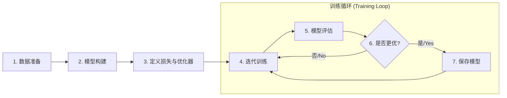

# 第一节 文本分类简单实现

## 一、文本分类任务概述

文本分类是 NLP 中常见的任务之一，它的目标是将给定的文本自动分配到一个或多个预定义的类别中。这项技术的实际应用广泛，例如**情感分析**可以判断商品评价或电影评论的情感倾向是正面、负面还是中性；**新闻分类**能够将新闻报道自动归入体育、财经、科技或娱乐等不同频道；在智能客服或语音助手中，**意图识别**技术用于判断用户输入的指令属于查询天气还是播放音乐等特定意图；而**垃圾邮件过滤**则能自动识别并拦截收件箱中的垃圾邮件，净化沟通环境。

在理论篇的**第二章**中，我们已经学习了如何将文本进行分词，并通过词向量技术将其转换为模型可以理解的数值形式。本节将在此基础上，以一个经典的新闻分类任务为例，详细讲解如何从零开始，一步步构建、训练和评估一个用于文本分类的深度学习模型。这个过程将涵盖数据处理、模型设计、训练循环、推理预测等所有核心环节。

## 二、NLP 项目通用流程

无论是文本分类，还是其他更复杂的 NLP 任务，深度学习的解决方案通常遵循一个标准化的项目流程。可以概括为以下几个核心模块：



这个流程是搭建深度学习应用的通用范式，是一套标准化、可复用的模板。理解并掌握这套流程，比单纯实现某个模型更为重要。在接下来的内容中，我们将按照这个流程，将各个模块封装成独立的类，构建一个更规范、更易于维护和扩展的项目。

## 三、新闻文本分类代码实践

> [本节完整代码](https://github.com/datawhalechina/base-nlp/blob/main/code/C7/01_text_classification.ipynb)

本节将使用 `scikit-learn` 库中的 `20 Newsgroups` 数据集，这是一个包含约20000篇新闻文档、近似均衡分布在20个不同新闻组（类别）的集合。

### 3.1 模块化设计思路

在开始编写具体代码之前，更重要的步骤是“设计”。一个原则是，要先想清楚每个模块的输入和输出是什么。

- **数据模块的输出是什么？** -> 模型需要的“词元ID序列” (`token_ids`) 张量和“标签ID” (`label_ids`) 张量。
- **模型的输入是什么？** -> 数据模块的输出。
- **模型的输出是什么？** -> 每个类别的置信度。

> **如果对数据处理感到困惑，不妨先从模型定义开始**。一旦我们清晰地定义了模型 `forward` 函数需要的输入（例如，ID序列），数据处理阶段的目标就变得很明确了，只需要把原始文本处理成模型所需的格式。

### 3.2 步骤一：数据解析与加载

#### 3.2.1 数据加载

首先，加载`scikit-learn`提供的原始数据集。

```python
from sklearn.datasets import fetch_20newsgroups

# 为了方便演示，只选择4个类别
categories = ['alt.atheism', 'soc.religion.christian', 'comp.graphics', 'sci.med']
train_dataset_raw = fetch_20newsgroups(subset='train', categories=categories, shuffle=True, random_state=42)
test_dataset_raw = fetch_20newsgroups(subset='test', categories=categories, shuffle=True, random_state=42)

sample = {
    "text_preview": train_dataset_raw.data[0][:200],
    "label": train_dataset_raw.target_names[train_dataset_raw.target[0]],
}
sample
```

输出如下：
```bash
{'text_preview': 'From: sd345@city.ac.uk (Michael Collier)\nSubject: Converting images to HP LaserJet III?\nNntp-Posting-Host: hampton\nOrganization: The City University\nLines: 14\n\nDoes anyone know of a good way (standard',
 'label': 'comp.graphics'}
```

#### 3.2.2 数据探索与可视化

在进行任何复杂的预处理之前，对数据进行探索性分析是很重要且必要的。这有助于我们理解数据特性，从而做出更合理的设计决策。

（1）**文本长度分布：**

```python
import matplotlib.pyplot as plt
import re

# 为了进行探索，先定义一个简单的分词函数
def basic_tokenize(text):
    text = text.lower()
    text = re.sub(r"[^a-z0-9(),.!?\\'`]", " ", text)
    text = re.sub(r"([,.!?\\'`])", r" \\1 ", text)
    tokens = text.strip().split()
    return tokens

# 计算每篇文档的词元数量
train_text_lengths = [len(basic_tokenize(text)) for text in train_dataset_raw.data]

plt.figure(figsize=(10, 6))
plt.hist(train_text_lengths, bins=50, alpha=0.7, color='blue')
plt.title('Distribution of Text Lengths in Training Data')
plt.xlabel('Number of Tokens')
plt.ylabel('Frequency')
plt.grid(True)
plt.show()
```

<p align="center">
  
  <br />
  <em>图 7-1 训练集文本长度分布</em>
</p>

（2）**词频分布：**

```python
from collections import Counter
import numpy as np

# 计算所有词元的频率
word_counts = Counter()
for text in train_dataset_raw.data:
    word_counts.update(basic_tokenize(text))

# 获取频率并按降序排序
frequencies = sorted(word_counts.values(), reverse=True)
# 生成排名
ranks = np.arange(1, len(frequencies) + 1)

# 绘制对数坐标图
plt.figure(figsize=(10, 6))
plt.loglog(ranks, frequencies)
plt.title('Rank vs. Frequency (Log-Log Scale)')
plt.xlabel('Rank (Log)')
plt.ylabel('Frequency (Log)')
plt.grid(True)
plt.show()
```

<p align="center">
  
  <br />
  <em>图 7-2 词频-排名对数图</em>
</p>

通过**数据分析**可以发现，图 7-1 的文本长度分布直方图显示大部分文本的长度集中在较短的区间，但仍存在少量长度非常长的“异常值”，说明简单的直接截断策略可能会丢失过多信息。除此之外，如图 7-2 的对数坐标图所示，词频分布呈现出自然语言中典型的齐夫定律（Zipf's Law）现象，即少数高频词占据了绝大多数的出现次数，而大量词汇构成了长长的“尾巴”，其出现频率极低。

#### 3.2.3 Tokenizer 封装

接下来，我们创建一个 `Tokenizer`（分词器）类来负责所有与分词、词典构建和 ID 转换相关的任务，它封装了与数据探索时相同的分词逻辑并增加了 ID 转换等功能。其中 `_tokenize_text` 方法实现了一套基于正则表达式的分词策略，先将文本转为小写，通过 `re.sub` 移除非字母、数字和基本标点之外的字符，为了确保标点符号能被作为独立的词元，在它们周围添加空格，最后按空格切分文本得到词元列表。在词典构建方面，通过遍历所有训练文本统计词频，并过滤掉出现次数过少的低频词以减少词典规模和噪声，同时词典初始化时会预设两个特殊的 Token，即用于填充的 `<PAD>`（ID 为 0）和用于表示未登录词的 `<UNK>`（ID 为 1）。

```python
class Tokenizer:
    def __init__(self, vocab):
        self.vocab = vocab
        self.token_to_id = {token: idx for token, idx in self.vocab.items()}

    @staticmethod
    def _tokenize_text(text):
        text = text.lower()
        text = re.sub(r"[^a-z0-9(),.!?\\'`]", " ", text)
        text = re.sub(r"([,.!?\\'`])", r" \\1 ", text)
        tokens = text.strip().split()
        return tokens

    def convert_tokens_to_ids(self, tokens):
        return [self.token_to_id.get(token, self.vocab["<UNK>"]) for token in tokens]

    def tokenize(self, text):
        return self._tokenize_text(text)
    
    def __len__(self):
        return len(self.vocab)

```

#### 3.2.4 Tokenizer 与词典构建

基于前面对数据的分析，现在可以正式构建词典和 `Tokenizer`。词典将只包含在训练集中出现超过 `min_freq` 次的词元。

```python
def build_vocab_from_counts(word_counts, min_freq=5):
    vocab = {"<PAD>": 0, "<UNK>": 1}
    for word, count in word_counts.items():
        if count >= min_freq:
            vocab[word] = len(vocab)
    return vocab

# 使用上一步计算出的word_counts来构建词典
vocab = build_vocab_from_counts(word_counts, min_freq=5)
tokenizer = Tokenizer(vocab)

{"vocab_size": len(tokenizer)}
```

输出如下：
```bash
{'vocab_size': 10983}
```

#### 3.2.5 如何处理长文本？

在数据探索中能够发现，`20 Newsgroups` 数据集中存在大量超长文本，有的甚至超过1万个词元。而大部分深度学习模型（尤其是非 Transformer 模型）都难以处理过长的序列，直接输入会导致内存溢出和计算效率低下。而简单的截断会丢失大量文本末尾的信息，可能会导致关键信息丢失。

一个更好的方法是将一篇长文档切分成多个固定长度、且有部分重叠的“文本块”（Chunks）。例如，一篇 1000 词的文档若按 `max_len=128`、`overlap=26` 的方式进行切分，此时第一个块会包含 `words[0:128]`，第二个块则顺延为 `words[102:230]`（`128-26=102`），并以此类推完成整个文档的切分。这样做有两大好处，一方面通过**信息保全**完整地利用了整篇文章的信息；另一方面则带来了**数据增强**的效果，将一篇长文档变成了多条训练样本，增加了训练数据量。

#### 3.2.6 封装 `Dataset` 和 `DataLoader`

`TextClassificationDataset` 负责的核心逻辑是接收原始文本，调用 `tokenizer` 进行 ID 化，并应用 **滑窗分割** 策略处理长文本。如果文本超过 `max_len`，则会进行切分。代码中的 `stride` 被设置为 `max_len` 的 80%，意味着每个文本块之间有20%的重叠，这有助于保持上下文信息的连续性。

```python
import torch
import torch.nn as nn
from torch.utils.data import Dataset
from tqdm import tqdm

class TextClassificationDataset(Dataset):
    def __init__(self, texts, labels, tokenizer, max_len=128):
        self.tokenizer = tokenizer
        self.max_len = max_len
        self.processed_data = []

        for text, label in tqdm(zip(texts, labels), total=len(labels)):
            token_ids = self.tokenizer.convert_tokens_to_ids(self.tokenizer.tokenize(text))
            
            # 滑窗分割逻辑
            if len(token_ids) <= self.max_len:
                self.processed_data.append({"token_ids": token_ids, "label": label})
            else:
                stride = max(1, int(self.max_len * 0.8))
                for i in range(0, len(token_ids) - self.max_len + 1, stride):
                    chunk = token_ids[i:i+self.max_len]
                    self.processed_data.append({"token_ids": chunk, "label": label})
    
    def __len__(self):
        return len(self.processed_data)

    def __getitem__(self, idx):
        return self.processed_data[idx]
```

接着，定义 `collate_fn` 函数，它负责将一个批次内长短不一的样本，通过 **填充** 操作（使用 `<PAD>` 对应的ID `0`），打包成形状规整的张量，以便模型进行批处理。

```python
def collate_fn(batch):
    max_batch_len = max(len(item["token_ids"]) for item in batch)
    
    batch_token_ids, batch_labels = [], []

    for item in batch:
        token_ids = item["token_ids"]
        padding_len = max_batch_len - len(token_ids)
        
        padded_ids = token_ids + [0] * padding_len
        batch_token_ids.append(padded_ids)
        batch_labels.append(item["label"])
        
    return {
        "token_ids": torch.tensor(batch_token_ids, dtype=torch.long),
        "labels": torch.tensor(batch_labels, dtype=torch.long),
    }
```

使用我们创建的 `Dataset` 和 `collate_fn` 来实例化训练和验证数据加载器 `DataLoader`：

```python
from torch.utils.data import DataLoader

train_dataset = TextClassificationDataset(train_dataset_raw.data, train_dataset_raw.target, tokenizer)
train_loader = DataLoader(train_dataset, batch_size=32, shuffle=True, collate_fn=collate_fn)

valid_dataset = TextClassificationDataset(test_dataset_raw.data, test_dataset_raw.target, tokenizer)
valid_loader = DataLoader(valid_dataset, batch_size=32, collate_fn=collate_fn)

{"train_samples": len(train_dataset), "valid_samples": len(valid_dataset), "batch_size": 32}
```

输出如下：
```bash
{'train_samples': 7142, 'valid_samples': 5408, 'batch_size': 32}
```

### 3.3 步骤二：模型构建

#### 3.3.1 模型结构设计

在编写模型代码前，先梳理清楚数据的“变形记”，也就是张量形状在网络中如何变化：

```
Input:
 token_ids (词元ID序列): [batch_size, seq_len]
     |
     V
nn.Embedding(padding_idx=0)
     |
     V
 embedded: [batch_size, seq_len, embed_dim]
     |
     V
nn.Linear(embed_dim, hidden_dim*2) -> nn.ReLU -> nn.Linear(hidden_dim*2, hidden_dim*4) -> nn.ReLU
     |
     V
 token_features: [batch_size, seq_len, hidden_dim*4]
     |
     V
Masked Average Pooling (关键操作)
     |
     V
 pooled_features: [batch_size, hidden_dim*4]  <-- seq_len维度被聚合掉了
     |
     V
nn.Linear (分类层)
     |
     V
Output:
 logits: [batch_size, num_classes]
```

#### 3.3.2 掩码平均池化

池化（Pooling）的目的是将一个序列的特征（`[seq_len, hidden_dim]`）聚合成一个代表整条序列的向量（`[hidden_dim]`），但简单的平均池化会受到填充 `<PAD>` 的影响从而导致语义偏差。举例来说，假设一个批次有 2 个句子且最大长度为 4，其中句子 A 的真实长度为 4（表示为 `[v_I, v_love, v_NLP, v_too]`），而句子 B 的真实长度为 2（表示为 `[v_NLP, v_rocks, v_PAD, v_PAD]`）。掩码池化的计算过程如下：

（1）**创建掩码**：`mask = [[1, 1, 1, 1], [1, 1, 0, 0]]`

（2）**向量置零**：将句子 B 中 `<PAD>` 对应的向量 `v_PAD` 乘以 0，使其变为零向量。

（3）**向量求和**：句子 A 求和得到 `sum_A = v_I + v_love + v_NLP + v_too`；句子 B 求和得到 `sum_B = v_NLP + v_rocks + 0 + 0`。

（4）**除以真实长度**：句子 A 除以 4 得到 `pool_A = sum_A / 4`；句子 B 除以 2 得到 `pool_B = sum_B / 2`。

通过这种方式就得到了不受填充影响的、精确的句子平均向量。而在 `forward` 方法中，这个过程大致包含四个步骤。首先是**创建掩码**，即根据输入的词元 ID 序列（`token_ids`）中不等于 `padding_idx` 的位置，生成一个值为 0 或 1 的掩码张量；紧接着进行**向量置零**，利用广播机制将特征向量与掩码相乘，使所有填充位置的特征向量都会变为零向量；随后**向量求和**，沿序列长度维度对特征向量进行求和；最后**除以真实长度**，将求和结果除以每个样本的真实长度（即掩码中 1 的数量），得到最终的池化向量。

#### 3.3.3 模型代码

根据上述分析，下面是 `TextClassifier` 模型的完整实现：

```python
class TextClassifier(nn.Module):
    def __init__(self, vocab_size, embed_dim, hidden_dim, num_classes):
        super(TextClassifier, self).__init__()
        self.embedding = nn.Embedding(vocab_size, embed_dim, padding_idx=0)
        
        self.feature_extractor = nn.Sequential(
            nn.Linear(embed_dim, hidden_dim * 2),
            nn.ReLU(),
            nn.Linear(hidden_dim * 2, hidden_dim * 4),
            nn.ReLU()
        )
        
        self.classifier = nn.Linear(hidden_dim * 4, num_classes)
        
    def forward(self, token_ids):
        embedded = self.embedding(token_ids)
        token_features = self.feature_extractor(embedded)
        
        # shapes:
        # token_ids: [batch_size, seq_len]
        # embedded: [batch_size, seq_len, embed_dim]
        # token_features: [batch_size, seq_len, hidden_dim * 4]
        # padding_mask: [batch_size, seq_len]
        # masked_features: [batch_size, seq_len, hidden_dim * 4]
        # summed_features: [batch_size, hidden_dim * 4]
        # pooled_features: [batch_size, hidden_dim * 4]
        # logits: [batch_size, num_classes]
        
        # --- 掩码平均池化 ---
        padding_mask = (token_ids != self.embedding.padding_idx).float()
        masked_features = token_features * padding_mask.unsqueeze(-1)
        summed_features = torch.sum(masked_features, 1)
        real_lengths = padding_mask.sum(1, keepdim=True)
        pooled_features = summed_features / torch.clamp(real_lengths, min=1e-9)
        
        logits = self.classifier(pooled_features)
        
        return logits
```

### 3.4 步骤三：训练与评估

将所有与训练、评估、优化和模型保存相关的逻辑都封装到一个`Trainer`类中。这个类负责协调模型、数据和优化器，完成整个训练流程。

```python
import os
import json

class Trainer:
    def __init__(self, model, optimizer, criterion, train_loader, valid_loader, device, output_dir="."):
        self.model = model
        self.optimizer = optimizer
        self.criterion = criterion
        self.train_loader = train_loader
        self.valid_loader = valid_loader
        self.device = device
        self.best_accuracy = 0.0
        self.output_dir = output_dir
        os.makedirs(self.output_dir, exist_ok=True)
        # 用于记录历史数据
        self.train_losses = []
        self.val_accuracies = []

    def _run_epoch(self, epoch):
        self.model.train()
        total_loss = 0
        for batch in tqdm(self.train_loader, desc=f"Epoch {epoch+1} [训练中]"):
            self.optimizer.zero_grad()
            
            token_ids = batch["token_ids"].to(self.device)
            labels = batch["labels"].to(self.device)
            
            outputs = self.model(token_ids)
            loss = self.criterion(outputs, labels)
            total_loss += loss.item()
            
            loss.backward()
            self.optimizer.step()
        
        return total_loss / len(self.train_loader)

    def _evaluate(self, epoch):
        self.model.eval()
        correct_preds = 0
        total_samples = 0
        with torch.no_grad():
            for batch in tqdm(self.valid_loader, desc=f"Epoch {epoch+1} [评估中]"):
                token_ids = batch["token_ids"].to(self.device)
                labels = batch["labels"].to(self.device)
                
                outputs = self.model(token_ids)
                _, predicted = torch.max(outputs, 1)
                
                total_samples += labels.size(0)
                correct_preds += (predicted == labels).sum().item()
        
        return correct_preds / total_samples

    def _save_checkpoint(self, epoch, val_accuracy):
        if val_accuracy > self.best_accuracy:
            self.best_accuracy = val_accuracy
            save_path = os.path.join(self.output_dir, "best_model.pth")
            torch.save(self.model.state_dict(), save_path)
            print(f"新最佳模型已保存! Epoch: {epoch+1}, 验证集准确率: {val_accuracy:.4f}")

    def train(self, epochs, tokenizer, label_map):
        self.train_losses = []
        self.val_accuracies = []
        for epoch in range(epochs):
            avg_loss = self._run_epoch(epoch)
            val_accuracy = self._evaluate(epoch)
            
            self.train_losses.append(avg_loss)
            self.val_accuracies.append(val_accuracy)

            print(f"Epoch {epoch+1}/{epochs} | 训练损失: {avg_loss:.4f} | 验证集准确率: {val_accuracy:.4f}")
            
            self._save_checkpoint(epoch, val_accuracy)
        
        print("训练完成！")
        # 训练结束后，保存最终的词典和标签映射
        vocab_path = os.path.join(self.output_dir, 'vocab.json')
        with open(vocab_path, 'w', encoding='utf-8') as f:
           json.dump(tokenizer.vocab, f, ensure_ascii=False, indent=4)
           
        labels_path = os.path.join(self.output_dir, 'label_map.json')
        with open(labels_path, 'w', encoding='utf-8') as f:
           json.dump(label_map, f, ensure_ascii=False, indent=4)
        print(f"词典 ({vocab_path}) 和标签映射 ({labels_path}) 已保存。")
        return self.train_losses, self.val_accuracies
```

### 3.5 步骤四：执行训练

通过前面的精心封装，现在执行训练的入口代码变得非常直观和简洁。我们先定义一个超参数字典 `hparams` 来集中管理所有配置，这是一种良好的工程实践。然后，只需实例化所有需要的“零件”，并将它们交给“训练总管” `Trainer` 即可。

```python
# 超参数
hparams = {
    "vocab_size": len(tokenizer),
    "embed_dim": 128,
    "hidden_dim": 256,
    "num_classes": len(train_dataset_raw.target_names),
    "epochs": 20,
    "learning_rate": 0.001,
    "device": "cuda" if torch.cuda.is_available() else "cpu",
    "output_dir": "output"
}

# 实例化
model = TextClassifier(
    hparams["vocab_size"], 
    hparams["embed_dim"], 
    hparams["hidden_dim"], 
    hparams["num_classes"]
).to(hparams["device"])

criterion = nn.CrossEntropyLoss()
optimizer = torch.optim.Adam(model.parameters(), lr=hparams["learning_rate"])

hparams
```

然后，我们使用这些超参数来实例化模型、损失函数、优化器，并将它们全部交给 `Trainer` 类进行管理。

```python
trainer = Trainer(
    model, 
    optimizer, 
    criterion, 
    train_loader, 
    valid_loader, 
    hparams["device"], 
    output_dir=hparams["output_dir"]
)

# 创建 标签名 -> ID 的映射，并传入 trainer 以便保存
label_map = {name: i for i, name in enumerate(train_dataset_raw.target_names)}

# 开始训练，并接收返回的历史数据
train_losses, val_accuracies = trainer.train(epochs=hparams["epochs"], tokenizer=tokenizer, label_map=label_map)
```

输出如下：
```bash
...
Epoch 14 [训练中]: 100%|██████████| 224/224 [00:00<00:00, 314.05it/s]
Epoch 14 [评估中]: 100%|██████████| 169/169 [00:00<00:00, 788.40it/s]
Epoch 14/20 | 训练损失: 0.0003 | 验证集准确率: 0.8469
...
Epoch 19 [训练中]: 100%|██████████| 224/224 [00:00<00:00, 326.07it/s]
Epoch 19 [评估中]: 100%|██████████| 169/169 [00:00<00:00, 786.61it/s]
Epoch 19/20 | 训练损失: 0.0001 | 验证集准确率: 0.8450
Epoch 20 [训练中]: 100%|██████████| 224/224 [00:00<00:00, 324.01it/s]
Epoch 20 [评估中]: 100%|██████████| 169/169 [00:00<00:00, 792.40it/s]
Epoch 20/20 | 训练损失: 0.0001 | 验证集准确率: 0.8443
训练完成！
词典 (output\vocab.json) 和标签映射 (output\label_map.json) 已保存。
```

在本次训练中，模型于第14个轮次（Epoch）达到了最佳性能，验证集准确率最高为 **84.69%**。由于代码并未固定随机数种子，模型初始权重和数据加载顺序在每次运行时都会有所不同，所以每次运行时得到的结果可能会有细微差异。

#### 3.5.1 训练过程可视化

为了更直观地分析模型的训练过程，例如判断是否收敛、是否存在过拟合等，可以将每个周期的训练损失和验证集准确率绘制成图表。

```python
def plot_history(train_losses, val_accuracies, title_prefix=""):
    epochs = range(1, len(train_losses) + 1)
    
    fig, (ax1, ax2) = plt.subplots(1, 2, figsize=(15, 5))
    
    # 绘制训练损失曲线
    ax1.plot(epochs, train_losses, 'bo-', label='Training Loss')
    ax1.set_title(f'{title_prefix} Training Loss')
    ax1.set_xlabel('Epochs')
    ax1.set_ylabel('Loss')
    ax1.grid(True)
    ax1.legend()
    
    # 绘制验证集准确率曲线
    ax2.plot(epochs, val_accuracies, 'ro-', label='Validation Accuracy')
    ax2.set_title(f'{title_prefix} Validation Accuracy')
    ax2.set_xlabel('Epochs')
    ax2.set_ylabel('Accuracy')
    ax2.grid(True)
    ax2.legend()
    
    plt.suptitle(f'{title_prefix} Training and Validation Metrics', fontsize=16)
    plt.show()

# 调用绘图函数
plot_history(train_losses, val_accuracies, title_prefix="Feed-Forward Network")
```

<p align="center">
  
  <br />
  <em>图 7-3 训练损失与验证集准确率变化曲线</em>
</p>

从图 7-3 中能够看出：
- **训练损失**：随着训练的进行，损失稳步下降并趋于平缓，说明模型在训练数据上得到了有效的学习。
- **验证集准确率**：准确率在前几个轮次（Epochs）中迅速提升，随后在达到一个较高水平后出现小幅波动并趋于饱和。这表明模型在训练早期就快速收敛，并在后续训练中将性能稳定在最佳水平附近。

### 3.6 步骤五：模型推理

训练完成后，最终的目的是使用模型对全新的、未见过的数据进行预测。一个健壮的推理流程必须确保使用与训练时完全相同的预处理配置（特别是词典）和模型权重。

#### 3.6.1 长文本推理的聚合策略

由于我们对长文本进行了滑窗分割，一篇原始文档在推理时会得到多个文本块的预测结果。那么如何将这些结果聚合成一个最终预测呢？常见的策略主要有两种，第一个是**多数投票法**，也是最直观的方法，具体做法是分别查看每个文本块被预测成的类别，然后选择得票最多的那个类别作为最终结果，若出现平票则可选择置信度总和最高的类别。第二个是**概率累乘/平均法**，该方法会计算每个类别在所有文本块上的平均置信度或概率，然后选择平均置信度最高的类别。虽然累乘也是一种选择，但在实践中容易因小概率值导致数值下溢，因此取对数后再求和（等价于累乘）或直接平均更为常用。

下面的 `Predictor` 类将封装完整的推理流程，并实现了“多数投票法”作为聚合策略。

```python
class Predictor:
    def __init__(self, model, tokenizer, label_map, device, max_len=128):
        self.model = model.to(device)
        self.model.eval()
        self.tokenizer = tokenizer
        self.label_map = label_map
        self.id_to_label = {idx: label for label, idx in self.label_map.items()}
        self.device = device
        self.max_len = max_len

    def predict(self, text):
        token_ids = self.tokenizer.convert_tokens_to_ids(self.tokenizer.tokenize(text))
        chunks = []
        if len(token_ids) <= self.max_len:
            chunks.append(token_ids)
        else:
            stride = max(1, int(self.max_len * 0.8))
            for i in range(0, len(token_ids) - self.max_len + 1, stride):
                chunks.append(token_ids[i:i + self.max_len])
        
        chunk_tensors = torch.tensor(chunks, dtype=torch.long).to(self.device)
        with torch.no_grad():
            outputs = self.model(chunk_tensors)
            preds = torch.argmax(outputs, dim=1)

        final_pred_id = torch.bincount(preds).argmax().item()
        
        final_pred_label = self.id_to_label[final_pred_id]
        return final_pred_label

# 加载资源
vocab_path = os.path.join(hparams["output_dir"], 'vocab.json')
with open(vocab_path, 'r', encoding='utf-8') as f:
    loaded_vocab = json.load(f)

labels_path = os.path.join(hparams["output_dir"], 'label_map.json')
with open(labels_path, 'r', encoding='utf-8') as f:
    label_map_loaded = json.load(f)

# 实例化推理组件
inference_tokenizer = Tokenizer(vocab=loaded_vocab)
inference_model = TextClassifier(
    len(inference_tokenizer),
    hparams["embed_dim"], 
    hparams["hidden_dim"], 
    len(label_map_loaded)
).to(hparams["device"])

model_path = os.path.join(hparams["output_dir"], "best_model.pth")
inference_model.load_state_dict(torch.load(model_path, map_location=hparams["device"]))

predictor = Predictor(
    inference_model, 
    inference_tokenizer, 
    label_map_loaded, 
    hparams["device"]
)

# 预测
new_text = "The doctor prescribed a new medicine for the patient's illness, focusing on its gpu accelerated healing properties."
predicted_class = predictor.predict(new_text)

{"text": new_text, "pred": predicted_class}
```

输出如下：
```bash
{'text': "The doctor prescribed a new medicine for the patient's illness, focusing on its gpu accelerated healing properties.",
 'pred': 'sci.med'}
```

## 四、过拟合问题

刚刚构建的模型并没有考虑**过拟合（Overfitting）** 的问题，即模型在训练集上表现优异，但在未见过的验证集或测试集上表现不佳。下面简单介绍三个常用的方案：

（1）**提前停止（早停）**

这种方法是在`Trainer`的`train`方法中，持续监控验证集的准确率（或损失）。如果发现验证集准确率连续N个轮次（N被称为“耐心值”，Patience）都没有超过历史最佳值，就提前终止训练。这可以在`Trainer`中增加一个`patience`参数和一个计数器来实现此逻辑。

（2）**随机 Token 遮盖**

这是一种数据增强方法，具体操作是在**训练过程**中，随机地将文本中的一部分词元（例如15%）替换为`<UNK>`。使得模型不能过度依赖个别“明星词汇”，而是要学习更全面的上下文语义来进行判断，继而提升模型的泛化能力。这个修改可以在`TextClassificationDataset`类的`__getitem__`方法中，在返回数据前增加一个随机替换的步骤。不过要注意，这个操作只应在训练时进行。

（3）**Dropout**

它的核心是在训练过程中，以一定的概率p随机地将神经网络中某些神经元的输出置为零。可以防止神经元之间形成过于复杂的共适应关系，迫使网络学习到更鲁棒、更泛化的特征。可以在 `TextClassifier` 模型的 `feature_extractor` 模块中，于 `nn.Linear` 层和 `nn.ReLU` 激活函数之后加入 `nn.Dropout(p)` 层。
